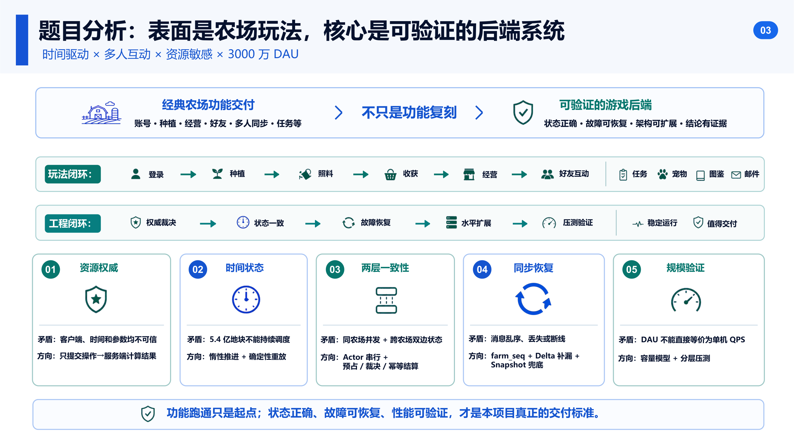
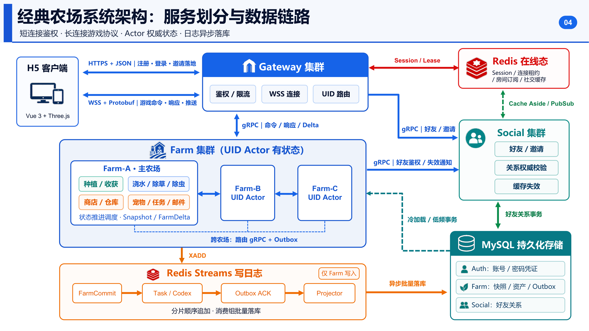
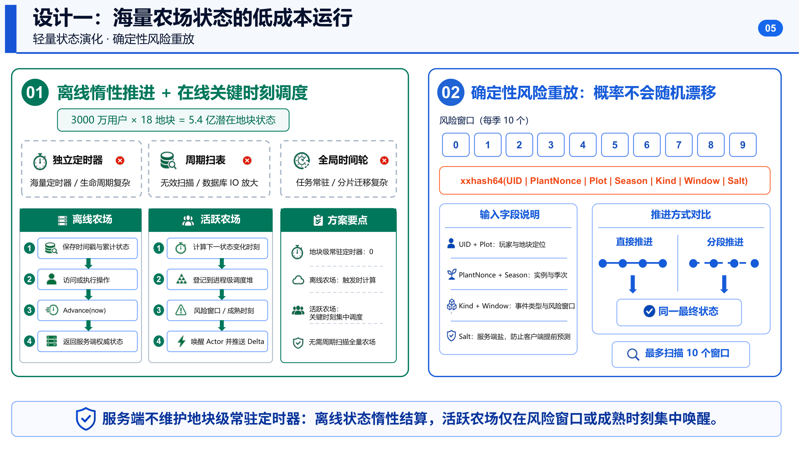
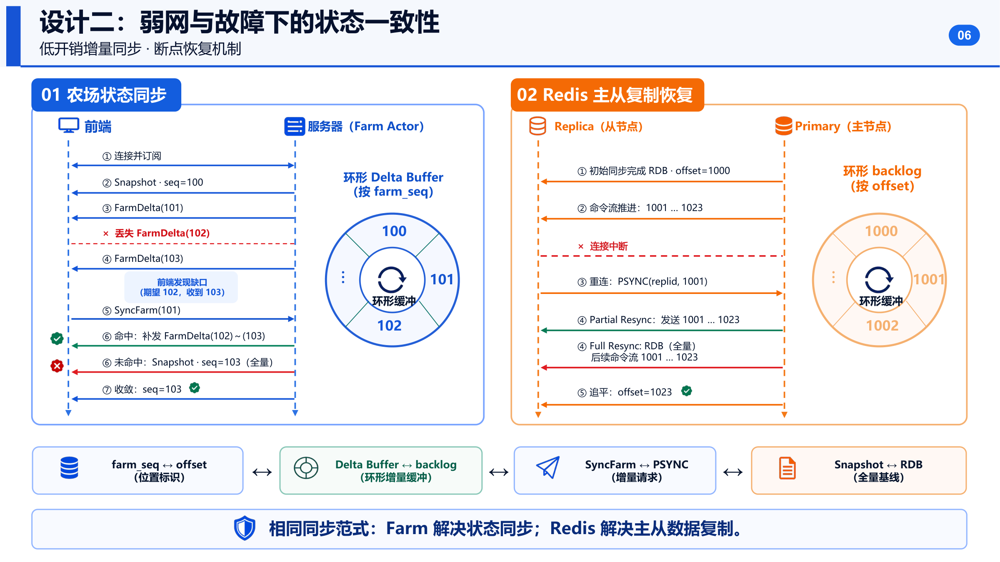
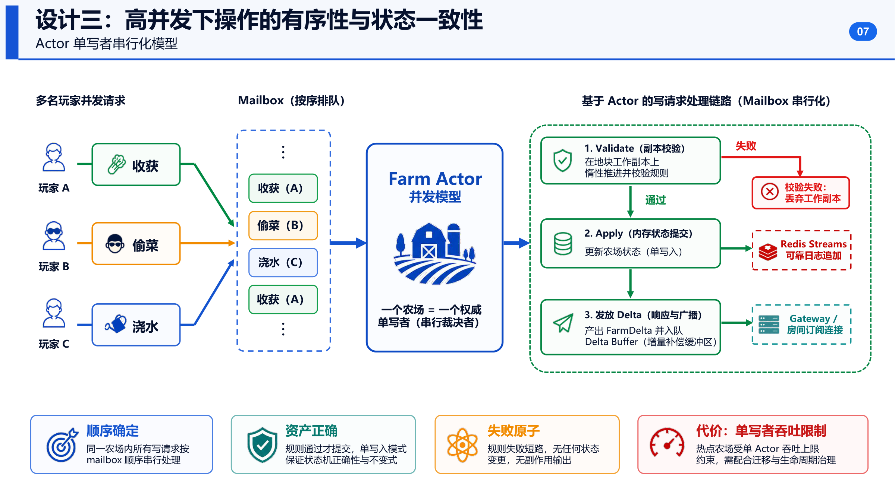
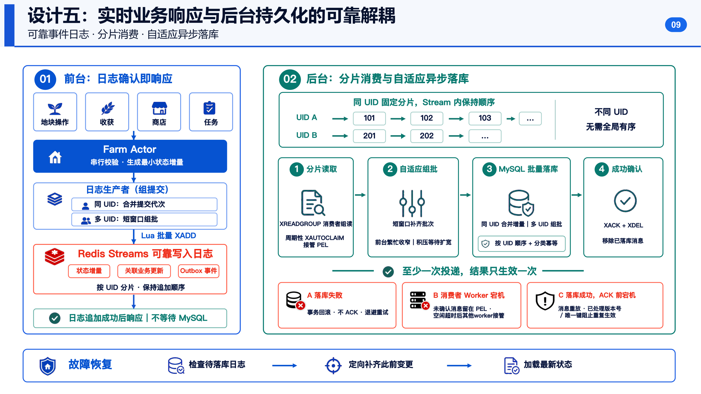
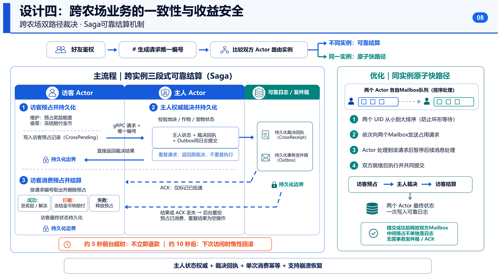
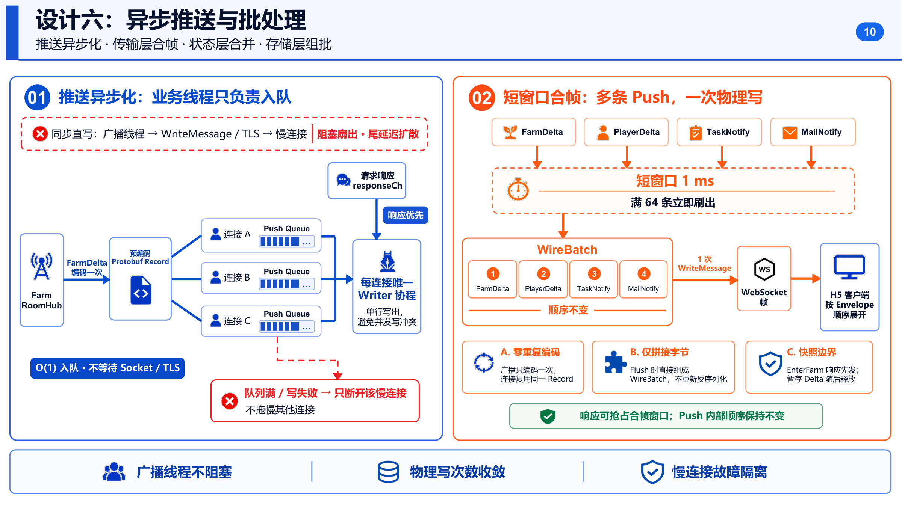

# 经典农场 · 项目架构文档

> 版本：2026-08-20
>
> 上游文档：[game-design-full.md](game-design-full.md) —— 玩法功能与参数设计文档（策划层，描述"游戏应该是什么样"）、[daily-tasks.md](daily-tasks.md) —— 每日任务配置说明（服务端任务参数与领取规则）。本文承接上述文档中标注为"待技术方案确定"的部分，聚焦"如何用工程手段落地并验证这些玩法"。

---

## 目录

1. [项目概述](#1-项目概述)
2. [架构目标](#2-架构目标)
3. [总体架构](#3-总体架构)
4. [技术选型](#4-技术选型)
5. [服务与模块说明](#5-服务与模块说明)
6. [核心业务流程](#6-核心业务流程)
7. [数据存储设计](#7-数据存储设计)
8. [关键架构设计](#8-关键架构设计)
9. [一致性与故障恢复](#9-一致性与故障恢复)
10. [部署与可观测性](#10-部署与可观测性)

---

## 1. 项目概述

**经典农场**是一个以 2009 年经典网页 QQ 农场为蓝本还原的多人在线农场游戏，题目要求是"账号登录、种植经营、好友互动、多人同农场实时同步"等一整套经典农场玩法。项目由后端实习生独立完成后端架构设计、实现与压测验证，前端基于既有 Demo 改造。

- **仓库**：`https://github.com/benkz666/farm`
- **玩法闭环**：登录 → 种植 → 照料 → 收获 → 经营 → 好友互动 → 任务 → 宠物 → 图鉴 → 邮件
- **工程闭环**：权威裁决 → 状态一致 → 故障恢复 → 水平扩展 → 压测验证 → 稳定运行

项目的独特之处在于，题目表面是"农场玩法复刻"，但命题人给出的约束——**3000 万 DAU**——决定了它本质上是一道**可验证的游戏后端系统设计题**：



| 维度    | 具体矛盾                                  | 本项目的应对方向                                      |
| ----- | ------------------------------------- | --------------------------------------------- |
| 资源权威  | 客户端、时间、参数均不可信                         | 客户端只提交操作意图，服务端计算并裁决全部结果                       |
| 时间状态  | 3000 万用户 × 18 地块 ≈ 5.4 亿潜在地块状态，不能持续调度 | 地块状态惰性推进（lazy advance）+ 确定性重放（xxhash 风险窗口）    |
| 两层一致性 | 同农场并发操作 + 跨农场双边状态变更                   | Actor 单写者串行裁决 + 预占 / 裁决 / 幂等结算                |
| 同步恢复  | 消息乱序、丢失、断线是常态                         | `farm_seq` 版本号 + Delta 环形缓冲补漏 + Snapshot 全量兜底 |
| 规模验证  | DAU 不能直接等价为单机 QPS                     | 标准容量单元（U）模型 + 分层压测（k6 / ghz / servicebench）   |


因此，本项目在"功能是否跑通"之外，把**状态正确性、故障可恢复性、性能可验证性**作为同等重要的交付标准：不仅要实现经典农场的完整玩法，还要证明这套后端在高并发、弱网、进程崩溃、多实例扩展等条件下依然行为正确，并用压测数据量化系统的吞吐、时延与资源边界。

项目采用**时间缩放机制**（`TIME_SCALE`）解决"原版农场按小时结算、无法在开发/演示/压测周期内验证"的问题：只压缩挂钟时间，不改动任何经济数值，支持 `authentic`（1:1，产品验收）/ `fast`（1:60，日常开发）/ `demo`（1:600，功能演示）/ `bench`（1:3600，压力测试）四档，由服务端 `FARM_TIME_PROFILE` 统一下发，保证同一部署内 Gateway 与 Farm 的时间口径一致。

## 2. 架构目标

围绕"经典农场功能交付"与"可验证的游戏后端"两个层面，本项目确立了以下架构目标，并在第 8 节逐一对应到具体设计：

### 2.1 资源权威（Server Authority）

客户端只能提交**操作**（浇水、收获、购买、偷菜……），不能提交**结果**。所有金币、经验、产量、地块状态变化均由服务端基于权威时间和权威规则计算。地块的风险判定（长草 / 生虫）使用服务端持有的盐（`FARM_HAZARD_SECRET`）做确定性哈希，客户端无法预测或伪造。

### 2.2 海量状态的低成本运行

3000 万 DAU、每人 18 块地，理论潜在地块状态高达 5.4 亿，服务端不能为每块地维护常驻定时器或周期性全表扫描。目标是：

- 离线农场：状态只在下次被访问 / 操作时一次性结算到当前时刻（惰性推进）；
- 在线农场：只在"下一个有意义的时刻"（成熟点、风险窗口边界）被精确唤醒一次，不做周期性轮询。

### 2.3 两层一致性

- **同一农场内**：多个玩家（主人操作 + 好友访问）对同一农场的并发写请求必须串行化，保证地块状态机不出现竞态；
- **跨农场之间**：访客对好友农场的操作（偷菜、浇水互助）涉及两个玩家的资产变更，必须保证"不重复发奖、不重复扣款"，且在网络分区或进程重启后仍能收敛到唯一确定的结果。

### 2.4 同步与故障恢复

- 客户端与服务端之间允许短暂的消息丢失、乱序、重连，但农场状态镜像最终必须与服务端权威状态一致；
- 任意一个服务进程可以在任意时刻崩溃重启，重启后不丢失已确认的操作效果，也不重复产生副作用；
- 弱网、断线不应表现为"业务失败"，而应表现为"正在同步"。

### 2.5 规模可验证

- 不能直接把 DAU 数字当作并发数或 QPS；需要建立从"日活 → 峰值并发 → 业务 QPS → 资源需求"的可复现容量模型；
- 单实例容量、多实例弱扩展效率、数据层瓶颈都必须用实测数据回答，而不是理论推断；
- 压测结论必须诚实反映边界与未验证项，不能用"理论上应该线性扩展"代替实测。

> 用命题人视角总结：**功能跑通只是起点；状态正确、故障可恢复、性能可验证，才是本项目真正的交付标准。**

## 3. 总体架构

系统由 3 个可独立部署的 Go 服务（Gateway / Farm / Social）、1 套 MySQL 权威存储、3 套职责分离的 Redis 实例组成，客户端是 Vue 3 + Three.js 的 H5 应用。整体呈"无状态接入层 + 按 UID 有状态分片的领域服务 + 权威持久化"的三层结构。



下图是该架构在答辩材料中的示意，与下方的文字版拓扑图对应：

```text
                         ┌────────────────────────┐
                         │   H5 客户端 (Vue3+Three.js)  │
                         └──────────┬─────────────┘
                     HTTPS+JSON     │      WSS+Protobuf(farm.v3.pb)
                  (注册/登录/邀请落地) │  (握手/游戏命令/响应/服务端推送)
                         ┌──────────▼─────────────┐
                         │      Gateway 集群        │  无状态：鉴权 / 限流 / WS会话
                         │ (HTTP+WS 前端, gRPC 内部) │  按 UID 一致性哈希路由到 Farm/Social
                         └───┬───────────────┬─────┘
                   gRPC(内部Bearer)      gRPC(内部Bearer)
                         │               │
             ┌───────────▼──────┐   ┌────▼────────────┐
             │     Farm 集群      │   │    Social 集群    │
             │ (按 UID 分片,      │◄──┤ (好友关系权威,     │
             │  Actor 有状态)     │gRPC│  邀请/搜索/鉴权)   │
             │                   │   └────┬─────────────┘
             │ 种植/收获/商店/仓库/  │        │
             │ 宠物/任务/邮件/图鉴   │        │
             │ 状态推进调度/Delta   │        │
             │ 跨农场gRPC Saga     │        │
             └───┬───────────┬───┘        │
        Redis Streams(写日志) │   gRPC(跨Farm实例)
                 ▼           │
     ┌──────────────────┐    │
     │ MySQL 投影(异步)   │◄───┘ (projector 批量落库)
     │ 账号/农场/好友/邮件 │
     │ 任务/outbox/…      │
     └────────┬──────────┘
              │
     ┌────────▼────────────────────────────────┐
     │  3 套独立 Redis：cache / journal / presence │
     │  cache: session、farm 热缓存                │
     │  journal: 写日志 Streams（Farm 专用 WAL）     │
     │  presence: 连接租约 / 房间订阅（Gateway/Farm）│
     └───────────────────────────────────────────┘
```

### 3.1 服务矩阵


| 服务          | 状态性                  | 主要职责                                                     | 内部端口（示例）                                    |
| ----------- | -------------------- | -------------------------------------------------------- | ------------------------------------------- |
| **Gateway** | 无状态                  | 账号注册登录、WebSocket 握手与会话、限流、按 UID 路由到 Farm/Social、推送批处理与合帧 | HTTP `:9002` / gRPC `:9202` / admin `:9302` |
| **Farm**    | 有状态（按 UID 分片）        | 种植/收获/照料、商店与仓库、宠物、任务、邮件、图鉴、跨农场裁决、写日志与状态推进调度              | HTTP `:9100` / gRPC `:9210` / admin `:9310` |
| **Social**  | 近似无状态（好友关系权威校验+失效通知） | 好友关系维护、好友邀请、用户搜索、跨进程好友关系鉴权                               | HTTP `:9004` / gRPC `:9204` / admin `:9304` |


Gateway 与 Farm/Social 之间**只走内部 gRPC**（`Authorization: Bearer <FARM_INTERNAL_TOKEN>`，常量时间比较防时序攻击），浏览器只能访问 Gateway 暴露的 HTTP/WS 端口。这条边界保证了"鉴权/限流"与"业务权威计算"物理隔离，也让 Gateway 可以无状态水平扩展。

### 3.2 数据链路概览

- **短连接（HTTPS + JSON）**：仅用于注册、登录、好友邀请落地页——一次性、无状态的请求。
- **长连接（WSS + 二进制 Protobuf，子协议 `farm.v3.pb`）**：承载全部游戏命令、响应与服务端主动推送（FarmDelta、PlayerDelta、任务/邮件通知等），这是玩家在线期间的主链路。
- **服务间（gRPC + Protobuf）**：Gateway ↔ Farm、Gateway ↔ Social、Farm ↔ Farm（跨分片跨农场裁决）、Farm/Social → Gateway（服务端主动推送回拨）。
- **持久化链路（Redis Streams + MySQL）**：Farm 的写操作先原子追加到按 UID 分片的 Redis Streams（充当预写日志 / WAL），前台在日志确认后即可响应；后台 Projector 异步、幂等地把日志物化进 MySQL 当前态表。

这套架构的核心设计取舍是：**把"状态权威"收敛到 Farm 进程内的单 UID Actor，把"持久化确认"下沉到 Redis Streams 而不是同步 MySQL 事务**，从而在保证正确性的前提下把关键路径延迟和数据库压力都降到最低，这也是后文第 8、9 节的主线。

## 4. 技术选型

### 4.1 服务端（`server/go.mod`，Go 1.25）


| 分类        | 选型                            | 版本      | 选择理由                                                                                   |
| --------- | ----------------------------- | ------- | -------------------------------------------------------------------------------------- |
| 语言        | Go                            | 1.25    | 原生协程模型天然适配"每 UID 一个 Actor 协程"的并发模型；GC 与调度器在高连接数场景下表现稳定                                 |
| WebSocket | `gorilla/websocket`           | v1.5.3  | 成熟稳定，支持自定义帧读写与心跳控制，便于实现推送合帧                                                            |
| 序列化       | `google.golang.org/protobuf`  | v1.36.5 | 游戏命令/响应/推送均为二进制 Protobuf，比 JSON 更省带宽与 CPU，且与前端 `@bufbuild/protobuf` 共用同一份 `.proto` 契约  |
| 服务间通信     | `google.golang.org/grpc`      | v1.65.1 | Gateway↔Farm/Social、Farm↔Farm 均为强类型内部调用，需要流式接口（好友失效推送）与超时/重试的一致语义                      |
| 关系数据库     | MySQL + `go-sql-driver/mysql` | v1.10.0 | 账号、农场当前态、好友关系、邮件、outbox 等权威数据的最终落地存储                                                   |
| 缓存/消息     | Redis + `redis/go-redis/v9`   | v9.21.0 | 三个独立实例分别承担 会话缓存 / 写日志(Streams) / 在线状态(presence)，用 Redis Streams 取代早期设计中的 Kafka，降低运维复杂度 |
| 一致性哈希     | `cespare/xxhash/v2`           | v2.3.0  | 用于地块风险（长草/生虫）的确定性伪随机判定，以及分片路由的辅助散列                                                     |
| 密码学       | `golang.org/x/crypto`         | v0.54.0 | 密码哈希（bcrypt）等鉴权相关原语                                                                    |
| 可观测性      | `prometheus/client_golang`    | v1.22.0 | 暴露 HTTP/WS/Actor/写日志/gRPC 队列等指标，配合 Grafana 面板                                          |


> **关于"Kafka → Redis Streams"**：早期设计文档（`docs/plan/接口压测.md` 等）和答辩 PPT 中提到"写日志"时最初构想是 Kafka；但 `go.mod` 中**没有任何 Kafka 客户端依赖**，当前写日志（`server/shared/store/write_journal.go`）与跨农场投递（`server/farmsvr/crossfarm/dispatcher.go`）均完全基于 `redis/go-redis/v9` 的 Streams（`XADD`/`XREADGROUP`/`XAUTOCLAIM`）实现，属于工程收敛后的最终选型，减少了一套外部组件的运维成本。

### 4.2 客户端（`client/package.json`）


| 分类    | 选型                                                    | 版本       | 选择理由                                                   |
| ----- | ----------------------------------------------------- | -------- | ------------------------------------------------------ |
| 框架    | Vue 3                                                 | ^3.5.13  | 组合式 API 适合管理大量地块/背包等响应式游戏状态                            |
| 构建    | Vite                                                  | ^6.0.0   | 快速冷启动与 HMR，适合频繁调整 3D 场景与 UI                            |
| 3D 引擎 | Three.js                                              | ^0.170.0 | 渲染农场地块、角色、天气等 3D 场景                                    |
| 序列化   | `@bufbuild/protobuf` + `protoc-gen-es`                | ^2.13.0  | 与服务端共用同一份 `.proto`，通过 `make proto` 生成前后端双端代码，杜绝手写协议不一致 |
| 路由    | vue-router                                            | ^4.6.4   | 登录/大厅/农场等页面切换                                          |
| 字体    | `@fontsource/noto-sans-sc`、`@fontsource/zcool-kuaile` | ^5.3.0   | 中文界面字体与农场风格标题字体                                        |


### 4.3 协议分层

- **HTTP + JSON**：仅用于注册 / 登录 / 好友邀请落地页等"一次性、无状态、对延迟不敏感"的接口；
- **WebSocket + Protobuf（`farm.v3.pb` 子协议）**：登录成功后升级为长连接，承载全部游戏内命令、响应、以及服务端主动推送，是延迟敏感的主链路；
- **gRPC + Protobuf**：服务间内部通信，Gateway 与 Farm/Social 之间用固定 Bearer Token 做内部鉴权，Farm 与 Farm 之间用于跨分片的 Saga 调用。

三种协议共用同一套由 `make proto` 生成的 Protobuf 消息定义，保证跨语言（Go/TS）、跨协议（WS/gRPC）的数据结构一致性，避免"网关转发时改字段"的隐蔽 bug。

## 5. 服务与模块说明

### 5.0 项目目录结构总览

仓库根目录按"服务端 / 客户端 / 部署 / 压测 / 文档 / 工具"划分：

```text
farm/
├── server/                 # Go 服务端（Gateway / Farm / Social 三个进程 + 公共库）
├── client/                 # Vue3 + Three.js 前端（H5 农场客户端）
├── deploy/                 # Docker Compose 与 K3s/K8s 部署清单
├── bench/                  # 压测工具链（k6 / ghz / servicebench 脚本与结果）
├── config/                 # 游戏数值配置源（如 crops.csv），经 `make gen` 生成前后端代码
├── tools/                  # 配置生成器（gen-config）、API 文档生成器（api-docs）
├── scripts/                # 本机启动/停止/压测夹具重置等运维脚本
├── docs/                   # 设计文档、接口文档、压测计划
├── Makefile                # 统一的开发/构建/压测入口
├── .env.example            # 完整的服务配置项样例（对齐第 10.2 节）
└── AGENTS.md                # 协作与提交规范
```

服务端 `server/` 内部采用"入口（`cmd/`）+ 领域实现（`farmsvr/`、`socialsvr/`、`gateway/`）+ 领域模型（`domain/`）+ 公共基础设施（`shared/`）+ 协议契约（`proto/`/`gen/`）"的分层组织方式：

```text
server/
├── cmd/                     # 各进程/工具的 main 入口（见 5.1）
│   ├── gateway/  farmsvr/  socialsvr/     # 三个可独立部署的服务
│   └── farmctl/  servicebench/  benchfixture/  benchstub/   # 运维与压测工具
├── auth/                    # 密码哈希、会话 Token 生成（HMAC-SHA256）
├── gateway/                 # Gateway 领域实现：HTTP 鉴权、WS 会话、推送合帧（见 5.2）
├── farmsvr/                 # Farm 领域实现（见 5.3）
│   ├── room/                #   Actor 运行时：FarmActor / Runtime / 组提交
│   ├── farmrpc/              #   内部 gRPC 服务、状态推进调度、动态写入准入
│   └── crossfarm/            #   跨农场裁决、Outbox 投递
├── socialsvr/                # Social 领域实现：好友关系 gRPC 服务（见 5.4）
│   └── api/
├── domain/farm/               # 纯领域模型：地块推进、经济、跨农场预占/收据等（不依赖存储/网络）
├── shared/                   # 跨服务公共基础设施（见 5.5）：store / sharding / friendauth /
│                              #   presence / outbox / clientwire / clientjson / telemetry / grpcx 等
├── proto/farm/                # .proto 协议源文件（public/v3 面向客户端，internal/v1 面向服务间）
├── gen/farm/                  # 由 `make proto` 生成的 Go 代码（不手写）
└── migrations/                # 按业务域拆分的 SQL 迁移：farm/ social/ auth/ worker/
```

客户端 `client/src/` 按"视图 / 游戏逻辑 / 网络 / 生成代码"划分：

```text
client/src/
├── views/                   # 页面级组件：LoginPage / FarmPage / InviteLanding
├── components/                # 可复用组件（如调试面板 DevNetPanel）
├── game/                     # 核心玩法逻辑：3D 场景（farm3d.js）、Delta 应用与补洞请求
│                              #   （farmMirror.js）、成熟点/风险窗口边界的同步调度镜像
│                              #   （farmAdvanceScheduler.js）、状态管理（state.js）、
│                              #   任务/宠物/图鉴 UI、断线重连恢复（reconnectRestore.js）
├── net/                       # WebSocket 客户端：二进制协议编解码（binaryWire.js）、
│                              #   会话管理（session.js）、认证流程（authFlow.js）
├── gen/                       # 由 `make proto` 生成的前端 Protobuf TS 代码
├── router.js / App.vue / main.js   # 应用入口与路由
└── *.test.js                  # 与源文件同目录的单元测试（Vitest 风格）
```

### 5.1 入口层 `server/cmd/`


| 目录                                   | 说明                                    |
| ------------------------------------ | ------------------------------------- |
| `cmd/gateway`                        | Gateway 服务进程入口                        |
| `cmd/farmsvr`                        | Farm 服务进程入口                           |
| `cmd/socialsvr`                      | Social 服务进程入口                         |
| `cmd/farmctl`                        | 运维/调试命令行工具（如按 UID 查询 Actor 状态、手动触发推进） |
| `cmd/servicebench`                   | 内部压测工具（HTTP/WS/gRPC 混合压测，输出 U 单位容量指标） |
| `cmd/benchfixture` / `cmd/benchstub` | 压测数据构造与依赖打桩                           |


### 5.2 Gateway（`server/gateway/`）

无状态接入层，主要子模块：

- **HTTP 鉴权（`http_auth.go`）**：`/api/register`、`/api/login`，基于 `auth.Authenticator`（bcrypt）校验密码、`store.SessionStore` 建立会话（Redis `session:{token}` → uid，TTL **7 天**，同一账号新登录会原子替换旧 token，旧 token 保留 5 分钟宽限期后校验为 `ERR_KICKED` 而非静默失效）、`sharding.RouteTable` 计算目标 Farm 分片；
- **WebSocket 会话**：握手升级、心跳、命令下行/响应上行的编解码；
- **推送合帧（`ws_push_coalesce.go`）**：每连接一个 `pushCh` + 独立写协程 `runPushWriter`，按 1ms 窗口或 64 条阈值合并为一次 `WriteMessage`，命令响应走独立高优先级 `responseCh` 避免被推送队列拖延；慢连接在 `pushCh` 打满时被主动断开隔离；
- `**apidocs/**`：面向前端/QA 的 HTTP 接口文档。

### 5.3 Farm（`server/farmsvr/`）—— 核心有状态领域服务

- `**room/`（Actor 运行时）**
  - `actor.go`：`FarmActor` 持有单个玩家的 `farm.Aggregate` 内存态与 `DeltaRing`；聚合体只能在 `Runtime.Do` 回调内被访问，从而保证单 UID 单线程访问；提供 `MarkDirty`/`RequireEconomyFlush`/`MarkPlotDirty`/`RequireCrossVisitorFlush` 等细粒度落盘标记方法，以及跨农场结果的内存幂等缓存 `resultCache`；
  - `runtime.go`：`Do(uid, fn)` 保证同一 UID 的操作在专属协程中严格串行执行；`DoPairDurable(uidA, uidB, fn)` 用于需要同时操作两个 Actor 的场景，通过 UID 排序后按序获取两个信箱、执行回调、再通过一次 `BatchFarmStore` 调用原子提交双方变更，从设计上避免死锁；
  - `pair_committer.go`：把多个 `DoPairDurable` 的提交请求在时间窗口内合并为一次批量 Redis/Lua 调用，减少跨农场操作的存储往返次数。
- `**farmrpc/`（内部 gRPC 服务与调度）**
  - `server.go`：Farm 的 gRPC 服务实现，定义各类 `Operation`/`CommandRequest`/`CommandResponse`，是 Gateway 命令的落地入口，并串联 `farmAdvanceScheduler`；
  - `advance_scheduler.go`：进程内最小堆调度器，只为"下一个关键时间点"（作物成熟、风险窗口边界）精确唤醒对应 Actor 一次，而非周期轮询；
  - `write_admission.go`：`DynamicWriteAdmission` 基于写日志堆积/延迟动态调整允许的最大在途写入数，是自适应背压的核心实现。
- `**crossfarm/`（跨农场一致性）**
  - `owner.go`：农场主人侧对 `CrossAction`（偷菜/浇水等）的裁决逻辑，含好友关系校验、结果计算、`CrossReceipt` 记录（用于幂等重放）与可选的 outbox 事件写入；
  - `dispatcher.go`：`OutboxDispatcher` 轮询 `farm_outbox` 表（250ms 周期），通过 gRPC `DeliverCrossResult` 把裁决结果投递回访客所在 Farm 实例，失败按指数退避重试，超过阈值进入死信状态；显式说明"并行化投递收益有限"，因为瓶颈在下游 MySQL。
- `**domain/farm/`（领域模型，与 `farmsvr` 平级但被其依赖）**
  - `advance.go`：状态推进核心——`Advance`/`settleTo` 惰性结算，`hazardRoll`/`hazardHit`/`scanHazard` 基于 `xxhash.Sum64(OwnerUID, PlantNonce, PlotIndex, SeasonIndex, kind, window, HazardSalt)` 的确定性哈希判定长草/生虫等风险事件，保证同一输入永远得到同一结果（可重放、可审计）。

### 5.4 Social（`server/socialsvr/`）

- `api/grpc_server.go`：好友关系的权威 gRPC 服务，内部维护 `invalidationHub` 向 Gateway/Farm 广播好友关系失效通知（用于使 `friendauth` 缓存及时失效）；底层依赖 `store.FriendStore`、`store.StealHintStore`。

### 5.5 共享基础设施（`server/shared/`）


| 模块                            | 职责                                                                                                                                                                |
| ----------------------------- | ----------------------------------------------------------------------------------------------------------------------------------------------------------------- |
| `store/`                      | MySQL/Redis 数据访问层：`write_journal.go`（写日志与投影）、`outbox.go`（跨农场结果 outbox）、`farm_batch.go`/`farm_mutation.go`（批量提交）、`mail.go`/`task.go`（邮件/任务持久化）、`connreg.go`（连接注册表） |
| `sharding/`                   | `shard.go`：`fnv.New64a` 对 UID 取哈希得到 1024 个逻辑分片，`RouteTable` 把逻辑分片区间映射到具体 Farm 实例，支撑水平扩展                                                                           |
| `friendauth/`                 | 好友关系的本地读缓存（64 分片、30s TTL、上限 65536 条），订阅 Social 的失效通知做主动淘汰，减轻跨服务好友校验的调用压力                                                                                          |
| `presence/`                   | 基于 Redis 的连接租约/在线状态管理                                                                                                                                             |
| `outbox/`                     | 通用 outbox 数据结构与状态机定义                                                                                                                                              |
| `clientwire/` / `clientjson/` | WS 二进制帧编解码 / HTTP JSON 编解码的公共工具                                                                                                                                   |
| `servicehost/`                | 服务启动脚手架：配置加载、健康检查、优雅关闭                                                                                                                                            |
| `telemetry/`                  | Prometheus 指标定义：HTTP/WS 请求、连接数、Actor 常驻数/信箱深度/加载耗时、写日志堆积与延迟、gRPC 流队列等                                                                                             |
| `errcode/` / `rpcerr/`        | 统一错误码与 gRPC 错误映射                                                                                                                                                  |
| `gameconfig/`                 | 游戏数值配置（作物生长参数、经济系数等）加载                                                                                                                                            |
| `grpcx/`                      | gRPC 客户端/服务端公共拦截器（内部鉴权、超时、指标）                                                                                                                                     |
| `testclock/`                  | 可控测试时钟，支撑 `TIME_SCALE` 与单测中的时间推进                                                                                                                                  |


### 5.6 Protobuf 契约（`server/proto/farm/`、`server/gen/farm/`）

`.proto` 源文件定义登录握手、游戏命令、服务端推送（Delta/Snapshot）、内部 gRPC 接口等全部消息结构；`make proto` 统一生成 Go（`gen/farm/`）与前端 TS（`client/src/**/*_pb.ts`）代码，是前后端、服务间协议一致性的唯一来源。

## 6. 核心业务流程

### 6.1 登录与进入农场

```text
客户端 --HTTP POST /api/login--> Gateway
Gateway: 校验密码(bcrypt) → 生成会话Token(HMAC-SHA256+32B随机nonce) → 写入SessionStore(Redis)
Gateway --HTTP 200 { token }--> 客户端
客户端 --WSS 升级(Sec-WebSocket-Protocol: farm.v3.pb)+携带token--> Gateway
Gateway: 校验token → sharding.RouteTable按UID计算目标Farm实例
Gateway --gRPC EnterFarm(uid)--> Farm
Farm: Runtime.Do(uid, load-or-create Aggregate) → 若Actor不在内存则从MySQL加载+按需惰性推进
Farm --SnapshotProto--> Gateway --WS二进制Snapshot--> 客户端（渲染出全量农场状态）
```

登录侧使用无状态 HTTP + Redis Session，进入游戏后切换为长连接；Farm 侧的"首次进入即惰性推进到当前时刻"是第 2.2 节目标的具体体现——离线期间的作物生长/风险事件不会被逐帧计算，而是在这一刻一次性结算。

### 6.2 单农场内操作（如浇水、收获、购买）

1. 客户端通过 WS 发送二进制命令（含 `ReqID` 用于响应匹配/去重）；
2. Gateway 校验会话与限流后，按 UID 路由，通过 gRPC 转发到对应 Farm 实例；
3. Farm 的 gRPC 服务把请求投递到 `Runtime.Do(uid, fn)`：
  - 若 Actor 不在内存，先加载（`domain/farm` 惰性推进到当前时刻）；
  - 在单协程环境下执行业务规则校验与状态变更（保证同一 UID 无并发竞态）；
  - 变更通过 `MarkDirty`/`RequireXxxFlush` 标记待持久化的粒度；
4. 变更被追加到该 UID 所在分片的 Redis Streams 写日志（同步确认，作为"已持久化"的边界），随后异步投影到 MySQL；
5. Farm 生成本次操作的 Delta，写入 `DeltaRing` 并推送给所有正在观看该农场的连接（本人 + 好友访客）；
6. Gateway 侧合帧后推送给客户端；命令的直接响应通过高优先级通道立即返回，不受推送合帧窗口影响。

### 6.3 跨农场操作（访问好友农场 / 偷菜 / 互助）

跨农场操作天生涉及两个 UID（访客与主人），且这两个 UID 可能落在**同一个 Farm 实例**或**不同的 Farm 实例**上，两种情况走不同的一致性路径（详见第 8.4 节）：

**情况 A：同实例快路径**

```text
访客命令 --> Gateway --> 目标Farm实例
Runtime.DoPairDurable(minUID, maxUID, fn):
  1. 按UID大小排序获取两个信箱（防死锁）
  2. 在回调内同时读取访客与主人的Aggregate
  3. 校验好友关系（friendauth缓存）→ 裁决结果（owner.go）
  4. 双方状态变更 + 生成CrossReceipt（幂等标记）
  5. 通过pair_committer批量提交，单次BatchFarmStore原子落写日志
  6. 分别向双方连接推送各自的Delta
```

**情况 B：跨实例 Saga 路径**

```text
访客命令 --> Gateway --> 访客所在Farm实例(A)
A: 预占/校验访客侧前置条件 --gRPC CrossAction--> 主人所在Farm实例(B)
B: owner.go裁决 → 记录CrossReceipt(幂等) → 写入本地farm_outbox（含目标为A的投递任务）
B --gRPC响应(裁决结果)--> A
A: 应用访客侧结果变更 → 写日志确认
（B侧的outbox由OutboxDispatcher异步轮询并投递结果，即使B在裁决后立即crash，
  重启后outbox中的记录仍会被投递，保证"主人侧的裁决只要提交成功，访客侧终将收到"）
```

两条路径共享同一套裁决逻辑（`crossfarm/owner.go`），区别仅在于"是否需要跨进程通信"以及"是否需要 outbox 兜底重投"，这是第 8.4 节要展开的关键设计。

### 6.4 断线重连与状态同步

```text
客户端断线 → 重新建立WS连接 → 携带上次收到的farm_seq --WS Resume--> Gateway --gRPC--> Farm
Farm: DeltaRing.Since(fromSeq)
  成功(ok=true) → 返回缺口区间内的增量Delta列表，客户端按序应用
  失败(ok=false，缺口超出环形缓冲200条容量) → 触发全量Snapshot兜底
```

这一机制在语义上类似"复制协议的增量续传 + 全量兜底"（如 Redis 主从的 PSYNC 思路），但具体实现是项目自研的 `DeltaRing`（固定容量的环形缓冲区），不依赖外部复制协议。`farm_seq` 是每个农场聚合内部单调递增的版本号，客户端和服务端都以它作为"状态是否落后"的唯一判据。

### 6.5 定时/异步驱动的流程

- **状态推进调度**：`advance_scheduler.go` 的最小堆只在"下一次关键事件"到期时唤醒对应 Actor，事件处理完毕后重新计算并插入下一个到期点；
- **写日志投影**：`write_journal.go` 的 Projector 协程持续从 Redis Streams 消费（`XREADGROUP`），按 UID 聚合、合并短时间窗口内的多次写入（coalesce），再批量写入 MySQL；
- **跨农场 outbox 投递**：`dispatcher.go` 以 250ms 周期轮询到期的 outbox 记录并投递，失败按指数退避重试，超过最大重试次数进入死信状态供人工/运维介入。

## 7. 数据存储设计

存储分为两层：**MySQL 作为唯一权威、可查询的当前态**，**Redis 承担缓存、写日志(WAL)、在线状态三类完全不同的角色并物理拆分为三个实例**，二者通过写日志 + 异步 Projector 连接。

### 7.1 MySQL 表结构（`server/migrations/`）


| 表                      | 关键字段                                                                                                                                                                              | 说明                                                                                                                |
| ---------------------- | --------------------------------------------------------------------------------------------------------------------------------------------------------------------------------- | ----------------------------------------------------------------------------------------------------------------- |
| `account`              | `uid`(AUTO_INCREMENT PK), `username`(UNIQUE), `password_hash`                                                                                                                     | 账号鉴权，与游戏数据分离                                                                                                      |
| `player`               | `uid`(PK), `nickname`, `level`, `exp`, `coin`, `unlocked_plots`, `codex_bitmap`, `friend_ids`, `daily_blob`, `pet_blob`, `cross_blob`, `cross_receipt_blob`, `farm_seq`           | 玩家主聚合的"扁平化"表：许多子系统（图鉴、好友快照、每日、宠物、跨农场预占/裁决结果）不建独立表，而是序列化为 `VARBINARY` blob 存在 `player` 行内，随聚合整体读写，减少多表 JOIN 与多事务协调 |
| `farm_plot`            | `(uid, plot_index)`(PK), `blob` VARBINARY(512)                                                                                                                                    | 每块地一行，`blob` 承载地块的作物/风险/时间戳等状态编码，容量从 256B 扩到 512B 以容纳偷菜访客名单                                                       |
| `item`                 | `(uid, kind, item_id)`(PK), `count`                                                                                                                                               | 背包/仓库统一表，`kind` 区分种子/化肥/狗粮/果实                                                                                     |
| `friendship`           | `(uid_lo, uid_hi)`(PK)                                                                                                                                                            | 用 `uid_lo=min, uid_hi=max` 归一化表示无向好友关系，一行表达双向关系，主键冲突即幂等去重                                                         |
| `player_task`          | `(uid, logic_day, task_id)`(PK), `journal_stream_ms/seq`                                                                                                                          | 每日任务进度与领取状态；后两个字段是写日志投影的高水位标记，用于幂等去重                                                                              |
| `mail` / `daily_login` | 见 `worker/005_task_mail.sql`                                                                                                                                                      | 邮件（含附件金币）与每日登录记录，均以唯一键保证并发领取时的幂等                                                                                  |
| `farm_outbox`          | `event_id`(PK), `producer_farm_id`, `producer_uid`, `target_uid`, `kind`, `payload`, `attempts`, `next_attempt_at`, `published_at`, `dead_lettered_at`, `claim_token/claim_until` | 跨农场裁决结果的可靠投递队列（Outbox 模式），`018` 迁移加入 `producer_farm_id` 并重建索引以支持按生产者分片扫描，为水平扩展多个 Farm 实例做准备                       |


设计上的取舍值得强调：

- `**player` 表大量使用 blob 字段而非规范化多表**：早期设计文档（`docs/superpowers/specs/`*）设想过独立的 `cross_operation`、`cross_owner_receipt` 等规范化表，但当前实现把跨农场预占（`cross_blob`）与裁决收据（`cross_receipt_blob`）都收敛为 `player` 表的两个 `VARBINARY` 列，跟随聚合整体加载/落盘，避免了"聚合状态分散在多张表、需要多次查询才能还原"的问题，代价是牺牲了 SQL 层面的可查询性（这些字段本质是"服务端私有存储格式"，不面向报表/运营查询）；
- **地块状态同样是 blob 编码**：地块的生长阶段、种植时间、风险窗口等信息编码进 `farm_plot.blob`，而不是拆成多个列，这是为了让 `domain/farm/advance.go` 的惰性推进逻辑可以用统一的方式反序列化/重算/序列化，不必关心 SQL 列的增删。

### 7.2 Redis 三实例分工


| 实例                 | 环境变量前缀                       | 用途                                      | 关键结构                                                                                                             |
| ------------------ | ---------------------------- | --------------------------------------- | ---------------------------------------------------------------------------------------------------------------- |
| **cache**（通用）      | `REDIS_`*                    | 会话（Token→UID）、路由与限流计数、通用短时缓存            | String / Hash，带 TTL                                                                                              |
| **journal**（写日志）   | `FARM_WRITE_JOURNAL_REDIS_`* | Farm 的预写日志（WAL），按 UID 分片的 Redis Streams | `XADD` 追加的 Stream，Lua 脚本维护"最新值哈希 + 待处理 UID 列表"                                                                   |
| **presence**（在线状态） | `PRESENCE_REDIS_`*           | 连接租约、房间订阅关系，用于判断玩家是否在线/在哪个 Gateway      | ZSET，member=`gatewayID:connID`，score=过期时间戳，租约 TTL **2 分钟**；玩家生命周期租约单成员互斥（同一账号只有一条活跃连接），房间订阅租约允许多成员（多个好友同时观看同一农场） |


三者物理隔离的原因：写日志是**高频追加、需要持久化保证**的关键路径，如果与普通缓存共用一个 Redis 实例，缓存的驱逐策略/内存压力会直接影响写日志的可靠性；在线状态则需要频繁的心跳续约，隔离后可以为它单独调参（如更激进的过期策略）而不影响另外两者。

### 7.3 从写日志到 MySQL 的数据流

```text
Farm Actor 变更 --Lua脚本原子追加--> Redis Streams(按UID分片, journal实例)
                                          │
                                Projector协程 XREADGROUP 消费
                                          │  (按UID聚合 + 时间窗口合并写)
                                          ▼
                                    MySQL UPDATE/INSERT
                                          │
                          写入 journal_stream_ms/seq 作为投影高水位
```

这一路径保证："只要写日志确认成功，数据就不会丢"，而 MySQL 的落地是**异步、可延迟、可合并**的，具体机制见第 8.5 节与第 9 节。

## 8. 关键架构设计

本节对应第 2 节的架构目标，逐一展开六个关键设计的实现细节，全部基于当前代码给出具体依据。

### 8.1 海量地块状态的低成本运行：惰性推进 + 确定性风险哈希

**问题**：3000 万 DAU × 18 地块，服务端不可能为每块地维护定时器或做周期性全表扫描。



**设计**（`server/domain/farm/advance.go`）：

- **惰性推进（Lazy Advance）**：地块状态不随挂钟时间持续演化，而是把"最后结算时间"存下来；每次该农场被访问/操作时，调用 `Advance`/`settleTo` 从"最后结算时间"一次性推进到"当前时间"，计算这段时间内的生长阶段变化、是否成熟、是否触发风险窗口；
- **确定性风险哈希**：长草/生虫等风险事件不用随机数（否则不可重放、不可审计，也无法在多次调用间保持一致），而是用 `hazardRoll`：
  ```text
  hazardRoll = xxhash.Sum64(OwnerUID, PlantNonce, PlotIndex, SeasonIndex, kind, window, HazardSalt)
  ```
  其中 `kind` 区分"长草/生虫"，`window` 是风险判定所在的时间窗口序号，`HazardSalt` 是服务端持有的进程级盐（`DeriveHazardSalt`，来自 `FARM_HAZARD_SECRET`）。相同输入永远得到相同输出，因此同一块地无论被推进多少次、以什么顺序被访问，最终风险事件的判定结果都是确定且一致的，也让"重放同一段时间"变得可测试。具体地，每季固定划分为 **10 个风险窗口**（每个窗口长度=本季时长的 10%），长草判定阈值 12%、生虫判定阈值 10%；一旦某块地判定"有草/有虫"，在被清除前不会重复判定同一风险再次消失，避免状态抖动；
- **只在必要时机唤醒**：结合 8.2 的进程内调度器，风险窗口边界和作物成熟点是仅有的两类需要"主动唤醒"的时刻，其余时间地块完全不消耗任何 CPU/内存以外的资源（不在内存中的 Actor 甚至不消耗内存，见 8.6）。

### 8.2 在线农场的精确唤醒：进程内最小堆调度器

**问题**：即使地块是惰性推进的，在线玩家仍然期望"作物一到成熟点，UI 立刻变化"，不能等到下次操作才刷新——这就需要在正确的时刻主动触发一次推进并推送 Delta。

**设计**（`server/farmsvr/farmrpc/advance_scheduler.go`）：

- 维护一个进程本地的最小堆 `advanceHeap`，堆中每个元素是 `scheduledAdvance{UID, due}`；
- `Schedule(uid, due)` 在地块状态发生变化（种植、施肥、浇水）后重新计算下一个关键到期点并插入堆；
- 后台 `run` 协程只在堆顶元素到期时被唤醒（用 timer 精确对齐堆顶到期时间，而不是固定间隔轮询），到期后把该 UID 的推进任务分发给一个有限大小的 worker 池执行；
- 堆中的旧条目通过"惰性剔除"处理：如果同一 UID 被多次 `Schedule`，旧的堆条目在被弹出时发现已经过期或已被更新的条目取代，直接跳过，不需要真的从堆中删除（避免 O(log n) 的堆内查找删除）。

这套调度器把"唤醒频率"从"地块数量"解耦为"下一个事件发生的时间"，配合 worker 池限制并发，避免热点时刻（例如活动开服瞬间大量作物同时成熟）压垮 Farm 进程。

### 8.3 状态一致性同步：`farm_seq` + Delta 环形缓冲 + Snapshot 兜底

**问题**：WebSocket 在弱网下必然出现丢包、乱序、断连重连，客户端的农场镜像不能假设"网络可靠"。



**设计**（`server/domain/farm/delta.go`、`server/farmsvr/room/actor.go`）：

- 每个农场聚合内部维护单调递增的版本号 `farm_seq`，任何一次可见状态变化都会产生一条带有该版本号的 `FarmDelta`；
- `DeltaRing` 是容量固定为 **200** 条的环形缓冲区（`DeltaRingCapacity = 200`，容量选择依据见协议文档 2.3 节），按 `FarmActor` 各自持有，由该 Actor 的单一协程串行写入，不需要额外加锁；
- 客户端携带自己已知的 `farm_seq`（`fromSeq`）重连时，服务端调用 `DeltaRing.Since(fromSeq)`：
  - 若 `fromSeq` 落在环形缓冲仍保留的范围内，返回从 `fromSeq` 开始的连续 Delta 列表，客户端按序应用即可"续播"；
  - 若 `fromSeq` 早于环形缓冲能覆盖的最早序列（说明断线期间产生的增量已经被淘汰），返回 `ok=false`，服务端退回发送一次完整 Snapshot，客户端丢弃本地镜像重新渲染。
- `actor.go` 中的 `InvalidateSnapshot`/`SnapshotProto`/`EncodedSnapshotProto` 维护一份预编码的快照缓存，减少"多个访客同时需要全量快照"时的重复编码开销。

这一机制的语义类似"增量复制 + 全量兜底"（可以类比 Redis 主从的 PSYNC 思路帮助理解），但具体实现是项目自研的定长环形缓冲，不依赖任何外部复制协议，代码量小、行为可预测。

### 8.4 高并发下的有序一致性：Actor 单写者 + UID 排序双写

**问题**：同一农场可能同时被主人操作、被多个好友访问/互动，必须避免"读到中间状态"或"两次并发写互相覆盖"；跨农场操作涉及两个 Actor，必须避免死锁。



**设计**（`server/farmsvr/room/runtime.go`、`actor.go`）：

- **单 UID 单写者**：`Aggregate` 只能在 `Runtime.Do(uid, fn)` 的回调内被访问和修改；`Do` 内部为每个 UID 维护一个专属的无缓冲信箱和协程，所有针对该 UID 的操作都必须排队进入这个协程串行执行，从语言层面杜绝了同一 Actor 的数据竞争，不需要显式加锁；
- **跨 Actor 操作的死锁规避**：`DoPairDurable(uidA, uidB, fn)` 需要同时持有两个 Actor 的"执行权"，如果不同请求以不同顺序获取两把锁（A 请求先拿 uid1 再拿 uid2，B 请求先拿 uid2 再拿 uid1）就会产生经典的循环等待死锁。做法是**先对 `uidA, uidB` 按数值大小排序，永远按"小 UID 先、大 UID 后"的顺序获取信箱**，这样任意两个并发的跨农场请求，无论涉及哪两个 UID，都遵循同一个全局顺序获取资源，从而不可能出现循环等待；
- **原子双写提交**：`fn` 在同时持有两个 Actor 的执行权时完成读取、校验、写入，最后通过 `pair_committer.go` 把两个 Actor 的变更合并进一次 `BatchFarmStore` 调用，减少 Redis/Lua 往返次数，同时保证"两个 Actor 的变更同时成功或同时失败"（在写日志层面是一次原子追加）。

### 8.5 可靠事件记录：Redis Streams 写日志 + 幂等投影

**问题**：Farm 进程可能随时崩溃重启；如果直接同步写 MySQL，高频操作（浇水/种植/收获）会把数据库压垮；如果写内存不落盘，进程重启就会丢数据。



**设计**（`server/shared/store/write_journal.go`）：

- **原子追加**：每次 Actor 的变更通过 `redis.NewScript` 定义的 Lua 脚本（`appendWriteJournalScript`/`appendFarmWriteBatchScript`）一次性完成：`XADD` 写入按 UID 分片的 Redis Stream、更新该 UID 的"最新值哈希"、维护"待处理 UID 列表"——这三步在 Lua 脚本内是原子的，不会出现"日志写了但索引没更新"的中间状态；
- **前台确认边界**：Farm 只需等待这次 `XADD` 成功即可认为"已持久化"并对客户端返回成功，不需要等 MySQL 落盘，把关键路径延迟从"MySQL 写延迟"降低到"Redis 写延迟"；
- **后台异步投影**：`runProjector` 协程通过 `XREADGROUP`（消费者组）持续消费日志，用 `projectionCoalesceWindow` 时间窗口把同一 UID 在短时间内的多次写入合并为一次 MySQL 更新，减少数据库压力；用 `XAUTOCLAIM` 领取超时未确认的消息，保证某个 Projector 协程崩溃后，其未处理完的消息会被其他协程接管，不会永久卡住；
- **幂等投影**：每条写日志记录自身的 Stream 位置（毫秒时间戳+序号）被作为高水位标记写回 MySQL（例如 `player_task.journal_stream_ms/seq`），Projector 重复消费同一条消息（at-least-once 语义下的正常现象）时，通过比较高水位标记判断"是否已经投影过"，避免重复计算/重复扣款；
- **分片与并发**：写日志按 UID 哈希分成多个 Stream shard（`FARM_WRITE_JOURNAL_SHARDS`），每个 shard 可以有独立的消费者组/Projector 协程并行处理，扩展性由 shard 数量控制。

### 8.6 跨农场一致性与"钱不能错发"：同实例快路径 + 跨实例 Saga + Outbox

**问题**：跨农场操作（偷菜、浇水互助）涉及访客与主人两个玩家的资产变更，两者可能落在同一个 Farm 实例，也可能落在不同实例（水平扩展后是常态）；无论哪种情况，都不能出现"主人被扣了但访客没收到奖励""同一次偷菜被结算两次"这类资产错误。



**设计**分两条路径，共享同一套裁决逻辑（`server/farmsvr/crossfarm/owner.go`）：

- **同实例快路径**：两个 UID 恰好路由到同一个 Farm 实例时，直接走 8.4 描述的 `DoPairDurable`，在一次原子操作内完成裁决 + 双方写入，是最短、最强一致的路径；
- **跨实例 Saga 路径**：两个 UID 分属不同 Farm 实例时，无法用内存锁保证原子性，只能用"预占 → 裁决 → 投递结果"的 Saga 式流程：
  1. 访客侧 Farm 实例通过 gRPC 调用主人侧 Farm 实例，请求裁决一次跨农场操作；
  2. 主人侧执行校验（含好友关系）、计算结果、**在写入主人自身状态变更的同一次持久化操作中，记录一条 `CrossReceipt`**（用于幂等：同一个请求 ID 重复到达时直接返回原结果，不重复扣款/发奖），并写入一条 `farm_outbox` 记录，声明"这个结果需要投递给访客侧";
  3. 主人侧的这次写入通过 8.5 的写日志确认后，才认为裁决"已经生效"；`farm_outbox` 记录与主人状态变更同属一次持久化操作，天然保证"裁决生效"和"outbox 任务存在"两者同生同灭（Transactional Outbox 模式），不会出现"扣了主人的钱但忘了通知访客"的丢失更新；
  4. `OutboxDispatcher`（`crossfarm/dispatcher.go`）以 250ms 周期轮询到期的 outbox 记录，通过 `ClaimDueOutbox` 认领（避免多个 dispatcher 实例竞争同一条记录），调用 gRPC `DeliverCrossResult` 把结果投递给访客所在实例；
  5. 投递失败按指数退避重试；超过最大重试次数（`dispatcherMaxAttempts`）后标记为死信，停止自动重试，等待人工介入；投递成功的记录会被清理。
- **代码中的一个明确工程结论**：`dispatcher.go` 中说明"并行化 outbox 投递收益有限"，因为瓶颈实际在下游 MySQL 的写入吞吐，而不是 gRPC 调用本身的延迟——这是从实测中得到的结论，而不是理论假设，体现了项目"用数据驱动设计决策"的原则。
- **补充边界细节**：访客侧预占（`CrossPending`）有明确的存活上限——最多 16 条在途预占、单条最长存活 10 秒（`CrossPendingTimeout`），超时后由访客侧下次触碰聚合时惰性回滚，不依赖独立的对账（Reconciler）进程；跨农场请求的去重键 `ReqID` 由服务端（Farm 进程内的原子计数器）生成，而非客户端提交，避免客户端重放攻击伪造幂等键。`farm_outbox` 记录写入后有 6 秒初始延迟才允许被 dispatcher 认领投递，这是为同步 Saga 路径（访客等待 gRPC 响应）留出优先窗口，避免二者竞争造成重复结算。

> **与早期设计的差异**：早期设计文档设想了独立的 `cross_operation`（四态机：预占/已裁决/已投递/已确认）与 `cross_owner_receipt` 规范化表；当前实现把"预占"收敛为 `player.cross_blob`、"裁决收据"收敛为 `player.cross_receipt_blob`，且**裁决幂等判定优先命中 Actor 内存中的 `resultCache`**，只有 Actor 被卸载重新加载时才回退到读取持久化的 `CrossReceipt`。这是"聚合内收敛状态、减少跨表事务"思路的延续。

### 8.7 推送异步化与批处理：Gateway 合帧 + Farm 侧异步分发

**问题**：Farm 每次状态变更都要推送给"关注该农场的所有连接"（本人 + 若干好友访客），如果每条 Delta 都单独走一次 WebSocket 帧和一次 gRPC 调用，在高并发下会产生大量小包，浪费系统调用与网络开销。



> 图中标注的 `RoomHub` 是 PPT 阶段的概念命名；当前代码中对应的落地实现是 Farm 侧的 `FanoutPublisher`（按 Gateway 分组批量推送）与 Redis 房间租约（详见第 11 节附录"Gateway 侧状态管理"一行），职责与图示一致，只是组件名称已演进。

**设计**：

- **Gateway 侧合帧**（`server/gateway/ws_push_coalesce.go`）：每个 WS 连接有自己的 `pushCh`（推送消息队列）和一个专属的 `runPushWriter` 写协程；写协程按**1ms 窗口或 64 条消息（`pushBatchMax`）先到先触发**的策略，把队列中积压的多条消息通过 `clientwire.AppendBinaryRecords` 合并追加进同一个字节缓冲，只发起一次 `WriteMessage` 系统调用；
- **响应优先级隔离**：客户端命令的直接响应（比如"浇水成功"）走独立的 `responseCh`，具有比推送队列更高的优先级，不会被"正在攒批的推送"拖延，保证操作反馈的即时性；
- **慢连接隔离**：如果某个连接的网络太差、`pushCh` 持续积压到打满，Gateway 会直接断开该连接而不是无限缓存或阻塞其他连接的推送，避免"一个慢客户端拖垮整个 Gateway 进程的推送能力"；
- **Farm 侧异步分发**：Farm 生成 Delta 后不会同步等待"确认所有观察者都收到了"才返回，而是把 Delta 异步地分发给各个订阅连接对应的 Gateway，写路径与推送路径解耦。

### 8.8 自适应背压：动态写入准入控制

**问题**：写日志的下游是 Redis Streams + MySQL Projector，如果 Farm 进程在极端流量下无限制地接受写请求，会导致 Streams 堆积、投影延迟不断增大，最终影响所有玩家的数据一致性（`farm_seq` 落后太多）。

**设计**（`server/farmsvr/farmrpc/write_admission.go`）：

- `DynamicWriteAdmission` 周期性（`FARM_WRITE_DYNAMIC_ADMISSION_POLL_INTERVAL`）采样写日志的**堆积量（pending）+ 消费延迟（lag）**作为背压信号；
- 定义低/高/硬三档水位线（low/high/hard watermark）：低水位以下保持宽松的最大在途写入数；超过高水位开始收紧准入上限；触及硬水位则大幅限制甚至拒绝新写入，优先保证已接受写入能够被消化；
- 这是一种**自适应**而非固定阈值的限流：当下游恢复（堆积下降）时准入上限会自动回升，不需要人工干预或重启进程。

这一设计把"保护数据库"的责任从"祈祷流量别太大"变成了系统自身可以感知并主动收缩的行为，是压测验证（第 10 节）中定位系统边界的关键机制之一。

## 9. 一致性与故障恢复

### 9.1 三层一致性模型


| 层级       | 范围                | 一致性强度                | 实现手段                                              |
| -------- | ----------------- | -------------------- | ------------------------------------------------- |
| L1：单聚合内  | 同一 UID 的农场状态      | 强一致（线性化）             | Actor 单写者串行执行（8.4）                                |
| L2：跨玩家   | 访客 ↔ 主人的资产变更      | 最终一致（同实例路径接近强一致）     | 同实例 `DoPairDurable` 原子提交 / 跨实例 Saga + Outbox（8.6） |
| L3：客户端镜像 | 服务端权威状态 ↔ 客户端本地渲染 | 最终一致，以 `farm_seq` 收敛 | Delta 续播 + Snapshot 兜底（8.3）                       |


三层各自选择与自身特点匹配的一致性强度：L1 因为始于单进程内串行执行，可以做到强一致且成本很低；L2 在跨进程场景下不追求强一致（同步阻塞两个不同 Farm 实例的成本过高），而是接受短暂的中间状态，但保证**最终且仅一次**地收敛到正确结果；L3 本身就假设客户端可能落后，只要求"最终追上"。

### 9.2 幂等性设计一览

一致性最终依赖的是"重复执行不会产生副作用"，项目在多个层次都有对应的幂等键：


| 场景        | 幂等键                                                                | 机制                                                 |
| --------- | ------------------------------------------------------------------ | -------------------------------------------------- |
| 客户端命令重发   | `ReqID`                                                            | Gateway/Farm 层对同一 `ReqID` 的重复请求直接返回缓存的响应，不重复执行业务逻辑 |
| 农场状态版本    | `farm_seq`                                                         | 单调递增，客户端/服务端都用它判断"这条更新是否已经应用过"                     |
| 写日志重复消费   | Stream 高水位（`journal_stream_ms/seq`）                                | Projector 对比高水位判断是否已投影过，避免 at-least-once 消费带来的重复落库 |
| 跨农场裁决重放   | `CrossReceipt`（内存 `resultCache` 优先，`player.cross_receipt_blob` 兜底） | 同一请求 ID 的裁决结果被记住，重复到达时直接返回原结果                      |
| 跨农场结果投递   | `farm_outbox.event_id`（主键） + `ClaimDueOutbox`                      | 认领机制避免多个 dispatcher 并发投递同一条记录；投递成功后清理，失败则重试直至死信    |
| 未完成预占的持久化 | `player.cross_blob`                                                | 跨农场预占（互助额度/冻结金币）随访客聚合持久化，而不是只存在 Gateway/Farm 进程内存里 |


### 9.3 故障恢复矩阵

按"故障发生的时间窗口"划分恢复策略：


| 故障场景                                        | 影响范围             | 恢复机制                                                                                                                                         |
| ------------------------------------------- | ---------------- | -------------------------------------------------------------------------------------------------------------------------------------------- |
| 客户端断网重连                                     | 单个连接             | `DeltaRing.Since(fromSeq)` 续播；缺口过大时退回 Snapshot（8.3）                                                                                          |
| Gateway 进程重启                                | 该 Gateway 上的所有连接 | Gateway 无状态，客户端重连到任意健康 Gateway 实例，Session 校验通过 Redis 完成，无需迁移状态                                                                               |
| Farm Actor 在写日志确认**之前**崩溃                   | 该 UID 的这一次操作     | 变更从未被确认，等价于"这次操作没有发生"；客户端会因为没收到响应而触发重试或提示失败，不会造成状态错误（未确认的变更不会半路持久化）                                                                          |
| Farm 进程在写日志确认**之后**、MySQL 投影**之前**崩溃        | 进程重启期间该 UID 不可访问 | 数据不丢：写日志已经落在 Redis Streams 里；Farm 进程重启后 Actor 重新加载时会看到最新的写日志记录（或由 Projector 异步补齐 MySQL 后重新加载），投影侧 `XAUTOCLAIM` 保证未确认消息被其他 Projector 协程接管继续处理 |
| Projector 协程崩溃                              | 部分写日志的投影延迟增大     | 消费者组机制下，未确认（未 `XACK`）的消息在空闲超时后可被 `XAUTOCLAIM` 转移给存活的协程继续处理，不会永久丢失                                                                            |
| 主人侧 Farm 实例在跨农场裁决**写入之后**、outbox 投递**之前**崩溃 | 访客暂时未收到跨农场操作结果   | outbox 记录与裁决结果的持久化是同一次写入的产物，进程重启后 `OutboxDispatcher` 会重新扫到这条未投递（`published_at IS NULL`）的记录并继续投递，访客最终会收到结果                                    |
| Outbox 投递多次失败                               | 单条跨农场结果长期未达      | 指数退避重试直至 `dispatcherMaxAttempts`，随后进入死信状态，停止自动重试并暴露给运维排查，避免无限重试掩盖真实故障                                                                        |
| 单个 Farm 实例整体不可用（宕机/网络分区）                    | 该实例负责的所有逻辑分片     | 当前实现依赖外部编排（K8s）重建实例 + 路由表更新；由于是有状态服务，需要重新从 MySQL/写日志恢复内存态，属于"冷启动恢复"而非"无缝故障转移"（详见 11 节的边界说明）                                                  |


## 10. 部署与可观测性

### 10.1 两套部署环境


| 环境                                                   | 用途               | 编排方式                                                                                                                                                                                                                                                                                                                                                                      |
| ---------------------------------------------------- | ---------------- | ------------------------------------------------------------------------------------------------------------------------------------------------------------------------------------------------------------------------------------------------------------------------------------------------------------------------------------------------------------------------- |
| **Docker Compose**（`deploy/compose.yml`，项目名 `benkz`） | 本地日常开发、功能验证、烟雾测试 | `make compose-up`：MySQL + 三个独立 Redis（`redis`/`redis-journal`/`redis-presence`）+ `migrate` 一次性任务 + Social + Farm + 三个 Gateway 实例（`gateway-1/2/3`）+ Web 前端；用 `profiles`（`app`/`obs`/`bench`/`fixture`/`loadtool`）分组按需启停                                                                                                                                                     |
| **K3s**（`deploy/k8s/`，命名空间 `benkz`）                  | 生产形态下的容量压测与验证    | `00-namespace.yaml` 起手创建命名空间与 Secret，`10-data.yaml`（MySQL/Redis）→ `20-migrate.yaml` → `30-apps.yaml`（Gateway/Farm/Social）→ `40-observability.yaml`（Prometheus/Grafana）逐层 apply；`deploy/k8s/scale/farm-dual.yaml` 提供双 Farm 分片的 ConfigMap（`farm-route-table`：逻辑分片 0-511→`farm-0`，512-1023→`farm-1`）+ Service + `replicas: 0`（由压测脚本按需 scale up）的 Deployment，用于第 10.4 节的弱扩展验证 |


### 10.2 关键运行参数（来自 `.env.example` / `compose.yml`）


| 参数                                                                 | 默认值                                            | 作用                                     |
| ------------------------------------------------------------------ | ---------------------------------------------- | -------------------------------------- |
| `FARM_ACTOR_MAX_RESIDENT`                                          | 20000                                          | 单 Farm 实例常驻 Actor 上限，超过后触发 LRU 卸载      |
| `FARM_ACTOR_IDLE_TTL`                                              | 2m                                             | Actor 空闲多久后可以被卸载出内存                    |
| `FARM_WRITE_JOURNAL_SHARDS` / `PROJECTORS`                         | 32 / 32                                        | 写日志 Stream 分片数与投影协程数，决定写路径的并行度         |
| `FARM_WRITE_JOURNAL_BATCH` / `BLOCK`                               | 1024 / 50ms                                    | Projector 单次 `XREADGROUP` 的最大批量与阻塞等待时间 |
| `FARM_WRITE_JOURNAL_CLAIM_IDLE`                                    | 5s                                             | `XAUTOCLAIM` 认领"空闲超过该时长仍未确认"的消息        |
| `FARM_WRITE_DYNAMIC_ADMISSION` / `MAX_IN_FLIGHT` / `MIN_IN_FLIGHT` | 1(开启) / 512 / 64                               | 动态写入准入的开关与上下限                          |
| `FARM_WRITE_BACKLOG_LOW` / `HIGH` / `HARD`                         | 8192 / 65536 / 262144                          | 写日志堆积量的低/高/硬水位线，驱动 8.8 节的自适应背压         |
| `FARM_COMMITTER_SHARDS`                                            | 8                                              | 提交器（批量落写日志）的并发分片数                      |
| `FARM_TIME_PROFILE`                                                | `demo`（Compose）/ 可切 `authentic`/`fast`/`bench` | 时间缩放档位（1.1 节）                          |
| `FARM_HAZARD_SECRET`                                               | dev 占位值，生产需替换                                  | 风险哈希盐的来源，决定长草/生虫判定的不可预测性               |


### 10.3 可观测性

- **指标**：`server/shared/telemetry/` 定义了覆盖 HTTP/WS 请求量与延迟、连接数、Actor 常驻数/信箱深度/加载与保存耗时、写日志堆积与投影延迟、gRPC 流队列长度等维度的 Prometheus 指标；
- **采集与展示**：Compose/K3s 的 `obs` profile 拉起 Prometheus + Grafana + `mysqld-exporter` + `redis-exporter`（同时抓取三个 Redis 实例）+ `cadvisor`（容器级资源），Grafana 通过 `deploy/observability/grafana/dashboards/` 下的预置面板（`farm-overview.json`、阶梯压测面板）呈现；
- **性能剖析**：`FARM_*_ADMIN_ADDR`（如 Farm 的 `:9310`）暴露 admin 端口，支持标准 Go `pprof` 采集 CPU/内存/协程剖析，用于定位压测中发现的热点；
- **未采用分布式追踪**：当前没有引入 OpenTelemetry/Jaeger 等分布式追踪系统，跨服务的请求链路排查依赖统一的 `ReqID`/日志关联与上述指标，属于后续可增强项。

### 10.4 压测体系与容量验证

项目建立了三层压测工具链，分别覆盖不同粒度：


| 工具                                           | 覆盖协议             | 定位                                                                       |
| -------------------------------------------- | ---------------- | ------------------------------------------------------------------------ |
| **k6**（`bench/k6/`）                          | HTTP + WebSocket | 面向 Gateway 对外协议的端到端压测，模拟真实客户端行为（登录、握手、游戏命令混合）                            |
| **ghz**                                      | gRPC             | 面向服务间 gRPC 接口的定向压测                                                       |
| **servicebench**（`server/cmd/servicebench/`） | 内部混合协议           | 项目自研的服务边界压测工具，可结合 `benchstub` 隔离下游依赖，专门测量 Gateway/Farm/Social 各服务边界的独立容量 |


**容量模型（U 单位）**：不把 CPU、连接数、Actor 数分别线性拟合，而是把三者按生产行为比例绑定成一个标准容量单元 **1U = 10,000 业务 QPS / 120,000 WebSocket 连接 / 162,600 常驻 Actor**，使单次压测同时覆盖连接保活、Actor 常驻、业务读写与跨农场访问的综合成本。