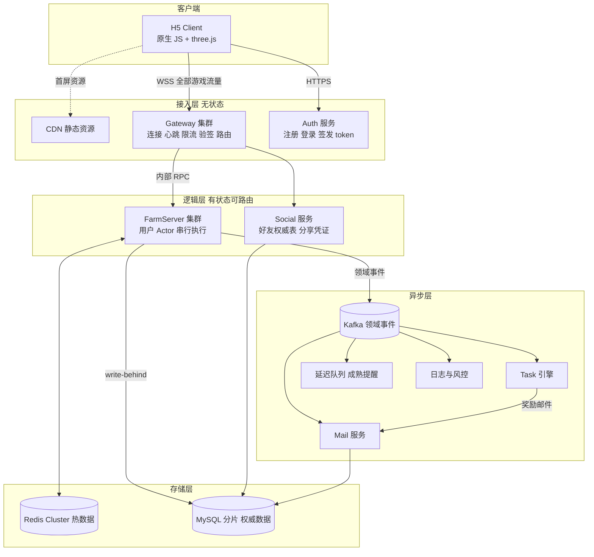
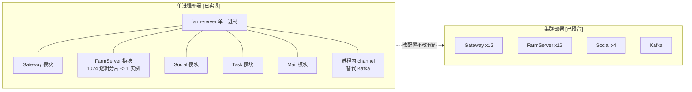
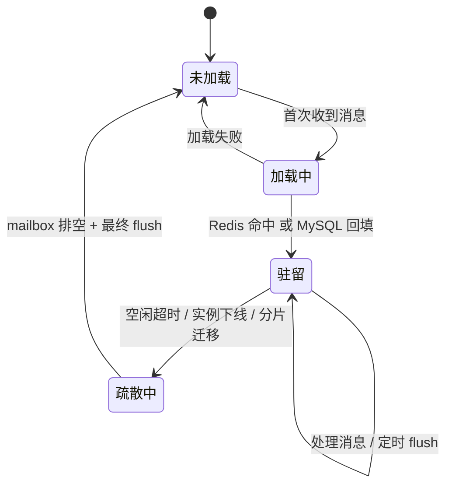
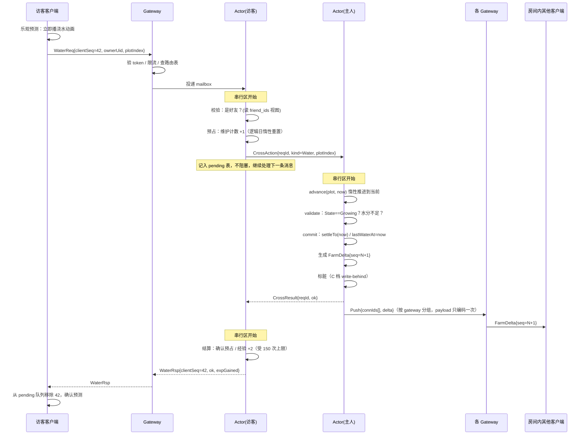
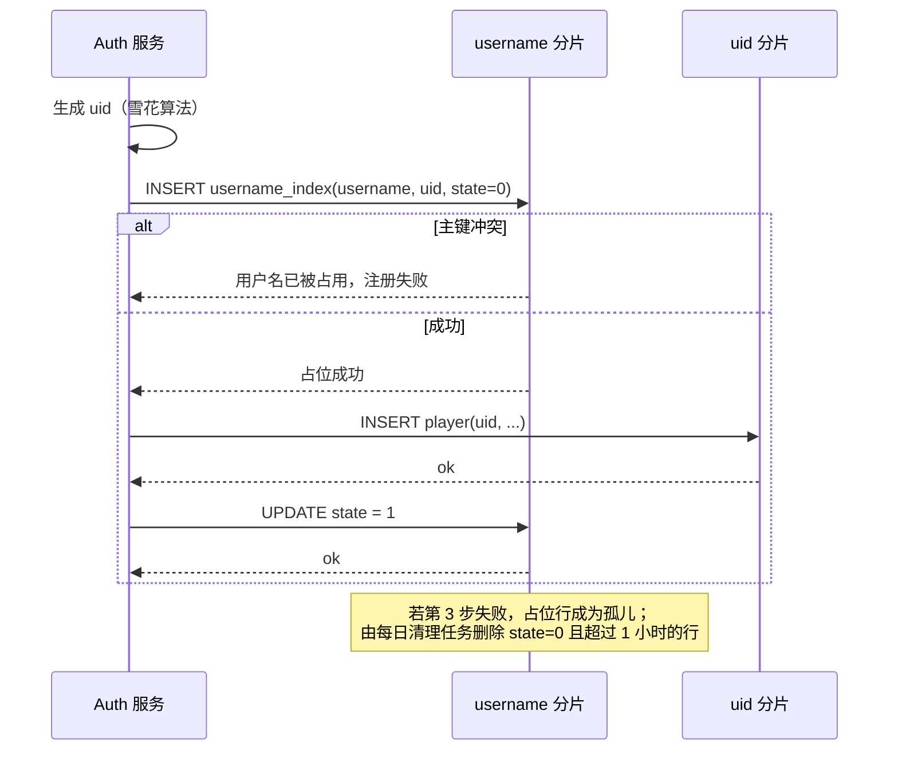
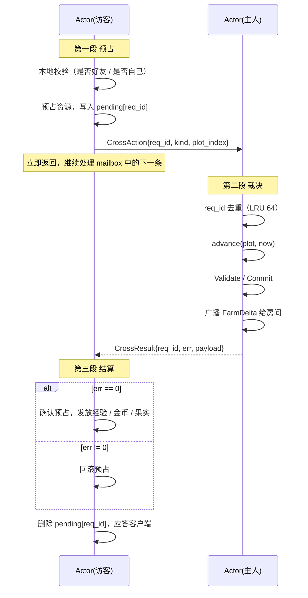
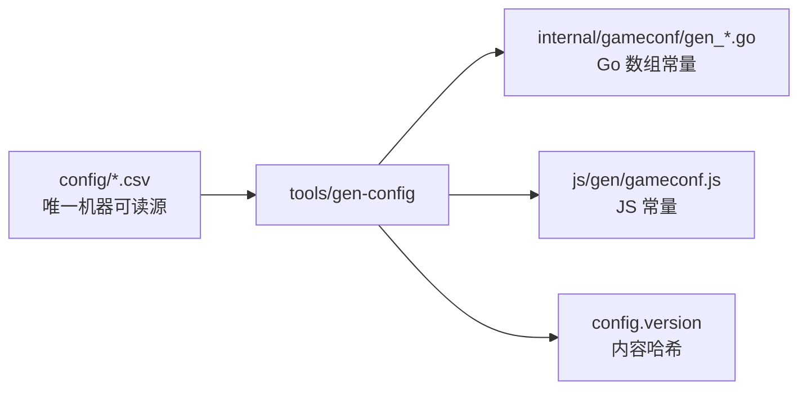
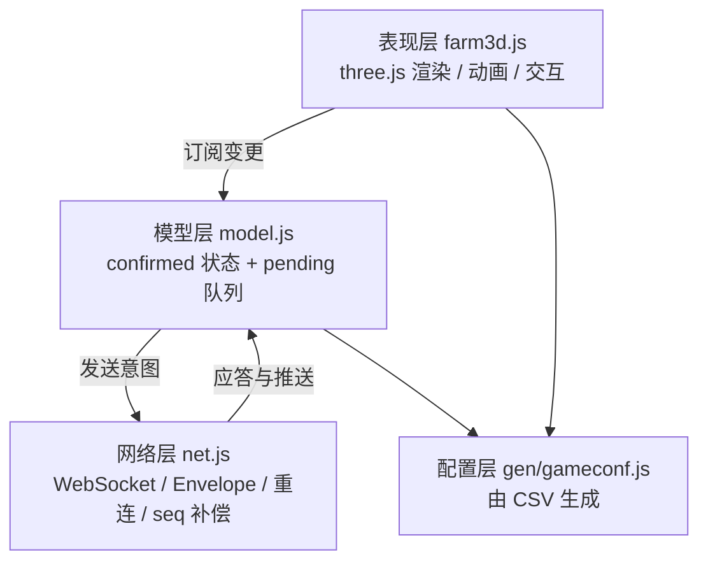

# 经典农场 · 技术架构设计文档

> 本文是技术层文档，描述「游戏应该怎么实现」。它承接 [game-design-full.md](game-design-full.md) 第 20.3 节声明的六项待定内容：服务端技术栈选型、数据模型与存储方案、接口定义、实时同步的实现机制、容量估算与压测方案、客户端表现层设计。
>
> 配套文件：
> - [protocol.md](protocol.md) —— 消息信封、错误码全表、房间同步协议、接口清单
> - [capacity-and-benchmark.md](capacity-and-benchmark.md) —— 容量推导、瓶颈分析、压测方案
> - [capacity-model.py](capacity-model.py) —— 容量估算脚本，本文第 2 章的全部数字由它产出，可复现
>
> 上游依据：[game-design-full.md](game-design-full.md) —— 玩法功能与参数设计。本文引用它时写作「策划 X.Y 节」。

---

## 1. 文档口径与约束

### 1.1 与策划文档的分工

策划文档定义**规则**，本文定义**机制**。两者的边界是严格的：

- 策划说「普通作物成熟后永久保持可收获状态」，本文说「`Mature` 不再有时间驱动的后继状态，也不需要 `wither_at`」
- 策划说「失败不产生任何副作用」，本文说「所有动作强制 validate / commit 两阶段，validate 阶段纯读」
- 策划说「先到先得」，本文说「单 Actor 串行执行，这是串行化的直接推论，不需要锁」

任何数值都不在本文重新定义。本文出现的数值全部是引用，改动必须回到策划文档和 [verify-balance.py](verify-balance.py)。

### 1.2 实现程度标注

策划文档用 `[原版]/[考据]/[设计]/[新增]` 标注数值来源。本文用三级标注区分**设计规模**与**实际交付**，避免把纸面设计说成已完成的工作：

| 标注 | 含义 |
| --- | --- |
| `[已实现]` | 3 周内实际编码并跑通，有测试或压测数据支撑 |
| `[已预留]` | 接口和数据结构按目标形态写好，但只在单实例下运行过。扩容时不需要改代码，只需要改配置 |
| `[仅设计]` | 只有设计，未编码。给出设计的目的是证明架构在该规模下成立，以及标出扩容路径 |

一个例子：分片路由 `shard = hash(uid) % 1024` 是 `[已预留]`——代码里真实存在且走通了，但 1024 个逻辑分片全部映射到同一个物理实例；而跨机房容灾是 `[仅设计]`。

### 1.3 双轨口径

题目要求「按 3000w DAU 做架构设计、容量估算、瓶颈分析和压测验证」，同时项目周期只有 3 周。这两者不冲突，但必须说清楚各自的落点：

- **设计轨**：架构按 3000w DAU 展开，容量估算给出完整推导与机器清单，瓶颈按压测暴露顺序逐个分析
- **实现轨**：单进程部署，跑通全部玩法，压测在单机上做，用实测拐点向集群外推

让这两轨不脱节的关键在于：**从第一天起就按目标形态写接口，只是把实例数配成 1**。具体做法见 4.2 节。

### 1.4 技术选型

| 层 | 选型 | 理由 |
| --- | --- | --- |
| 服务端语言 | Go 1.22+ | goroutine + channel 与 Actor 模型同构，mailbox 就是一个 channel；单机长连接能力强；`pprof` 和 `go test -bench` 让压测和瓶颈定位几乎零成本 |
| 传输 | WebSocket（游戏流量） + HTTPS（注册登录） | 服务端要主动推送地块变更，必须长连接。农场是秒级更新的房间制玩法，不需要 UDP/KCP，见 2.3 节 |
| 序列化 | Protobuf 定义 schema，传输层可切 JSON / binary | 开发期用 JSON 便于抓包调试，压测期切 binary。只维护一份 `.proto` |
| 热数据 | Redis 7 | Actor 的 backing store 与跨进程共享状态 |
| 持久化 | MySQL 8 分库分表 | 游戏数据是强 schema 的，关系模型合适；分片方案见 5.7 节 |
| 消息 | Kafka `[仅设计]` / 进程内 channel `[已实现]` | 领域事件的扇出。单进程阶段退化为 channel，接口一致 |
| 客户端 | 原生 JS + three.js | 沿用已有的 [js/farm3d.js](../../js/farm3d.js)。3 周内换引擎不划算 |

不选 Node.js 的理由：农场的核心是大量长驻内存的独立状态机，Go 的抢占式调度和多核并行让每个 Actor 天然是一个 goroutine，而单线程事件循环需要手工做时间片切分。不选 Java 的理由：3 周内自己写一套 Actor 框架，Go 的成本明显更低。

### 1.5 非目标

以下内容明确不做，也不在架构中预留位置：

- 支付与计费、公会、PVP、交易行、多农场
- 跨机房容灾与异地多活（单区域部署，`[仅设计]` 层面提一句演进方向即可）
- 第三方 OAuth（策划 4.1 节已定为用户名 + 密码）
- 客户端热更新与资源分包（3 周内不做，首包直出）

---

## 2. 约束与规模

### 2.1 三个真问题

3000w DAU 这个数字本身不产生设计，它产生的是三个必须回答的问题：

| 表面需求 | 真实技术问题 | 本文的回答 |
| --- | --- | --- |
| 种植循环 | 3000w 用户 × 18 块地 = 5.4 亿个「定时器」怎么办 | 决策 D1：全惰性状态推进，零定时器 |
| 多人同农场实时同步 | 同一份状态被多个写者并发修改，如何串行化且低延迟 | 决策 D2：用户 Actor，单 mailbox 串行执行 |
| 3000w DAU | 数据怎么分片、状态放哪、扩容路径是什么 | 决策 D4：逻辑分片固定 1024，物理实例可变 |

### 2.2 容量估算摘要

完整推导见 [capacity-and-benchmark.md](capacity-and-benchmark.md)，全部数字由 [capacity-model.py](capacity-model.py) 产出。这里只列结论：

| 指标 | 数值 | 备注 |
| --- | ---: | --- |
| DAU | 3,000 万 | 题目给定 |
| 平均并发 | 41.7 万 | 人均日 4 次会话 × 5 分钟 |
| 峰值并发 PCU | 166.7 万 | 晚高峰系数 4 |
| PCU 设计值 | 200 万 | 留 20% 余量 |
| 平均 QPS | 4.2 万 | 人均日 120 次操作 |
| 峰值 QPS | 20.8 万 | 峰值系数 5 |
| QPS 设计值 | 25 万 | 留 20% 余量 |
| 峰值出向消息 | 31.7 万 msg/s | 应答 + 房间广播 |
| 峰值出向带宽 | 0.63 Gbps | 单消息约 250 B |
| 热数据 | 约 10 KB / 用户 | 逐字段拆解见 5.8 节 |
| 在线总存储 | 3.1 TB | 注册用户按 DAU × 4 估 |
| 核心集群规模 | 102 台 | 网关 12 + 逻辑 16 + Redis 16 + MySQL 32 + 其他 26 |
| 单机压测通过线 | 24,038 QPS | 由集群规模反推，见容量文档 |

带宽不到 1 Gbps 这个结果值得单独说一句：**这个系统不是带宽密集型的**。农场的每次交互只传输一个地块的状态变更，几百字节，而且没有位置同步这类高频流。真正紧张的是连接数和 CPU。

最后一行是这份容量估算最有用的产物：它把「3000w DAU」这个抽象目标翻译成了一个**单机可验证的通过线**。压测只要证明单进程能稳定跑到 24,038 QPS 且 P99 未爆炸，整个容量模型就闭环了。推导过程见 [capacity-and-benchmark.md](capacity-and-benchmark.md) 第 4 章。

### 2.3 一个决定性判断：这不是 MMO

看到「多人实时同步」就套用 MMO 的 AOI、帧同步、KCP，是这道题最常见的过度设计。农场的实时同步和 MMO 的实时同步是两种东西：

| 维度 | MMO | 本项目 |
| --- | --- | --- |
| 房间人数 | 数百到数千 | 主人 + 若干访客，实测均值约 1.3，峰值几十 |
| 位置移动 | 有，需要 AOI 裁剪 | 无，地块是固定的 18 个格子 |
| 更新频率 | 10—60 Hz | 秒级，由玩家点击驱动 |
| 单次广播扇出 | O(几百) | O(几) |
| 延迟要求 | 100 ms 以内，抖动敏感 | 500 ms 以内即无感 |
| 状态同步方式 | 帧同步或状态同步 + 插值 | 事件 diff |

结论是：**不需要 AOI、不需要帧同步、不需要 UDP/KCP、不需要客户端插值**。TCP 上跑 WebSocket，服务端推 diff，客户端应用，就够了。

这个判断是整个架构成立的前提。正因为扇出是 O(几) 而不是 O(几百)，200 万 PCU 的广播压力才只有 31.7 万 msg/s——如果换成 MMO 的扇出模型，同样的 PCU 会产生上亿 msg/s，那是完全不同的系统。

反过来说，如果把它设计成 MMO，不只是浪费，而是会被质疑没有理解问题。

---

## 3. 核心设计决策

本章用 ADR（Architecture Decision Record）格式：每条决策给出**决策内容、驱动理由、被否决的替代方案、代价**。代价那一栏不能空着——没有代价的决策通常意味着还没想清楚。

### D1 全惰性状态推进，零后台定时器

**决策**：农场中的所有随时间演化的状态——作物成熟、缺水、长草、生虫、狗粮消耗、逻辑日重置——一律不设服务端后台定时器，全部在被访问时按需推进到当前时刻。正在观看农场的客户端只维护一个最近边界 timer，在风险窗口或成熟点发送 `SyncFarm`；`SyncFarm` 先执行 `AdvanceAll(now)`、同步落盘并产生 Delta，再返回权威结果。成熟后没有新的普通作物时间边界。客户端 timer 只是触发一次读取，不直接修改状态。日常任务同样不需要后台定时器：读取时用服务器 `time.Local` 的自然日 key 查询或初始化当天记录。

**驱动理由**

策划文档 7.1 节已经把最难的一半做完了：「照料影响产量而不是速度」使得**成熟时刻在播种那一刻就固定下来**，仅化肥会显式修正它。这让「作物是否成熟」退化为 `now >= mature_at` 一次整数比较，不需要对生长历史做分段积分。

策划 7.5 节的增量结算是另一半：地块只存「累计扣减量」和「上次结算时刻」，任何一次结算的计算量只与距上次结算的时长有关。

在这两条之上，惰性推进就自然成立了。收益是数量级的：3000w 用户 × 18 块地 = 5.4 亿个状态，如果每个都挂定时器，光是定时器堆的内存和 tick 开销就足以压垮系统；而惰性推进下，**后台负载严格为零**，CPU 只在玩家实际操作时才消耗。

**替代方案与否决理由**

| 方案 | 否决理由 |
| --- | --- |
| 每个地块一个定时器 | 5.4 亿定时器，不可行 |
| 全局时间轮，每秒 tick 一批 | 每秒要扫描的地块数 = 5.4 亿 / 平均周期，仍是十万量级的持续 CPU 消耗，且这些计算 99% 是浪费的（没人在看） |
| 定期批量扫表更新状态 | 数据库写放大严重，且状态在两次扫描之间是陈旧的 |

**代价**

- 读路径变重：每次读地块都要先跑一次 `advance()`。但该函数是纯内存 O(10) 计算，实测约 200 ns，相对于一次网络往返完全可忽略
- 「成熟提醒」这类主动推送仍需要定时器。但这是**通知**不是**状态**，走延迟队列即可，且可以按用户合并（同一用户 5 分钟内的多个成熟合并成一条）`[仅设计]`
- 概率性事件（长草、生虫）不能用普通随机数，必须改造成确定性可重放的形式。这是 D1 引出的额外工作，见 5.4 节

**这条决策的一个额外好处**：状态可以从任意时点重算复现。定位线上问题时，把地块的原始字段和一个时间戳喂给 `advance()` 就能重现当时的状态，不需要日志回放。

### D2 用户 Actor：按数据所有权切分，而不是按功能切分

**决策**：一个玩家的**全部**数据——农场地块、仓库、背包、金币、经验、任务进度、邮件、图鉴、宠物——装进同一个 Actor（一个 mailbox + 一个处理循环）。所有对该玩家数据的写操作，无论发起者是他本人还是访客，都投递到这个 mailbox 串行执行。

```
shard = hash(uid) % 1024   ->  逻辑分片
逻辑分片 -> 物理 FarmServer 实例（路由表，可变）
实例内 -> Actor(uid) 的 mailbox
```

**驱动理由**

第一，它让策划 13.3 节的三条冲突规则**不需要任何实现**就成立了：

- 「先到先得」= mailbox 的 FIFO 顺序
- 「失败可解释」= 串行执行下校验看到的是确定状态，不存在「校验时通过、提交时失效」
- 「硬上限不可突破」= 40% 额度的读改写在串行区内，没有竞态

如果不用 Actor，这三条各自需要分布式锁或 CAS 重试，而且「失败无副作用」在 CAS 重试模型下很难保证（重试期间可能已经产生了部分副作用）。

第二，农场游戏里 90% 的操作只触碰单个玩家的数据。把仓库、金币、任务拆成独立服务，会让一次「收获」变成四次 RPC（改地块、加仓库、发经验、推任务进度），延迟和故障率都会成倍上升。

**替代方案与否决理由**

| 方案 | 否决理由 |
| --- | --- |
| 无状态服务 + Redis 分布式锁 | 每个操作至少两次 Redis 往返（加锁、解锁），加上业务读写共四次。锁超时和锁续期是持续的故障源 |
| 无状态服务 + 数据库行锁 | 热点农场（大 V）会造成行锁排队，且事务边界横跨多表 |
| 按功能拆微服务（农场服/仓库服/任务服） | 一次收获四次 RPC；跨服务事务需要 saga；本质上是把本可以是本地调用的东西变成了分布式问题 |
| 按农场（而不是按用户）建 Actor | 农场和用户是一对一的（策划 4.1 节），但仓库、金币这些不属于农场。分成两个 Actor 会让「收获」这个最高频的操作变成跨 Actor 的 |

**代价**

- Actor 是有状态的，因此 FarmServer 不能无状态扩缩容。需要路由表、Actor 迁移和优雅下线机制，见 4.4 节
- 单个 Actor 是单线程的，理论上会成为热点上限。但纯内存操作单核可达每秒数十万次，而单个农场的实际操作频率是每秒个位数，余量有六个数量级
- 跨玩家操作（访客浇水、偷菜）必须走异步消息，不能同步调用。这引出了 7.2 节的跨农场动作协议

### D3 分级持久化：按数据价值决定一致性强度

**决策**：不对所有写操作使用同一种持久化策略，而是按数据价值分三档。

| 档 | 数据 | 策略 | 数据丢失窗口 |
| --- | --- | --- | ---: |
| A | 隐藏种子掉落、扩地、购买消耗、邮件附件领取 | 同步写 DB，返回成功前落盘 | 0 |
| B | 金币变动、经验变动、收获入库、偷菜结算 | 追加 op-log 到顺序日志，Actor 重启时 replay | ≈ 0 |
| C | 浇水、除草、除虫、地块健康度中间态 | write-behind，标脏后攒批，30 秒或 200 条触发 flush | ≤ 30 秒 |

**驱动理由**

农场的写操作有极强的价值分层。一次浇水丢了，玩家最多少 2 点经验，重新浇一次即可；而一次「花 50 万金币开垦第 18 块地」丢了，是事故。用一套策略覆盖两者，要么性能不可接受（全同步），要么风险不可接受（全异步）。

C 档带来的性能收益是决定性的：一次白萝卜生长周期内玩家会浇水 3 次、除草除虫 2 次，加上健康度结算，产生约 10 次地块写。攒批后合并成 1 次 `UPDATE`，**写合并率约 5:1 到 10:1**。这直接把 MySQL 的分片需求从 80 个降到 16 个。

**代价**

- 进程崩溃会丢失最多 30 秒的 C 档数据。这个窗口内玩家可能已经看到了浇水成功的反馈——需要在客户端重连时用服务端状态强制覆盖本地状态，见 9.3 节
- 需要维护三条不同的写路径和一个 op-log replay 机制，复杂度实打实地增加了
- 写合并率是一个必须监控的指标，如果它掉下来（比如玩家行为模式变化），DB 压力会突然上升。它列在 10.1 节的指标清单里

### D4 逻辑分片固定 1024，物理实例可变

**决策**：分片键是 `uid`，逻辑分片数固定为 **1024**，永不改变。逻辑分片到物理实例的映射存在一张路由表里，可以随时调整。

```
uid -> hash(uid) % 1024 -> 逻辑分片号 -> 查路由表 -> 物理实例
```

**驱动理由**

直接对物理实例数取模（`hash(uid) % N`）的致命问题是：N 变化时几乎所有数据都要搬家。而逻辑分片这一层间接使得**扩容只需要搬迁若干个逻辑分片，其余数据完全不动**。

从 1 个实例扩到 16 个实例的具体步骤 `[仅设计]`：

1. 新实例上线，路由表暂不指向它
2. 选定要迁走的 64 个逻辑分片，对这些分片开启双写（源实例写完后同步给目标实例）
3. 全量拷贝这 64 个分片的历史数据
4. 校验一致后，原子切换路由表条目；切换瞬间源实例把这些分片上的 Actor 全部 drain + flush，拒绝新消息并回复「重定向」
5. 客户端收到重定向后重连，Gateway 重新查路由表
6. 关闭双写，清理源实例上的残留数据

整个过程不停服，单个玩家感知到的是一次约 100 ms 的重连。

1024 这个数字的选择：它要足够大以支持未来的实例数（16 个实例时每个实例 64 个逻辑分片，粒度合适），又要足够小以让路由表能放进内存并被所有节点缓存（1024 个 int32 = 4 KB）。

**代价**

- 路由表本身需要强一致的分发机制（etcd 或 Redis + 版本号 + 长轮询）`[仅设计]`
- 迁移期间的双写窗口存在数据不一致风险，需要校验步骤
- 单实例阶段这一层是纯开销（多一次查表）。但这个开销是一次数组索引，可以忽略

### D5 好友关系：单行权威 + 可重建物化视图

**决策**：好友关系的权威存储是一张 `friendship(uid_lo, uid_hi)` 表，主键为二元组，按 `hash(uid_lo, uid_hi)` 分片。每个玩家自己分片内的 `friend_ids` 只是一个**可随时重建的读缓存**，不是权威数据。

**驱动理由**

策划 11.2 节有一条硬约束：「好友关系必须要么双向建立，要么完全不建立，不允许出现 A 的列表里有 B 而 B 的列表里没有 A 的状态。」

而「双向」天然意味着要写两个玩家的数据，在按 uid 分片的模型下这是跨分片写。常见做法是双写两份加最终一致，但那恰恰会在中间态产生策划明令禁止的单向关系。

单行存储把原子性问题消灭在源头：一次 `INSERT` 带唯一键约束，要么成功要么冲突，天然原子且天然幂等（重复点击分享链接返回「已是好友」就是靠唯一键冲突）。约定 `uid_lo = min(a,b)`、`uid_hi = max(a,b)`，保证同一对好友无论从哪一方发起都落在同一行、同一分片。

而读路径的性能靠物化视图保证：`friend_ids` 是一个 ≤ 200 个 uint64 的紧凑数组（1.6 KB），直接存在玩家自己的记录里，读「我的好友列表」永远是单分片单次读。视图与权威数据不一致时，从 `friendship` 表按两个索引扫一遍即可重建。

**代价**

- 写路径变成两步：先写权威行，成功后异步更新双方的视图。中间态是「关系已建立但视图未更新」——这不违反策划约束（关系本身是双向原子的），只是列表刷新有轻微延迟
- 需要一个视图重建工具和一个每日对账任务 `[仅设计]`
- 好友数上限检查（200 上限）需要读两个玩家的视图，是跨分片读。但读比写容易得多，且允许轻微超限后由对账修正

### D6 服务端权威 + 客户端乐观预测

**决策**：客户端只发送**意图**（「我要在 3 号地播 5 号种子」），不发送结果。所有判定、随机数、时间戳一律以服务端为准。客户端可以本地预测并立即播放动画，但服务端应答与预测不一致时无条件以服务端为准。

**驱动理由**

策划第 8 章已经明确写了「所有动作均为服务端权威判定，客户端的显示只是预期结果」。架构上要把它落实到三个具体位置：

- **时间**：完全忽略客户端上报的时间戳。客户端本地倒计时只是显示，靠定期校时对齐（9.4 节）
- **随机**：隐藏种子掉落、长草生虫、偷菜数量、狗拦截，全部在服务端计算
- **配置**：客户端持有的作物表只用于渲染和预测，任何数值判定都不信任它

乐观预测是必须的，不是可选项：农场的操作节奏很快（连续点击 18 块地收获），如果每次点击都要等一个网络往返才有反馈，手感会非常差。

**代价**

- 客户端需要维护「已确认状态 + 待确认操作队列」两层状态，并实现回滚，见 9.3 节
- 预测逻辑和服务端逻辑存在重复。缓解手段是配置管线两端共用同一份生成代码（第 8 章），但判定逻辑仍需写两遍

---

## 4. 系统架构

### 4.1 目标形态



各服务的职责边界：

| 服务 | 有状态 | 职责 | 为什么独立 |
| --- | :-: | --- | --- |
| Gateway | 否 | 连接管理、心跳、限流、token 验签、按 uid 路由、房间推送分发 | 连接数和逻辑负载的伸缩曲线不同，必须能独立扩容 |
| Auth | 否 | 注册、登录、签发 token | 登录洪峰的流量特征与游戏流量完全不同；且它是唯一需要处理密码的地方，隔离有安全价值 |
| FarmServer | 是 | 用户 Actor，全部玩法逻辑 | 系统的核心。有状态，按逻辑分片路由 |
| Social | 否 | 好友权威表读写、分享凭证签发与校验 | 好友关系的分片键不是 uid（见 D5），与 FarmServer 的分片规则不同，无法合并 |
| Task | 否 | 订阅领域事件，推进任务进度 | 事件驱动，与玩法解耦；新增任务类型不改玩法代码 |
| Mail | 否 | 邮件收发、附件领取 | 全服邮件的存储模型特殊（模板 + 游标），见 5.7 节 |

**Task 和 Mail 为什么不放进 Actor**：这看起来违反 D2「按数据所有权切分」。理由是任务进度和邮件都是**事件驱动的被动数据**——玩家很少主动查，但产生它们的事件量很大。放进 Actor 意味着每个领域事件都要唤醒目标 Actor，而目标 Actor 可能根本不在线。独立成服务后，事件可以在离线状态下积累。玩家的任务进度和未读邮件数会在 Actor 加载时一并拉入内存缓存。

### 4.2 3 周内的实现形态

**同一份代码，两种部署。**



让这个「改配置不改代码」成立，靠四条纪律：

1. **所有跨服务调用走接口，不走直接函数调用**。单进程下接口的实现是本地调用，集群下是 gRPC。调用方看不出区别
2. **路由表从第一天就存在**。单实例阶段路由表是 `[1024]int32{0,0,...,0}`，全部指向实例 0
3. **事件总线从第一天就存在**。单进程下 `EventBus.Publish()` 往 channel 里丢，集群下往 Kafka 里丢
4. **绝不在 Actor 内同步等待另一个 Actor**。这条是死锁防线，也是分布式化的前提。单进程下如果偷懒直接调用对方 Actor 的方法，代码在集群下会彻底不可用

第 4 条最容易被违反，因为单进程下直接调用「能跑」。7.2 节的跨农场动作协议就是为了从设计上堵死这条捷径。

### 4.3 Actor 生命周期



| 阶段 | 行为 |
| --- | --- |
| 加载 | 先查 Redis，miss 则查 MySQL 并回填 Redis。加载期间到达的消息进入 mailbox 排队，不丢弃。同一 uid 的并发加载用 singleflight 合并 |
| 驻留 | 内存是权威。写操作标脏，按 D3 分档持久化。默认空闲超时 10 分钟 |
| 疏散 | 停止接收新消息（新消息返回「重定向，请重连」），排空 mailbox，执行最终 flush，然后从实例的 Actor 表中移除 |
| 迁移 | 分片迁移时对该分片上的全部 Actor 触发疏散，路由表切换后由目标实例重新加载 |
| 优雅下线 | 收到 SIGTERM：从负载均衡摘除 → 停止接受新连接 → 对全部 Actor 触发疏散 → 等待全部 flush 完成 → 退出。有超时兜底（30 秒） |

**空闲超时为什么定 10 分钟**：策划 3.2 节的会话模型是「人均日 4 次、单次 5 分钟」。10 分钟的超时能覆盖单次会话内的短暂停顿（玩家去看好友农场再回来），又不会让离线用户长期占用内存。这个值是可配置的，压测时会验证它对内存和加载 QPS 的影响。

### 4.4 一次浇水的完整链路

选浇水作为范例，是因为它是最能体现架构复杂度的高频操作：它既是跨玩家的（访客给主人浇水），又要改双方数据（主人的地块、访客的经验和计数器），还要广播给房间内所有人。



链路上有五个细节值得单独说明：

**为什么访客 Actor 要先预占计数**。策划 4.4 节规定维护动作每逻辑日前 150 次计经验，而策划第 8 章规定「失败不产生任何副作用」。如果先执行再计数，那么「主人 Actor 判定失败」时计数已经被消耗；如果先计数再执行，失败时需要回滚。选择预占 + 确认/回滚，是因为它同时满足两条规则，且回滚在 Actor 串行模型下是安全的（预占和回滚都在访客 Actor 的串行区内）。

**为什么访客 Actor 不阻塞等待**。这是 4.2 节第 4 条纪律。访客 Actor 发出 `CrossAction` 后立即返回去处理 mailbox 里的下一条消息，结果通过另一条消息异步回来。pending 表记录 `reqId -> {clientSeq, 预占内容, 超时时刻}`，5 秒超时则回滚预占并给客户端返回超时错误。如果这里阻塞等待，两个玩家互相给对方浇水就会死锁。

**为什么广播要按 gateway 分组**。房间内可能有 3 个订阅者分布在 2 个 Gateway 上。朴素做法是发 3 个包、编码 3 次；分组后是发 2 个包、编码 1 次。在 200 万 PCU 下这个差异是实打实的 CPU 和网络开销，详见容量文档的瓶颈分析。

**delta 的 seq 从哪来**。每个农场 Actor 维护一个单调递增的 `farmSeq`，任何改变地块的操作都 +1。客户端据此检测丢包，见 [protocol.md](protocol.md) 的房间同步协议。

**为什么响应和广播是两条消息**。访客自己也在房间里，会同时收到 `WaterRsp` 和 `FarmDelta`。这看起来冗余，但两者语义不同：`WaterRsp` 是对「我的这次请求」的应答（携带 clientSeq，用于确认乐观预测和结算经验），`FarmDelta` 是「农场状态变了」的广播（携带 farmSeq，用于状态同步）。合并它们会让协议在「访客不在房间内」等边界情况下变得混乱。

---

## 5. 领域模型与数据模型

本章是全文技术密度最高的部分。核心目标只有一个：**把策划文档的规则翻译成一组不需要定时器、不需要浮点、可以从任意时点重放的数据结构和纯函数。**

### 5.1 聚合边界

一个 Actor 持有一个玩家的完整聚合：

```
FarmAggregate (Actor 内存态)
├── Core        uid / nickname / level / exp / coin
├── Plots       [18]Plot                地块，5.2 节
├── Items       map[ItemKey]uint32      背包 + 仓库
├── Codex       uint64                  图鉴 bitmap，29 条作物
├── Daily       DailyState              逻辑日维护计数器；任务进度按自然日持久化，5.6 节
├── Pet         PetState                看家狗与狗盆，5.7 节
├── FriendIDs   []uint64                好友视图缓存，权威在 Social（决策 D5）
├── MailSummary 未读数 / 待领附件数      邮件正文按需拉取
├── Room        subscribers / farmSeq / deltaRing   房间同步状态
└── Pending     map[reqId]PendingAction 跨 Actor 请求表，7.2 节
```

明确**不在**聚合内的三类数据：

| 数据 | 归属 | 理由 |
| --- | --- | --- |
| `friendship` 权威行 | Social 服务 | 分片键是 `(uid_lo, uid_hi)`，与 uid 分片规则不同（决策 D5） |
| 邮件正文 | Mail 服务 | 离线也会持续产生，且体积远大于其访问频率 |
| 配置表 | 全局只读单例 | 进程启动时加载，所有 Actor 共享同一份，零拷贝 |

### 5.2 地块数据结构

地块是全系统被读写最频繁的对象，字段设计直接决定内存占用和 CPU 开销。

```go
// 全部时间字段为毫秒级 UNIX 时间戳，全部时长字段为已按 TIME_SCALE 折算的绝对毫秒数。
type Plot struct {
    State        uint8  // 六态状态机（策划 5.1）
    SeasonIndex  uint8  // 当前第几季，0-based
    SeasonTotal  uint8  // 总季数，冗余自配置
    StageCount   uint8  // 生长阶段数 3 或 4，冗余自配置
    FertMask     uint8  // 各阶段是否已施肥的位掩码（策划 9.1 约束一）
    WeedNextWin  uint8  // 下一个待判定的杂草风险窗口序号
    PestNextWin  uint8  // 下一个待判定的害虫风险窗口序号
    _            uint8

    CropID       uint16
    FinalYield   uint16 // 跨越成熟点时固化的实际产量
    StolenCount  uint16 // 本轮已被偷走的数量
    _            uint16

    PlantNonce   uint32 // 每次播种由 CSPRNG 生成，参与随机种子构造
    HarvestRound uint32 // 成熟轮次，偷菜去重的作用域

    SeasonStartAt   int64 // 本季开始时刻，风险窗口的时间原点
    SeasonDuration  int64 // 本季「名义」生长时长，施肥不改变它
    MatureAt        int64 // 实际成熟时刻，施肥时前移
    LastSettleAt    int64 // 健康度上次结算时刻
    LastWaterAt     int64 // 上次浇水时刻，播种视为浇水
    WeedSince       int64 // 杂草出现时刻，0 表示无草
    PestSince       int64 // 害虫出现时刻，0 表示无虫
    AccruedWeighted int64 // 累计加权扣减，单位「百分点·毫秒」，5.5 节

    Stealers []uint32 // 本轮已偷过的 uid，通常为 nil
}
```

结构体大小 **112 字节**，18 块地共 2 KB。`Stealers` 在绝大多数情况下是 nil（只占 24 字节的 slice header），最坏情况 200 个好友全来偷同一块地时才增长到 800 字节。

**为什么冗余存 `SeasonTotal` 和 `StageCount`**。它们完全可以从 `CropID` 查配置得到。冗余存储是为了延续策划 3.3 节确立的「地块自描述」原则：配置热更改动了某作物的季数时，在途作物按播种时的配置继续跑完，不会出现「种下去是 2 季，收的时候变 3 季」。

**为什么区分 `SeasonDuration` 和 `MatureAt`**。这是策划文档留下的一处需要架构层裁决的歧义。策划名词表把「本季生长时长」定义为「从开始到成熟所需的缩放时长」，同时它又是「健康度与照料参数的统一分母」；而策划 8.7 节的施肥会缩短成熟时刻。如果施肥同时改变分母，会引发两个问题：

1. 健康度分母变小 → 已累积的扣减占比变大 → 施肥导致健康度**下降**，玩家无法理解
2. 风险窗口长度 = 分母 × 10%，分母变小则窗口边界整体移位 → 已判定过的窗口序号失效

因此本文裁定：**`SeasonDuration` 是播种时确定的名义时长，永不改变，作为健康度、水分持续、风险窗口的统一分母；施肥只前移 `MatureAt`。** 副作用是施肥会间接小幅提高产量（暴露在不良状态下的时间变短了），这与策划 9 章「化肥不提高产量」有轻微出入，但量级极小且方向自然。这一条列入 11.3 节的待策划确认项。

**`MatureAt` 一个字段承担两个用途**。定义「名义生长进度」`g(now) = SeasonDuration - (MatureAt - now)`，则：

- 播种时 `now = SeasonStartAt`、`MatureAt = SeasonStartAt + SeasonDuration`，得 `g = 0`
- 成熟时 `now = MatureAt`，得 `g = SeasonDuration`
- 施肥缩短 `d` 时 `MatureAt -= d`，`g` 立即前跳 `d`——正是施肥的语义
- 当前生长阶段 = `g × StageCount / SeasonDuration`
- 当前阶段剩余名义时长 = `(stage+1) × SeasonDuration / StageCount - g`，正是策划 9.1 约束二的判据

所以不需要单独存 `FertShortened` 或阶段进度，一个 `MatureAt` 同时服务于「是否成熟」的热路径判断和「当前处于哪个阶段」的施肥校验。

**不再需要 `WitherAt`**。策划 5.3 节规定普通作物成熟后永久保持可收获状态；`Mature` 只会被收获动作推进到下一季或残株状态。未来特殊限时作物若需要失效时间，应使用独立、逐作物配置，不能改变普通作物的推进规则。

### 5.3 惰性推进：advance()

这是决策 D1 的落地。**所有读写地块的入口，第一件事必须是调用 `advance()`。** 没有例外——查看农场要调，浇水要调，偷菜要调，持久化前也要调。

```go
// advance 把地块状态惰性推进到 now。
// 前置条件：now >= p.LastSettleAt（服务端时间单调）
// 普通作物只随时间从 Growing 推进到 Mature。
func advance(p *Plot, ctx *Ctx, now int64) {
    if p.State != StateGrowing {
        // Mature / Wasteland / Tilled / Residue / Withered 不随时间演化
        return
    }
    if now < p.MatureAt {
        settleTo(p, ctx, now)
        return
    }
    // 跨越成熟点：先把健康度结算到成熟时刻为止，再固化产量
    settleTo(p, ctx, p.MatureAt)
    p.FinalYield = computeYield(p, ctx)
    p.State = StateMature
    p.HarvestRound++
    p.StolenCount = 0
    p.Stealers = p.Stealers[:0]
}
```

三个跨界情况的处理：

| 跨界 | 触发方式 | 处理 |
| --- | --- | --- |
| 跨越成熟点 | 时间驱动，`advance()` 内 | 结算健康度到 `MatureAt` 为止（策划 7.2：成熟后不再产生不良状态），固化 `FinalYield`，轮次 +1，清空偷菜记录 |
| 跨越季边界 | **动作驱动**，不在 `advance()` 内 | 由收获动作触发，见下 |

**为什么跨季不由时间驱动**。策划 5.1 的状态机是 `Mature --收获--> Growing`：多季作物必须由主人收获才进入下一季，放着不收会一直保持成熟并承受被偷风险。所以季边界是动作的效果，不是时间的效果。

收获时进入下一季的重置逻辑（策划 7.5「多季作物每季独立结算」）：

```go
func enterNextSeason(p *Plot, ctx *Ctx, now int64) {
    p.SeasonIndex++
    p.SeasonStartAt   = now                      // 从收获时刻起算，不是从上一季成熟时刻
    p.SeasonDuration  = ctx.Conf.SeasonDuration(p.CropID, p.SeasonIndex)  // 已折算
    p.MatureAt        = now + p.SeasonDuration
    p.LastSettleAt    = now
    p.LastWaterAt     = now                      // 策划 7.2：播种/新季视为已浇水
    p.AccruedWeighted = 0                        // 健康度重置为 100
    p.WeedSince, p.PestSince = 0, 0
    p.WeedNextWin, p.PestNextWin = 0, 0
    p.FertMask = 0
    p.State = StateGrowing
}
```

`SeasonStartAt = now`（收获时刻）而不是上一季的 `MatureAt`，意味着**拖延收获会拖长全周期**。这是一个刻意的选择：玩家可以永久保留当前成熟季，但不收获就不会开始下一季，同时还会承受被偷风险。策划 6.3 表格中的「全周期」因此是连续及时收获时的理论下界。

### 5.4 健康度结算与确定性伪随机

#### settleTo

```go
// settleTo 把健康度结算推进到 t。调用方保证 t <= MatureAt。
func settleTo(p *Plot, ctx *Ctx, t int64) {
    from := p.LastSettleAt
    if t <= from {
        return
    }

    // 缺水：完全确定，无需随机。策划 7.2 水分持续时长 = 本季 35%
    dryFrom := max(from, p.LastWaterAt+p.SeasonDuration*WaterRatioNum/WaterRatioDen)
    dryMs := max(0, t-dryFrom)

    weedMs := scanHazard(p, ctx, from, t, &p.WeedSince, &p.WeedNextWin, HazardWeed)
    pestMs := scanHazard(p, ctx, from, t, &p.PestSince, &p.PestNextWin, HazardPest)

    // 权重 44 / 26 / 30，策划 7.3
    p.AccruedWeighted += WDry*dryMs + WWeed*weedMs + WPest*pestMs
    p.LastSettleAt = t
}
```

#### scanHazard：概率事件的惰性重放

杂草和害虫是本项目唯一「概率生成且随时间演化」的状态，也是惰性推进最难处理的部分。策划 7.2 规定每季 10 个风险窗口、每个窗口按 12% / 10% 独立判定。朴素做法需要一个每窗口触发一次的定时器，那就回到了 D1 要消灭的问题。

解法的关键观察：**在一次结算区间 `[from, t)` 内不存在任何玩家动作**（动作只发生在 `t` 时刻，且动作发生前必然先结算到 `t`）。因此该区间内不良状态至多发生一次「无 → 有」转移，永远不会发生「有 → 无」。这把逻辑压成了一个不带回溯的单向扫描。

```go
// scanHazard 返回 [from, t) 区间内该类不良状态的持续毫秒数，
// 并按需惰性判定尚未判定过的风险窗口。
//
// 不变式 I：SeasonStartAt + nextWin*windowLen >= LastSettleAt
//   含义是「所有起点早于上次结算时刻的窗口都已判定完毕」。
//   该不变式在长草时会被暂时打破，由 clearHazard 在除草时恢复。
func scanHazard(p *Plot, ctx *Ctx, from, t int64,
                since *int64, nextWin *uint8, kind uint8) int64 {
    if *since == 0 {
        windowLen := p.SeasonDuration / RiskWindows // 策划 7.2：恒为 10 个窗口
        for k := *nextWin; k < RiskWindows; k++ {
            wStart := p.SeasonStartAt + int64(k)*windowLen
            if wStart >= t {
                break // 该窗口尚未到来，留给下次结算
            }
            *nextWin = k + 1
            if hazardHit(ctx, p, kind, k) {
                *since = wStart // 不良状态从窗口起点开始存在
                break
            }
        }
    }
    if *since == 0 {
        return 0
    }
    return t - max(*since, from)
}
```

配套的清除逻辑必须恢复不变式，否则会出现「刚除完草立刻又长出来」的 bug：

```go
// clearHazard 由除草 / 除虫动作调用，t 为动作时刻。
func clearHazard(p *Plot, since *int64, nextWin *uint8, t int64) {
    *since = 0
    windowLen := p.SeasonDuration / RiskWindows
    // 把 t 所在窗口及之前的窗口全部标记为已判定。
    // 不这样做的话，下一次结算会重新命中「当前窗口」，草在除掉的瞬间又长出来。
    k := (t-p.SeasonStartAt)/windowLen + 1
    if k > RiskWindows {
        k = RiskWindows
    }
    if uint8(k) > *nextWin {
        *nextWin = uint8(k)
    }
}
```

#### hazardHit：种子构造

```go
func hazardHit(ctx *Ctx, p *Plot, kind, window uint8) bool {
    var buf [24]byte
    binary.LittleEndian.PutUint64(buf[0:], ctx.UID)         // 谁的农场
    binary.LittleEndian.PutUint32(buf[8:], p.PlantNonce)    // 哪一次播种
    buf[12] = p.PlotIndex                                    // 哪块地
    buf[13] = p.SeasonIndex                                  // 第几季
    buf[14] = kind                                           // 草还是虫
    buf[15] = window                                         // 第几个窗口
    binary.LittleEndian.PutUint64(buf[16:], ctx.HazardSalt) // 服务端秘密盐
    return xxhash.Sum64(buf[:])%10000 < ctx.Conf.HazardThreshold[kind] // 1200 / 1000
}
```

这个构造要同时满足四条性质：

| 性质 | 由哪部分保证 | 为什么需要 |
| --- | --- | --- |
| 确定性 | 输入中不含任何随时间变化的量 | 任意时刻重算得到同一结果，多人同时访问同一农场看到完全一致的杂草状态 |
| 序列独立 | `uid + plotIndex + seasonIndex + kind` | 不同地块、不同季、草和虫的判定序列互不相关 |
| 轮次独立 | `PlantNonce` | 见下 |
| 不可预测 | `HazardSalt` | 见下 |

**`PlantNonce` 解决的问题**。若种子只由 `(uid, plotIndex, seasonIndex, kind, window)` 构成，那么同一块地反复种植时每一轮的判定序列完全相同，玩家会发现「3 号地永远在第 2 个窗口长草」。`PlantNonce` 在每次播种时由服务端 CSPRNG 生成并写入地块，打破这个模式。它的代价只有 4 字节。

**`HazardSalt` 必须持久化**。它是服务端秘密常量，防止玩家离线复现哈希从而预知长草时刻。如果每次进程启动随机生成，重启后在途作物**尚未判定**的窗口序列会改变——已判定的部分已固化在 `AccruedWeighted` 和 `WeedSince` 里所以不会破坏数据，但会让 D1「状态可从任意时点重放复现」这个调试优势失效。因此盐存在配置里，与数据库同生命周期。

**哈希函数选型**。xxhash64 单次约 5 ns，一次结算最多 20 次调用共约 100 ns。它不是密码学 PRF，理论上大量采样可以恢复盐；但攻击收益仅是「少浇几次水」，远低于攻击成本。如果需要严格不可预测性，换 SipHash-2-4（它正是为带密钥的短输入哈希设计的），成本约 2 倍，仍可忽略。

### 5.5 产量：全整数运算

策划 7.3 节把三项权重设计为和恰好等于 1.00。这个设计除了语义上的优雅，还有一个未被策划文档提及的工程收益：**整个健康度到产量的链路可以用纯整数表达，且是精确的。**

设 `A = AccruedWeighted`（单位「百分点·毫秒」）、`D = SeasonDuration`（毫秒）：

```text
健康度      = 100 - A / D
产量系数    = 0.6 + 0.4 × 健康度 / 100
            = 0.6 + 0.4 × (100 - A/D) / 100
            = 1 - A / (250 × D)
实际产量    = floor(基础产量 × (250×D - A) / (250×D))
```

```go
func computeYield(p *Plot, ctx *Ctx) uint16 {
    base := int64(ctx.Conf.Crop(p.CropID).YieldPerSeason)
    d, a := p.SeasonDuration, p.AccruedWeighted
    // 策划 7.3：权重和为 1.00 使 clamp 在理论上永不触发。
    // 保留它作为断言性质的防线——触发即意味着结算逻辑有 bug。
    assertDev(a <= 100*d)
    if a > 100*d {
        a = 100 * d
    }
    return uint16(base * (250*d - a) / (250 * d))
}
```

与策划 7.4 节的产量系数表逐项核对，整数公式给出完全相同的结果：

| 照料档位 | A / D | `(250 - A/D) / 250` | 策划表 |
| --- | ---: | ---: | ---: |
| 完美照料 | 0 | 1.0000 | 1.0000 |
| 仅缺水全程 | 44 | 0.8240 | 0.8240 |
| 仅带草全程 | 26 | 0.8960 | 0.8960 |
| 仅带虫全程 | 30 | 0.8800 | 0.8800 |
| 轻度疏忽 | 32.6 | 0.8696 | 0.8696 |
| 典型放置 | 70.4 | 0.7184 | 0.7184 |
| 三项全程犯满 | 100 | 0.6000 | 0.6000 |

**为什么坚持不用浮点**。四条理由，最后一条是决定性的：

1. 浮点在不同 CPU、不同编译优化下可能有末位差异，会破坏 D1「任意时刻重放得到相同结果」
2. `AccruedWeighted` 是累加量，多季作物几十次结算后浮点误差会累积
3. 整数运算更快，且没有 NaN / Inf 这类需要防御的输入
4. **产量是向下取整的**。浮点在边界值（`15.9999999` 与 `16.0000001`）上会产生 off-by-one，表现为「完全相同的照料，有时收 16 个有时收 15 个」。这类问题在客服工单里几乎无法解释，在测试里也极难复现

溢出检查：`base ≤ 35`，`D ≤ 139 缩放小时 = 5.004×10⁸ ms`（策划 6.3 最长的葫芦），`250 × D × base ≈ 4.4×10¹²`，远小于 int64 上界 `9.2×10¹⁸`。

### 5.6 逻辑日与自然日任务：两类边界都不需要定时器

#### 逻辑日的惰性重置

```go
func logicalDayID(ctx *Ctx, now int64) uint32 {
    if ctx.Conf.TimeProfile == ProfileAuthentic {
        return uint32((now + 8*Hour) / (24 * Hour)) // 策划 3.4：UTC+8 每日 00:00
    }
    // 其余档位从服务启动时刻起滚动，间隔 = max(24h × TIME_SCALE, 5min)
    return uint32((now - ctx.ServiceStartAt) / ctx.Conf.LogicalDayMs)
}

type DailyState struct {
    DayID        uint32
    MaintainCnt  uint16    // 维护动作计经验计数，上限 150（策划 4.4）
}

// 每次访问前调用。DayID 不匹配即整体归零，无需任何定时任务。
func (d *DailyState) sync(dayID uint32) {
    if d.DayID != dayID {
        *d = DailyState{DayID: dayID}
    }
}
```

如果没有这个惰性重置，「每逻辑日重置 3000w 用户的维护计数器」在 `bench` 档下会变成每 5 分钟一次全量刷写，是一个纯粹自找的瓶颈。

#### 日常任务的自然日按需初始化

任务不跟随 demo 逻辑日。`TaskList`、玩法进度推进与领奖都根据服务器 `time.Local` 计算 `YYYYMMDD` 日 key，并以 `(uid, day_key, task_id)` 持久化。首次访问当天时用幂等插入初始化固定四项：播种、收获、拜访好友农场、每日登录；其中每日登录的进度与目标均为 1。

```go
func localDayKey(now time.Time) int64 {
    local := now.In(time.Local)
    return int64(local.Year()*10_000 + int(local.Month())*100 + local.Day())
}
```

到下一个本地 00:00 时，新的 day key 自然指向一组新记录，不需要批量重置。任务奖励通过任务页直接入账；每日登录复用 task_id=4，旧 `ClaimDailyLogin` 命令仅代理同一状态。任务与每日登录奖励不进入邮箱。

### 5.7 狗盆：自描述的时间

策划 12.2 节：狗盆 120 g，标准粮耗 5 g/缩放小时，盆空则拦截率归零。同样不需要定时器，但需要处理时间档切换。

```go
type PetState struct {
    ActiveDog   uint8     // 0 = 未启用
    Owned       uint8     // 位掩码
    DogLevel    [3]uint8  // 策划 12.3：各狗种等级独立保留
    Intercepts  [3]uint16 // 各狗种累计成功拦截次数
    BowlEmptyAt int64     // 狗盆吃空的时刻
    MsPerGram   int64     // 加粮时按当时时间档折算的每克维持毫秒数
}

func (p *PetState) IsGuarding(now int64) bool {
    return p.ActiveDog != 0 && now < p.BowlEmptyAt
}
```

存 `BowlEmptyAt` 而不是「剩余克数 + 上次结算时刻」，和地块存 `SeasonDuration` 而不是 `CropID` 是同一个理由——策划 3.3 节确立的**自描述**原则。时间档切换后，已加的粮仍按加粮时的速率消耗，不会突然烧光或永不烧光。

唯一的不一致点在跨档加粮：一个 `BowlEmptyAt` 无法同时表达两种消耗速率。处理方式是加粮时按当前档位把整盆重新折算：

```go
func (p *PetState) Feed(now int64, gram int64, msPerGram int64, capacity int64) {
    remain := int64(0)
    if p.BowlEmptyAt > now && p.MsPerGram > 0 {
        remain = (p.BowlEmptyAt - now) / p.MsPerGram // 按旧速率折回克数
    }
    total := min(capacity, remain+gram)              // 策划 12.2：盆容量 120 g
    p.MsPerGram = msPerGram
    p.BowlEmptyAt = now + total*msPerGram
}
```

切档只在运维操作时发生，不是玩家动作，因此这处近似可以接受。

### 5.8 存储模型与分片

#### 分片规则

| 数据 | 分片键 | 逻辑分片数 | 说明 |
| --- | --- | ---: | --- |
| 玩家全部数据 | `uid` | 1024 | 与 Actor 路由用同一个函数，保证 Actor 与其数据永远同分片 |
| 好友关系权威表 | `(uid_lo, uid_hi)` | 1024 | 决策 D5。同一对好友无论从哪方发起都落在同一行同一分片 |
| 用户名唯一索引 | `username` | 1024 | 见下文的注册流程 |
| 全服邮件 | 不分片 | — | 全量很小，单表足够 |

#### 表结构

```sql
-- 分片键 uid
CREATE TABLE player (
  uid                BIGINT UNSIGNED PRIMARY KEY,
  nickname           VARCHAR(32)     NOT NULL,
  level              SMALLINT UNSIGNED NOT NULL,
  exp                INT UNSIGNED    NOT NULL,
  coin               BIGINT          NOT NULL,
  codex_bitmap       BINARY(8)       NOT NULL,  -- 29 条作物，8 字节有余
  friend_ids         VARBINARY(1600) NOT NULL,  -- 物化视图，<= 200 个 uint64
  daily_blob         VARBINARY(64)   NOT NULL,  -- DailyState 打包
  pet_blob           VARBINARY(64)   NOT NULL,  -- PetState 打包
  global_mail_cursor BIGINT UNSIGNED NOT NULL,
  created_at         BIGINT          NOT NULL,
  updated_at         BIGINT          NOT NULL
);

CREATE TABLE farm_plot (
  uid        BIGINT UNSIGNED  NOT NULL,
  plot_index TINYINT UNSIGNED NOT NULL,
  blob       VARBINARY(256)   NOT NULL,        -- Plot 结构体打包
  PRIMARY KEY (uid, plot_index)
);

-- 背包与仓库共用，靠 kind 区分（策划 10.2 职责分离，但存储结构相同）
CREATE TABLE item (
  uid     BIGINT UNSIGNED   NOT NULL,
  kind    TINYINT UNSIGNED  NOT NULL,          -- 1 种子 2 化肥 3 狗粮 4 果实
  item_id SMALLINT UNSIGNED NOT NULL,
  count   INT UNSIGNED      NOT NULL,
  PRIMARY KEY (uid, kind, item_id)
);

CREATE TABLE mail (
  uid        BIGINT UNSIGNED  NOT NULL,
  mail_id    BIGINT UNSIGNED  NOT NULL,
  type       TINYINT UNSIGNED NOT NULL,
  payload    VARBINARY(512)   NOT NULL,
  state      TINYINT UNSIGNED NOT NULL,        -- 位标志：已读 / 已领
  created_at BIGINT           NOT NULL,
  PRIMARY KEY (uid, mail_id)
);

-- 分片键 (uid_lo, uid_hi)，与 uid 分片规则不同
CREATE TABLE friendship (
  uid_lo     BIGINT UNSIGNED NOT NULL,         -- 约定 uid_lo = min(a, b)
  uid_hi     BIGINT UNSIGNED NOT NULL,
  created_at BIGINT          NOT NULL,
  PRIMARY KEY (uid_lo, uid_hi),
  KEY idx_hi (uid_hi, uid_lo)                  -- 重建 friend_ids 视图用
);

-- 分片键 username
CREATE TABLE username_index (
  username VARCHAR(32) PRIMARY KEY,
  uid      BIGINT UNSIGNED  NOT NULL,
  state    TINYINT UNSIGNED NOT NULL,          -- 0 占位中 1 已生效
  created_at BIGINT         NOT NULL
);

-- 不分片
CREATE TABLE global_mail (
  mail_id    BIGINT UNSIGNED PRIMARY KEY,
  payload    VARBINARY(512) NOT NULL,
  publish_at BIGINT         NOT NULL,
  expire_at  BIGINT         NOT NULL
);
```

#### 为什么大量使用 blob

`farm_plot.blob`、`daily_blob`、`pet_blob` 都是整体读写的结构体，从不按内部字段做条件查询。拆成列只会增加行宽、增加 schema 变更成本，而换不来任何查询能力。

代价是明确的：不能用 SQL 直接排查数据。缓解手段是提供一个 `farmctl dump <uid>` 命令行工具，把 blob 解成可读 JSON。

反例是 `item` 表——它保持了展开的列，因为运营需要「某道具的全服存量」这类聚合查询，而且道具种类是可变长的。

#### 分片系统里的全局唯一约束

`username` 必须全局唯一，但它和 `uid` 的分片规则不同，所以注册是一个跨分片操作。标准解法是「先占位后确认」：



这里刻意不用分布式事务：孤儿占位行的唯一后果是某个用户名在 1 小时内不可用，代价远低于引入 2PC 的复杂度和性能损失。

#### 全服邮件：不写 3000w 行

策划 15.1 节有「系统公告」类型的邮件。朴素实现是给每个玩家插一行，一次公告 3000w 次写入——这会是全系统最大的单点写压力，而且它是完全可以避免的。

模型改成「一份模板 + 每玩家一个游标」：

- `global_mail` 表存公告本体，一次公告只写 1 行
- `player.global_mail_cursor` 记录该玩家已读到的最大 `mail_id`
- 读取收件箱时，取 `mail_id > cursor AND now < expire_at` 的公告，与个人邮件归并展示
- 带附件的公告需要额外记录已领取的 `mail_id` 集合。因为策划 15.2 规定邮件只保留 7 天，这个集合最多几十条，用一个变长 id 列表存在 `player` 里即可

#### 图鉴：4 个字节

策划 16 章共 29 条（26 普通 + 3 隐藏）。用一个 `uint64` bitmap，实际只用 29 位。里程碑判定是一次 `popcount`。这是全系统性价比最高的一处存储设计——一个看起来需要「收集列表」的功能，最终只占 8 字节且判定是单条 CPU 指令。

#### 单用户热数据拆解

这张表是容量估算的输入，[capacity-model.py](capacity-model.py) 直接引用它：

| 组成 | 字节 | 说明 |
| --- | ---: | --- |
| 玩家核心字段 | 128 | uid / 昵称 / 等级 / 经验 / 金币 / 时间戳 |
| 地块 | 2,016 | 18 × 112 B |
| 好友视图 | 1,600 | 200 × 8 B，满好友时的上界 |
| 仓库 + 背包 | 732 | 29 种果实 + 32 种道具 |
| 每日状态 | 64 | DailyState |
| 宠物 | 64 | PetState |
| 图鉴 | 8 | bitmap |
| 邮件摘要 | 2,560 | 20 封 × 128 B 摘要，正文按需拉 |
| 小计 | **7,172** | |
| Go 运行时开销 ×1.4 | **10,041** | 对象头、slice header、map 桶、内存对齐 |

取 **10 KB / 用户** 作为容量估算基数。

---

## 6. 动作执行模型

### 6.1 所有动作共用一个形状

策划第 8 章为每个动作定义了「执行者 / 前置状态 / 消耗 / 效果 / 奖励 / 失败原因」六个要素，并给出一条通用规则：**失败不产生任何副作用**。把这条规则从「程序员的自觉」变成「结构性保证」，是本章的目的。

```go
type Action interface {
    // Validate 纯读，不得修改任何状态。返回 0 表示可执行。
    Validate(a *FarmAggregate, ctx *Ctx) ErrCode
    // Commit 只在 Validate 返回 0 之后调用，且不返回错误——它必须成功。
    Commit(a *FarmAggregate, ctx *Ctx) *Effect
}

func Execute(a *FarmAggregate, ctx *Ctx, act Action) (*Effect, ErrCode) {
    advanceAll(a, ctx, ctx.Now) // 惰性推进，全系统唯一入口
    if err := act.Validate(a, ctx); err != 0 {
        return nil, err // 此处返回时，聚合状态与进入前完全一致
    }
    eff := act.Commit(a, ctx)
    a.Room.farmSeq++
    a.markDirty(eff.DirtyMask)
    ctx.Bus.Publish(eff.Events...)
    return eff, 0
}
```

**`Commit` 不返回错误，这是一条强约束**。它强迫所有失败判断必须在 `Validate` 里做完；如果实现 `Commit` 时发现了一个 `Validate` 没检查的条件，那是设计缺陷，唯一正确的修法是把检查移到 `Validate`，而不是在 `Commit` 里加一个 `return err`。

这个约束能够严格成立，靠的是决策 D2 的 Actor 串行——`Validate` 和 `Commit` 之间不可能有其他操作插入，因此 `Validate` 看到的状态就是 `Commit` 执行时的状态。在锁模型下这条约束做不到：要么持锁跨越两个阶段（锁持有时间变长），要么接受 TOCTOU（检查通过后状态已变）。

**这是决策 D2 和策划「失败无副作用」规则的交汇点**：Actor 串行让两阶段成为可能，两阶段让「失败无副作用」从口头约定变成类型系统级别的保证。

### 6.2 状态机转移表

策划 5.2 节的权限矩阵直接编码成一张查表，而不是散落在各个动作的 `Validate` 里：

```go
// allowed[状态][动作] = 是否允许。直接对应策划 5.2 的表格。
var allowed = [StateCount][ActionCount]bool{
    StateWasteland: {ActTill: true},
    StateTilled:    {ActPlant: true},
    StateGrowing:   {ActWater: true, ActWeed: true, ActPest: true, ActFertilize: true},
    StateMature:    {ActHarvest: true, ActSteal: true},
    StateResidue:   {ActClear: true},
    StateWithered:  {ActClear: true},
}
```

测试用表驱动方式遍历全部 `6 × 9 = 54` 个组合，逐一断言允许或拒绝。策划表格改动时，测试和实现改同一处。

### 6.3 领域事件

策划 14.1 节明确：「任务进度由玩法动作产生的事件驱动累加，而不是由任务系统主动轮询。这让新增任务类型不需要改动玩法代码。」这是策划层给出的架构约束，本节是它的落地。

```go
// 动作的 Commit 只负责产生事件，不关心谁消费
type Effect struct {
    DirtyMask uint32
    Events    []Event
    Rsp       proto.Message
}

// 任务只消费播种、收获与拜访事件；其余事件仍可供邮件、数据上报和风控消费。
type (
    Planted        struct{ UID uint64; CropID uint16 }
    Watered        struct{ UID, TargetUID uint64 }
    WeedRemoved    struct{ UID, TargetUID uint64 }
    PestRemoved    struct{ UID, TargetUID uint64 }
    Fertilized     struct{ UID uint64 }
    CropHarvested  struct{ UID uint64; CropID uint16; Amount uint32 }
    StealSucceeded struct{ UID, TargetUID uint64; CropID uint16; Amount uint32 }
    ItemSold       struct{ UID uint64; ItemID uint16; Amount, Coin uint32 }
    FriendAdded    struct{ UIDA, UIDB uint64 }
    LevelUp        struct{ UID uint64; NewLevel uint16 }
    CodexUnlocked  struct{ UID uint64; CropID uint16 }
)
```

事件同时服务四个消费方：任务引擎（推进进度）、邮件服务（升级奖励、被偷通知）、数据上报（进数仓）、风控（异常行为检测）。新增任何一方都不需要改玩法代码。

---

## 7. 一致性与并发

### 7.1 三个一致性层级

不同范围用不同强度的一致性，这是有意的分层而不是妥协：

| 范围 | 机制 | 保证 | 典型延迟 |
| --- | --- | --- | ---: |
| 单玩家聚合内 | Actor 串行 + validate/commit | 线性一致，强原子 | 微秒 |
| 跨两个玩家 | 预占—裁决—结算三段式 + `req_id` | 最终一致，有界（5 秒超时） | 毫秒 |
| 玩家与独立服务之间 | 权威表 + 可重建视图 / 事件驱动 | 最终一致 | 秒级 |

**90% 以上的操作落在第一层**——播种、收获、施肥、购买、出售、扩地、领邮件、领任务，全部只触碰单个玩家的数据。第二层只有四个动作（浇水、除草、除虫、偷菜的跨农场路径）。第三层只有好友关系和邮件。

### 7.2 跨农场动作协议

这是全系统唯一需要分布式协调的地方，因此值得设计成一个**统一的、可复用的模式**，而不是每个动作各写一套。

#### 三段式



访客侧的 pending 记录是一个小状态机：

```text
Idle --发起且预占落盘--> Reserved --主人裁决并持久化回执--> Settled --> Idle
                                   --裁决失败--> RolledBack --> Idle
                                   --客户端 5 秒超时--> Reserved
Reserved --10 秒未收到可结算回执--> RolledBack --> Idle
```

#### 各动作的预占内容

| 动作 | 预占什么 | 成功时 | 失败时 |
| --- | --- | --- | --- |
| 浇水 | 维护计数 +1（策划 4.4 的 150 次上限） | 发放 +2 经验 | 计数 −1 |
| 除草 / 除虫 | 同上 | 发放 +2 经验 + 5 金币（策划 8.5） | 计数 −1 |
| 偷菜 | 冻结「果实单价 × 10」金币 | 解冻，果实入仓库 | 解冻 |
| 偷菜被狗拦截 | 同上 | — | **冻结额转为实扣，全额转给主人**（策划 12.4） |

**为什么必须预占而不是事后结算**。策划 4.4 的 150 次上限是访客侧的资源，而动作的成败由主人侧裁决。如果不预占，就会出现「主人侧成功了，但访客侧发现计数已满」的状态——此时动作已经生效，无法撤销。预占把资源检查提前到发起端，与「失败无副作用」保持一致。

**偷菜的冻结是资损防线**。策划 12.4 规定被狗抓到要赔付「果实单价 × 10」金币。如果只在发起时检查余额充足、被拦截时才扣款，玩家可以在等待窗口内把金币花光来逃避赔付。虽然单次收益只有几百金币，但这是一个可稳定复现的漏洞。冻结的成本极低（访客 Actor 串行区内的一次减法），因此没有理由不做。协议层为此新增了错误码 `ERR_STEAL_NO_AFFORD`（[protocol.md](protocol.md) 4.5 节），策划文档中没有这一条。

#### 三条铁律

**铁律一：Actor 内绝不同步等待另一个 Actor。** 访客 Actor 发出 `CrossAction` 后立即返回，结果通过另一条消息异步回来。如果这里阻塞等待，玩家 A 给 B 浇水的同时 B 给 A 浇水就会立刻死锁。单进程阶段直接调用对方 Actor 的方法「能跑」，这正是它危险的地方——代码在集群化时会彻底不可用。

**铁律二：`req_id` 全局唯一且由发起方生成。** 主人 Actor 的内存 LRU 只用于热路径；每次裁决的 `CrossResult` 还要与主人地块变更一起写入聚合的 64 条持久化回执表，并保留 10 分钟。这样即使 Actor 卸载、进程重启或 MQ 延迟重投，同一个 `req_id` 也返回**第一次的原始结果**，而不是按变化后的地块状态重新判定。

**铁律三：超时最终必须回滚。** 5 秒是客户端等待回执的上限：到点只返回 `ERR_TIMEOUT`，但不能立即退款，因为主人可能已提交。预占保留到 10 秒；这段时间的迟到回执仍正常结算，10 秒后仍无可结算回执才由聚合惰性回滚。预占创建、主人裁决回执和访客结算都同步落盘，保证重启后仍可继续这个状态机。

### 7.3 三个验收场景的保证机制

策划 13.4 节把三个场景定为「多人同农场」的验收标准。[protocol.md](protocol.md) 第 6 章给出了它们的消息序列，这里说明逻辑层为什么能保证。

**场景一 协同照料**。两个访客的动作都投递到主人 Actor 的同一个 mailbox，串行执行，各自产生一条 `farm_seq` 递增的 delta。房间内三方按 seq 顺序应用，最终状态必然一致。保证来自 D2，不需要额外机制。

**场景二 收获竞争**。关键在于 `FinalYield` 在跨越成熟点时就已固化（5.3 节），此后是一个不变量：

```text
收获得到的数量 = FinalYield - StolenCount
```

无论收获和偷菜谁先执行，等式两边都守恒。若收获先执行，地块离开 Mature 态，后到的偷菜在 `Validate` 阶段被状态机拒绝，返回 `ERR_HARVESTED_BY_OWNER`；若偷菜先执行，`StolenCount` 增加，后到的收获自动减去。**不存在「果实总量超过实际产量」的可能，因为总量根本不是加出来的，而是从一个固定值里减出来的。**

**场景三 偷菜额度竞争**。上限是一个整数常量：

```go
cap := int(p.FinalYield) * StealCapNum / StealCapDen // 40%，策划 11.3
n := min(rand(1, 10), cap-int(p.StolenCount))
if n <= 0 {
    return ERR_STEAL_QUOTA_EXHAUSTED
}
```

串行执行使 `cap - StolenCount` 的读改写不存在竞态，`StolenCount` 单调不减且严格不超过 `cap`。「单访客一轮一次」由 `Stealers` 列表保证，该列表在 `advance()` 跨越成熟点时清空，作用域天然与「一轮成熟」对齐。

### 7.4 对账 `[仅设计]`

最终一致的部分需要一个兜底的修复机制。每日低峰跑一次：

| 对账项 | 方法 | 修复动作 |
| --- | --- | --- |
| `friend_ids` 视图 | 与 `friendship` 权威表逐个比对 | 以权威表为准重建视图 |
| 僵尸 pending | 扫描超过 1 小时未结算的跨 Actor 记录 | 回滚预占并记录告警 |
| 孤儿用户名占位 | 扫描 `state=0` 且超过 1 小时的行 | 删除 |
| 经济守恒 | 用 Kafka 流水核算「金币产出 − 消耗 = 存量变化」 | 差异超阈值则告警，人工介入 |

经济守恒这一项在游戏项目里是刚需：它是发现「刷金币」类漏洞的唯一可靠手段。本项目的优势是 [verify-balance.py](verify-balance.py) 已经算出了各配置下的理论日产出，实测值可以直接对照，见 10.1 节。

---

## 8. 配置管线

### 8.1 单一数据源与两端代码生成



CSV 文件与策划 18 章的参数总表逐节对应：`crops.csv`、`hidden_crops.csv`、`fertilizer.csv`、`dogs.csv`、`land_chain.csv`、`tasks.csv`、`time_profiles.csv`、`health.csv`。

**为什么代码生成而不是运行时加载 JSON**，四条理由：

1. 编译期类型安全。字段名写错、类型不匹配，编译不通过，而不是上线后在某个冷门分支里 panic
2. 零解析开销。生成的是 `var Crops = [29]CropConf{...}` 这样的数组常量，访问是一次索引，不是 map 查找
3. **前后端共用同一份源**。这是决策 D6 的代价（客户端预测逻辑与服务端重复）的主要缓解手段——数值部分完全不可能不一致，只有判定逻辑需要写两遍
4. 配置版本号自然产生。`config.version` 是 CSV 内容的哈希，客户端握手时携带，不匹配则返回 `ERR_CONFIG_STALE` 强制刷新

### 8.2 与 verify-balance.py 的关系

策划 18 章声明「参数总表是配置的唯一来源」，而 [verify-balance.py](verify-balance.py) 的配置区与之逐项对应。引入 CSV 后出现了第三份拷贝，必须处理。

3 周内的做法：CSV 从参数总表誊写一次，并在 CI 中加一个比对脚本，检查 CSV 与 `verify-balance.py` 配置区的每一个数值是否一致，不一致则构建失败。

更彻底的做法是让 `verify-balance.py` 直接从 CSV 读取，消灭这份拷贝。这需要重构脚本的配置区，列为 3 周之后的后续项。

### 8.3 时间档切换的运行时语义

`TIME_SCALE` 在整个系统中**只被读取三次**：

| 读取位置 | 影响 |
| --- | --- |
| 播种 / 进入下一季 | 折算 `SeasonDuration` 并写入地块（策划 3.3） |
| 喂狗粮 | 折算 `MsPerGram` 并重算 `BowlEmptyAt`（5.7 节） |
| 计算逻辑日长度 | `LogicalDayMs = max(24h × TIME_SCALE, 5min)`（策划 3.4） |

前两处遵循自描述原则，切档后已在途的作物和已加的狗粮按原速率继续，不受影响。第三处会立即生效，可能导致逻辑日边界跳变一次——切档是运维动作而非玩家动作，这个代价可以接受。

把 `TIME_SCALE` 的读取点收敛到三处，是让「压测时切到 `bench` 档」这个操作安全可行的前提，也是 [capacity-and-benchmark.md](capacity-and-benchmark.md) 压测方案成立的基础。

---

## 9. 客户端架构

### 9.1 分层



现有的 [js/state.js](../../js/state.js) 目前是**本地权威状态**，需要改造成**服务端状态的镜像**。这是 3 周里前端最大的一块工作量，也是最容易被低估的——它不是加一个网络模块，而是把数据流的方向整个反转过来。风险登记在 11.2 节。

[js/farm3d.js](../../js/farm3d.js) 的渲染逻辑基本可以保留，只需把数据来源从本地状态换成模型层的订阅。

### 9.2 网络层

| 机制 | 参数 |
| --- | --- |
| 自动重连 | 指数退避 1s / 2s / 4s / 8s / 16s，上限 30s |
| 请求超时 | 10 秒 |
| 在途请求表 | `client_seq -> { resolve, reject, timer }` |
| 心跳与校时 | 每 30 秒一次 `Ping`（[protocol.md](protocol.md) 1.4 节） |

重连后对在途请求的处理是分类的：**幂等请求自动重发，非幂等请求转为提示用户手动重试**。分类依据就是 [protocol.md](protocol.md) 3.1 节的幂等分级——「状态机幂等」类可以放心重发，「显式去重」类虽然有 `client_seq` 保护也可以重发，只有跨 Actor 动作因为结果不确定（可能已经生效了）需要先拉状态再决定。

### 9.3 乐观更新与回滚

```text
渲染状态 = apply(confirmed, pending[])

发起操作         : pending.push(op)，立即重渲染
收到 Rsp{err=0}  : pending.remove(client_seq)
收到 Rsp{err≠0}  : pending.remove(client_seq)，播放失败反馈 + 错误码文案
收到 FarmDelta   : 更新 confirmed
重连完成         : confirmed = 服务端快照，pending 全部丢弃
```

**重连时无条件丢弃 pending，并用服务端快照覆盖 confirmed**，这是决策 D3 分级持久化的必然要求：C 档数据有最多 30 秒的丢失窗口，客户端可能持有一个服务端已经不认的状态。让客户端自作主张地合并会产生无法排查的状态分歧。

**哪些操作做乐观预测**，判据是「结果可由客户端确定性预测」且「失败是低概率」：

| 做乐观预测 | 不做 | 不做的原因 |
| --- | --- | --- |
| 浇水、除草、除虫 | 播种 | 要扣背包，且可能触发解锁校验 |
| 锄地、清理 | 收获 | 数量由服务端的健康度结算决定 |
| — | 偷菜 | 数量是服务端随机的（1—10），且可能被狗拦截 |
| — | 购买、出售 | 涉及金币，错了要回滚数字，观感很差 |

偷菜是最需要克制的一个：它的即时反馈需求最强，但结果最不可预测。硬做乐观预测的结果是玩家先看到「偷到 5 个」再跳变成「被狗抓了，赔了 170 金币」，比等 200 ms 糟糕得多。正确的做法是播放一段偷菜动画填充这段等待，结果在动画结束时揭晓——这也更符合玩法的紧张感。

### 9.4 时钟与倒计时

```text
serverNow() = Date.now() + offset      // offset 由 Ping/Pong 维护
剩余时间    = plot.mature_at - serverNow()
```

倒计时由 `requestAnimationFrame` 本地推进，**服务端不推送剩余时间**。这是决策 D1 惰性计算在客户端的镜像：既然 `mature_at` 是一个确定的时间戳，客户端拿到它之后完全可以离线算出任意时刻的剩余时间，没有理由让服务端每秒推一次。

客户端不能仅凭本地倒计时把 `Growing` 改成 `Mature`。它在最近的风险窗口或 `mature_at` 到达时请求一次 `SyncFarm`；服务端推进并返回 Delta 后才切换视觉状态。成熟后普通作物不再安排时间同步。`server_time` 用于校准客户端倒计时，边界操作发出前也会先做一次同步，因此不会出现画面仍显示生长、服务端却提示「作物不在生长中」的矛盾。

### 9.5 首屏

3 周内不做资源分包和热更新，首包直出，目标 **2 MB 以内**。

现有的 [js/farm3d.js](../../js/farm3d.js) 用程序化几何体而不是外部模型文件，这个选择对首包体积非常有利，予以保留。three.js 走 `vendor/` 本地引用，生产环境改为 CDN。

---

## 10. 可观测性

### 10.1 指标清单

#### 业务指标

| 指标 | 用途 |
| --- | --- |
| DAU / PCU / 新增 / 次日留存 | 基础盘 |
| 各动作 QPS（按 cmd 分） | 容量规划的实测输入，校正 [capacity-model.py](capacity-model.py) 的假设 |
| 偷菜成功率、各狗种拦截率 | 对照策划 12.4 的理论值 25% / 35% / 45% |
| 健康度分布 | 对照策划 7.4 的档位表 |
| 金币产出 / 消耗 / 存量 | 经济守恒对账（7.4 节） |

**把业务指标与 [verify-balance.py](verify-balance.py) 的预测值放在同一张监控面板上对照**，是这个项目独有的验证手段。策划 19.2 节已经算出「6 地白萝卜日均金币产出 2117、日均经验 438」这类具体预测，线上实测偏离超过 20% 就说明玩法实现或数值配置出了问题。绝大多数项目没有这样一份可对照的理论基线，这里有，应该用起来。

同理，各狗种的实测拦截率如果偏离配置值，几乎可以肯定是随机数或判定逻辑写错了——这类 bug 靠功能测试很难发现，靠指标对照一眼就能看出。

#### 系统指标

| 类别 | 指标 |
| --- | --- |
| 延迟 | P50 / P95 / P99，按 cmd 分组 |
| Actor | 驻留数、加载耗时、淘汰率、**mailbox 积压深度** |
| 广播 | 扇出分布、`编码次数 / 广播次数` 比值（应接近 `1/订阅者数`） |
| 持久化 | **write-behind 合并率**、flush 耗时、脏 Actor 数 |
| 缓存与存储 | Redis 命中率、MySQL 慢查询数、连接池等待 |
| Go 运行时 | GC pause、goroutine 数、堆大小、`sync.Pool` 命中率 |
| 连接 | 总连接数、单机连接数、握手 QPS、异常断连率 |

**mailbox 积压深度是最重要的单一健康指标。** 正常情况下它恒为 0 或 1；一旦某个 Actor 持续 > 10，说明它的处理速度跟不上投递速度，也就是出现了热点。它比 CPU 使用率更早、更精确地反映问题，因为 CPU 是全机聚合的，掩盖不了单个 Actor 的排队。设为核心告警项。

**write-behind 合并率**是决策 D3 的健康度量。它掉下来意味着 MySQL 压力会立刻上升，属于必须提前发现而不是事后救火的指标。

### 10.2 日志与流水

日志和流水是两回事，混在一起是常见错误：

| | 日志 | 业务流水 |
| --- | --- | --- |
| 目的 | 排查故障 | 对账、风控、数据分析 |
| 去向 | 本地文件 → 日志系统 | Kafka → 数仓 |
| 采样 | 成功 1%，失败 100% | **不采样，全量** |
| 内容 | `ts / level / uid / cmd / req_id / err / cost_us` | 金币变动、道具变动、偷菜、领奖、等级变化 |
| 可丢 | 可以 | 不可以 |

流水不能采样，否则 7.4 节的经济守恒对账就失去意义。

### 10.3 排障工具

三个命令行工具，都是决策 D1 的直接红利：

```bash
# 把 Actor 内存态与 DB 中的 blob 解成可读 JSON 并 diff，排查持久化不一致
farmctl dump <uid>

# 把某块地推进到指定时刻，打印每一步 settle 的明细：
# 各风险窗口的判定结果、缺水区间、累计扣减的构成
farmctl replay <uid> <plot_index> <timestamp>

# 校验某个玩家的好友视图与权威表是否一致
farmctl check-friends <uid>
```

`replay` 是最有价值的一个。因为惰性推进让地块状态成为原始字段的纯函数，定位「为什么我的菜只收了 12 个」这类问题时，不需要翻日志、不需要复现，把地块字段和时间戳喂进去就能得到完整的推导过程。这在有定时器的架构里是做不到的——那里的状态是一连串异步 tick 的累积结果，无法重建。

---

## 11. 三周排期与风险

### 11.1 逐日里程碑

按每周 6 个工作日、共 18 天安排。

#### 第 1 周 · 服务端骨架与种植循环

| 日 | 内容 | 交付判据 |
| ---: | --- | --- |
| D1 | 项目骨架、CSV 配置管线与两端代码生成、`.proto` 定义 | `make gen` 能从 CSV 产出 Go 与 JS 两份配置 |
| D2 | Actor 框架：mailbox、路由表、生命周期、pending 表、事件总线 | 能用单元测试驱动一个 Actor 收发消息并淘汰 |
| D3 | 地块模型、`advance()` / `settleTo()` / `scanHazard()` / 确定性伪随机 | 惰性推进的单元测试全绿，含跨成熟、成熟长期稳定、跨季 |
| D4 | 动作执行模型（validate / commit）、种植循环 8 个动作 | `6 × 9` 状态机矩阵的表驱动测试全绿 |
| D5 | 等级经验、扩地、商店、仓库背包、隐藏种子掉落 | 能在测试里跑通「从 0 级到开垦第 7 块地」的完整链路 |
| D6 | 测试补齐与重构 | 覆盖率达标，`advance()` 的 benchmark 达到 0 allocs/op |

**D3 单独占一整天是刻意的。** 它是全系统技术密度最高的部分（第 5 章），也是最容易埋下隐蔽 bug 的地方——`scanHazard` 的不变式一旦写错，表现是「偶尔除完草立刻又长出来」，这种问题在后期极难定位。在这里多花半天，比后面花两天排查划算。

#### 第 2 周 · 网络层与社交

| 日 | 内容 | 交付判据 |
| ---: | --- | --- |
| D7 | WebSocket 网关、Envelope、错误码、鉴权、限流 | 能用命令行客户端登录并执行一次锄地 |
| D8 | 房间订阅、delta 广播、seq 补偿、断线重连 | 两个客户端进同一农场，一方操作另一方即时可见 |
| D9 | 跨农场动作协议（预占—裁决—结算），接通浇水 / 除草 / 除虫 | 好友互助全链路通，且失败时预占正确回滚 |
| D10 | 好友权威表与视图、分享链接 HMAC 凭证 | 策划 11.2 节的四种情形逐一验证通过 |
| D11 | 偷菜、看家狗、赔付预扣 | 策划 13.4 节的三个验收场景全部通过 |
| D12 | 任务（事件驱动）、邮件、图鉴 | 完成任务 → 发奖励邮件 → 领取附件的链路闭环 |

#### 第 3 周 · 客户端与压测

| 日 | 内容 | 交付判据 |
| ---: | --- | --- |
| D13 | 客户端网络层、模型层改造（本地权威 → 服务端镜像） | 客户端能连上并渲染服务端下发的农场快照 |
| D14 | 乐观更新与回滚、时钟校准、`farm3d` 接真实数据 | 完整玩法在浏览器里可玩 |
| D15 | Redis 与 MySQL 落地：加载路径、write-behind、op-log | 重启进程后数据不丢 |
| D16 | 压测机器人、第一层与第二层压测，拿到基线 | 得到 v0 基线的 QPS 与 P99 |
| D17 | 四轮优化与对比数据 | 单机拐点 ≥ 24,038 QPS |
| D18 | 压测报告、演示脚本、答辩材料 | 三份文档定稿 |

### 11.2 风险登记

| # | 风险 | 影响 | 概率 | 缓解措施 |
| ---: | --- | :-: | :-: | --- |
| R1 | 客户端数据流反转的工作量被低估 | 高 | 高 | 见下 |
| R2 | 跨 Actor 协议的调试成本高 | 中 | 中 | D9 提前做，留出 D10—D12 三天暴露问题；`farmctl` 工具在 D2 就搭好 |
| R3 | `advance()` 的边界情况在后期才暴露 | 高 | 中 | D3 用属性测试（随机生成时间序列，断言不变式）而不只是样例测试 |
| R4 | 压测环境不足 | 低 | 低 | 已确认单台压测机可产生 3,350 个机器人，足以打到通过线 |
| R5 | 3 周同时交付客户端、服务端、压测报告 | 高 | 高 | 见 11.3 节的砍功能顺序 |

**R1 需要展开说明。** 现有的 [js/state.js](../../js/state.js) 是本地权威状态——客户端自己算作物成熟、自己扣背包。改成服务端权威后，客户端的每一处状态写入都要改成「发意图 + 等 delta」。这不是加一个网络模块，而是把整个数据流的方向反转，涉及现有客户端代码的大面积改动。

排期上只给了 D13—D14 两天，非常紧。缓解手段有三条：

1. D1 就把 `.proto` 和配置生成做完，让客户端可以提前对着协议写网络层，不必等服务端
2. 模型层先做「只读镜像」（全量刷新，不做增量和乐观预测），确保玩法能跑通；乐观预测作为增强项，做不完可以砍
3. 保留 `farm3d.js` 的渲染逻辑不动，只换数据源。渲染是现有代码里最值钱的部分，不应重写

### 11.3 砍功能的优先级顺序

如果进度落后，按以下顺序砍，先砍的在前：

| 顺序 | 砍掉 | 保留 | 理由 |
| ---: | --- | --- | --- |
| 1 | 图鉴里程碑奖励 | 图鉴收集与展示 | 策划 16 章说明图鉴「不参与任何玩法计算」，里程碑只是正反馈 |
| 2 | 狗的成长等级 | 基础拦截率 | 策划 12.3 的每级 +1% 对威慑梯度影响很小 |
| 3 | 隐藏种子掉落 | — | 策划 6.5 是惊喜机制，不影响核心循环 |
| 4 | 多季作物 | 单季作物全部保留 | 砍掉可省去跨季逻辑，但会削弱作物深度 |
| 5 | 化肥 | — | 策划 9 章验证了它是控时工具而非增效工具，砍掉不破坏平衡 |

**四项不可砍**，它们既是题目的重点考察项，也是策划 1.2 节列为「重点」的内容：

- 种植循环全链路（锄地 → 播种 → 照料 → 成熟 → 收获 → 清理，含健康度）
- 多人同农场实时同步（策划 13.4 的三个验收场景）
- 好友与分享链接自动加好友
- 偷菜（含 40% 硬上限与单访客一轮一次）

砍到第 4 项时应当停下来重新评估排期，而不是继续砍。砍掉多季作物意味着策划 6.3 整节的内容作废，那已经是在削减题目要求的完成度了。

### 11.4 待策划确认项

本文在实现层做了五处策划文档未覆盖的裁决。它们都不改变数值，但会影响玩家的实际体验，需要回到策划层确认：

| # | 问题 | 本文的裁决 | 影响与出处 |
| ---: | --- | --- | --- |
| 1 | 施肥是否改变健康度的分母 | 不改。`SeasonDuration` 是播种时确定的名义时长，施肥只前移 `MatureAt` | 施肥会间接小幅提高产量（暴露时间变短），与策划 9 章「化肥不提高产量」有轻微出入。见 5.2 节 |
| 2 | 多季作物的下一季从何时起算 | 从**收获时刻**起算，而非上一季的成熟时刻 | 拖延收获会拖长全周期，策划 6.3 表格中的「全周期」成为理论下界。见 5.3 节 |
| 3 | 施肥后风险窗口如何处理 | 窗口固定在墙钟时间轴上，以 `SeasonStartAt` 为原点。施肥使靠后的窗口来不及触发 | 策划 7.2 的「每季恰好 10 次判定」在施肥时不严格成立。见 5.2 节 |
| 4 | 偷菜时金币不足以支付潜在赔付 | 发起时冻结「果实单价 × 10」，不足则直接失败 | 新增错误码 `ERR_STEAL_NO_AFFORD`，策划文档中无此失败原因。见 7.2 节 |
| 5 | 被狗拦截是唯一有副作用的失败 | 保留策划设计，在协议上特殊处理 | 应答体需携带赔付金额，是全表唯一违反「失败无副作用」的情形。见 [protocol.md](protocol.md) 4.5 节 |

其中第 1 和第 2 项对长期数值平衡有可测量的影响，建议在 [verify-balance.py](verify-balance.py) 中补充对应的验算。

### 11.5 三周之后的演进方向

按优先级排列，供后续迭代参考：

1. 让 [verify-balance.py](verify-balance.py) 直接读 CSV，消灭配置的第三份拷贝（8.2 节）
2. 实现分片迁移工具与路由表分发，把决策 D4 从 `[已预留]` 推进到 `[已实现]`
3. 成熟提醒的延迟队列与合并推送（决策 D1 的代价栏）
4. 每日对账任务（7.4 节）
5. 全链路多机压测，用实测值替换 [capacity-model.py](capacity-model.py) 配置区 C 的全部假设
6. 跨机房容灾与异地多活
