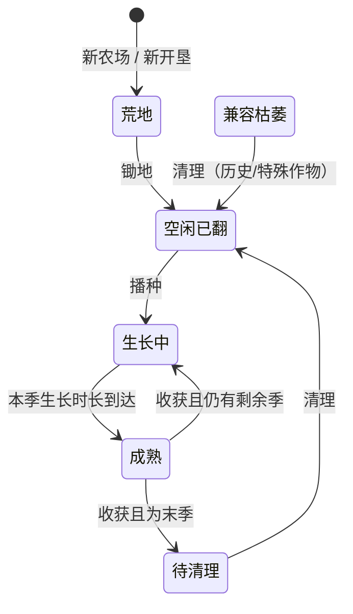

# 经典农场 · 玩法功能与参数设计文档

> 本文是策划层文档，描述「游戏应该是什么样」，不涉及技术栈、接口与实现方案。
>
> 配套文件：[docs/verify-balance.py](verify-balance.py) —— 数值验算脚本，本文第 19 章的全部结论由它产出，可复现。
>
> 下游文档：[architecture.md](architecture.md) —— 技术架构设计，承接本文第 20.3 节列出的全部待定项。

---

## 1. 文档口径与标注约定

### 1.1 为什么要标注来源

本项目的数值不是凭空设计的，而是以 2009 年经典网页 QQ 农场为蓝本。但原版官方帮助页已难以稳定访问，考据资料的可信度参差不齐。为了避免把"猜测"当成"史实"，本文对**每一条规则和每一个数值**标注来源等级。


| 标注     | 含义                | 处置原则          |
| ------ | ----------------- | ------------- |
| `[原版]` | 可由多份同期资料交叉印证      | 原值照抄，不得修改     |
| `[考据]` | 仅有单一来源留档，属版本参数    | 原值照抄，在存疑项中登记  |
| `[设计]` | 原版未记录或无法确认，本项目设计  | 必须给出设计理由与验算依据 |
| `[新增]` | 原版没有此机制，为满足题目要求新增 | 必须说明与原版体验的兼容性 |


### 1.2 实现范围

题目要求的玩法为固定清单，本项目对每项的投入深度做了明确取舍。

**重点**（核心，投入主要精力）

- 种植循环：锄地 → 播种 → 照料 → 成熟 → 收获 → 清理，含健康度与多季作物
- 多人同农场实时同步：多个玩家同时在一个农场操作，地块状态实时一致
- 好友系统：点击分享链接自动成为好友，好友间互助与偷菜

**做薄**（一个最小完整闭环）

- 任务系统、邮件系统、图鉴、宠物（映射为看家狗）
- 化肥（唯一会修改成熟时刻的机制）、多季作物、隐藏种子

---


## 2. 名词表

本表是全项目的统一术语。文档、配置、代码、界面文案必须使用同一套词，不得出现同义异名。


| 术语     | 含义                                                |
| ------ | ------------------------------------------------- |
| 农场     | 一个玩家名下的全部地块与农场级状态（狗、狗盆等）的集合，是多人同步的最小单位            |
| 地块     | 农场内的一块土地，是种植与照料的操作对象                              |
| 作物     | 种子种下后生长的植物，含普通作物与隐藏作物                             |
| 季      | 多季作物的一次结果周期。单季作物只有 1 季                            |
| 本季生长时长 | 当前这一季从开始到成熟所需的缩放时长，是健康度与照料参数的统一分母                 |
| 全周期    | 从播种到最后一季收获完成的总缩放时长，等于各季时长之和                       |
| 健康度    | 0—100 的数值，由三种不良状态的累计时长决定，只影响产量，不影响成熟时刻            |
| 不良状态   | 缺水、杂草、害虫三种，会扣减健康度                                 |
| 产量系数   | 由健康度映射出的乘数，作用于基础产量                                |
| 果实     | 收获得到的物品，存入仓库，出售换金币                                |
| 仓库     | 存放果实                                              |
| 背包     | 存放种子、化肥、狗粮等未使用的道具                                 |
| 主人     | 农场的所有者                                            |
| 访客     | 正在浏览他人农场的玩家                                       |
| 缩放小时   | 游戏内的时间单位。1 缩放小时对应的真实时长由时间档决定                      |
| 逻辑日    | 跟随时间档的周期边界，用于昼夜演示节奏与缩放玩法的每日上限；日常任务另用服务器本地自然日      |
| 风险窗口   | 判定是否长草 / 生虫的时间片，长度为本季生长时长的固定比例                    |
| 时间档    | 一组时间缩放配置（`authentic` / `fast` / `demo` / `bench`） |


---


## 3. 时间系统


### 3.1 为什么需要时间缩放

原版是为数月留存设计的：白萝卜 10 小时成熟，开满 18 块地按最优策略需要约 157 天。这套节奏本身没有问题，但它意味着**无法通过实际游玩来展示玩法**，无论是开发自测、功能演示还是压力测试。

处理方式是引入一个全局缩放因子 `TIME_SCALE`，**只压缩挂钟时间，不改动任何经济数值**。所有作物的成熟时间、水分持续、狗粮消耗等时长类参数一律乘以该因子；而种子价、果实价、产量、经验完全不变。

这样做的三个理由：

1. **不扭曲经济模型。** 各时间档下观察到的经济行为是同构的，平衡性只需调一次。若改写成熟时间，每个档位都要重新平衡。
2. **压测需要这个旋钮。** 要在几分钟内压出"一天的玩法流量"，时间缩放正是所需的手段。
3. **保住考据可信度。** 作物表保持 2009 原值，不因演示便利而失真。


### 3.2 时间档


| 档位          | `TIME_SCALE` | 1 缩放小时 = | 白萝卜 1 轮 | 用途        |
| ----------- | ------------ | -------- | ------- | --------- |
| `authentic` | 1            | 1 小时     | 10 小时   | 真实体验，产品验收 |
| `fast`      | 1/60         | 1 分钟     | 10 分钟   | 日常开发与功能自测 |
| `demo`      | 1/600        | 6 秒      | 60 秒    | 功能演示      |
| `bench`     | 1/3600       | 1 秒      | 10 秒    | 压力测试      |


线上运行档位由服务端环境变量 `FARM_TIME_PROFILE` 全局选择（当前支持
`demo` / `fast` / `authentic`）。同一部署的 Gateway 与 Farm 必须一致。
`FARM_ALLOW_DEBUG_TIME=1` 时，已登录测试人员可从设置页发起全服热切换，Gateway
会把新值同步到所有 Farm 与 Gateway 进程；正式环境关闭该开关后，浏览器只能展示
服务端下发的权威档位，不能修改。调试热切换时，仍在生长的当前季按已完成比例
重新映射 `SeasonStartAt / SeasonDuration / MatureAt`；施肥推进、当前健康度、
浇水有效期和草虫持续时间同比例保留，成熟作物不会退回生长态。

### 3.3 缩放的作用位置

**缩放因子必须折算进地块数据，而不是在每次读取时临时相乘。**

地块记录的是「本季生长时长（已缩放）」这个绝对值，因此地块是自描述的。正常
播种和进入新季度时只写入一次；测试模式主动热切换则执行一次受控的持久化换算，
而非让客户端每次读取时自行乘缩放因子。

关闭调试热切换时，同一农场内不同时期播种的作物可以带有不同缩放结果，互不影响。

### 3.4 逻辑日

逻辑日是跟随时间档的周期边界，用于昼夜演示节奏和维护动作等缩放玩法的每日上限；日常任务与每日登录改用服务器 `time.Local` 的自然日（本地 00:00），不跟随时间档缩放。逻辑日设有下限：

```text
逻辑日真实时长 = max(24 小时 × TIME_SCALE, 5 分钟)
```


| 档位          | 逻辑日真实时长               |
| ----------- | --------------------- |
| `authentic` | 1440 分钟（即真实一天）        |
| `fast`      | 24 分钟                 |
| `demo`      | 5 分钟（下限生效，原始值 2.4 分钟） |
| `bench`     | 5 分钟（下限生效，原始值 0.4 分钟） |


设置下限的原因：若不设下限，`bench` 档下逻辑日只有 24 秒，维护动作等缩放玩法的每日上限会被高频重置而失去约束意义。5 分钟同时保证了 `demo` 档下可以现场演示一次完整的逻辑日重置；自然日任务不受该重置影响。

`authentic` 档的逻辑日边界为 **UTC+8 每日 00:00**；其余档位从服务启动时刻起按固定间隔滚动。

---


## 4. 玩家与成长


### 4.1 账号

题目要求"账号与登录"，原版依赖 QQ 体系。本项目采用用户名 + 密码注册登录，登录后持有会话凭证。不做第三方 OAuth。（初版账号只做最简单的逻辑）

一个账号对应一个农场，一一绑定，不支持多农场。

### 4.2 初始状态


| 项目   | 数值       | 标注                      |
| ---- | -------- | ----------------------- |
| 初始等级 | 0 级      | `[原版]`                  |
| 初始金币 | 1000     | `[设计]`                  |
| 初始地块 | 6 块，均为荒地 | `[原版]` 6 块；`[设计]` 初始为荒地 |
| 初始背包 | 空        | `[设计]`                  |
| 初始仓库 | 空        | `[设计]`                  |


初始金币定为 1000 的依据：种满 6 块白萝卜需 `125 × 6 = 750`，留 250 余量容纳一次误操作。给得更多会削弱初期的经营压力，给得更少则可能卡死。

### 4.3 等级与经验

到达等级 `N` 所需的**累计**经验为：

```text
累计经验门槛 = N × 200
```

例如 5 级需累计 1000 经验；4 级门槛为 800，所以从 4 升到 5 只需再获得 200 经验。

等级只有两个作用：解锁作物、解锁扩地与狗。等级不提供任何产量或速度加成。

### 4.4 经验来源


| 动作      | 经验         | 计入每日上限 |
| ------- | ---------- | ------ |
| 锄地 / 清理 | +3         | 否      |
| 播种      | +2         | 否      |
| 浇水      | +2         | 是      |
| 除草      | +2         | 是      |
| 除虫      | +2         | 是      |
| 收获      | 按作物而定，每季结算 | 否      |
| 施肥      | 0          | 否      |
| 偷菜      | 0          | 否      |
| 日常任务奖励  | 按任务而定      | 否      |
| 图鉴里程碑   | 按里程碑而定     | 否      |


浇水、除草、除虫三类维护动作合计**每逻辑日前 150 次**计经验（折合 300 经验），超出部分动作依然生效但不给经验。自己与好友农场的操作都计入同一计数器。

验算确认这个上限只在中后期生效：6 块地循环种白萝卜每日约 75 次维护动作（占上限 50%），12 块地恰好 150 次，18 块地 225 次才会触及。新手体验不受影响。

### 4.5 扩地

达到等级要求且金币足够时，可永久开垦下一块地。开垦出的地块为荒地。


| 开垦后总地块数 | 等级要求 | 本次金币    |
| ------- | ---- | ------- |
| 7       | 5    | 10,000  |
| 8       | 7    | 20,000  |
| 9       | 9    | 30,000  |
| 10      | 11   | 50,000  |
| 11      | 13   | 70,000  |
| 12      | 15   | 90,000  |
| 13      | 17   | 120,000 |
| 14      | 19   | 150,000 |
| 15      | 21   | 180,000 |
| 16      | 23   | 230,000 |
| 17      | 25   | 300,000 |
| 18      | 27   | 500,000 |


累计 1,750,000 金币。地块上限 18 块，不再扩展。

**扩地全程是金币瓶颈而非经验瓶颈。** 验算显示：初始 6 块地种白萝卜，到 5 级需 55 缩放小时，而攒够第 7 块地的 1 万金币需 113 缩放小时，金币需求是经验需求的 2.1 倍。最高扩地要求 27 级仅需 5400 累计经验，远早于金币达标。这是原版的设计意图，也意味着**演示时给金币比给经验有效**。

---


## 5. 地块


### 5.1 状态机




| 状态             | 含义                           |
| -------------- | ---------------------------- |
| 荒地 `Wasteland` | 未开垦松土，不能播种                   |
| 空闲已翻 `Tilled`  | 已松土，可播种                      |
| 生长中 `Growing`  | 作物正在生长，可照料                   |
| 成熟 `Mature`    | 可收获，也可被访客偷取                  |
| 待清理 `Residue`  | 末季收获完成，残留植株待清理               |
| 枯萎 `Withered`  | 仅兼容历史数据并预留特殊活动作物；普通作物不会随时间进入 |


### 5.2 各状态允许的动作


| 动作   | 荒地  | 空闲已翻 | 生长中 | 成熟  | 待清理 | 枯萎  |
| ---- | --- | ---- | --- | --- | --- | --- |
| 锄地   | ✓   | —    | —   | —   | —   | —   |
| 播种   | —   | ✓    | —   | —   | —   | —   |
| 浇水   | —   | —    | ✓   | —   | —   | —   |
| 除草   | —   | —    | ✓   | —   | —   | —   |
| 除虫   | —   | —    | ✓   | —   | —   | —   |
| 铲除植物 | —   | —    | ✓   | —   | —   | —   |
| 施肥   | —   | —    | ✓   | —   | —   | —   |
| 收获   | —   | —    | —   | ✓   | —   | —   |
| 偷菜   | —   | —    | —   | ✓   | —   | —   |
| 清理   | —   | —    | —   | —   | ✓   | ✓   |


成熟状态下不再产生新的不良状态，也不能浇水除草除虫——健康度在进入成熟时已经结算完毕。

### 5.3 成熟保鲜与枯萎兼容

普通作物进入成熟状态后**不会因为时间流逝自动枯萎**，会一直保持可收获、可被偷取状态。及时收获的压力来自好友偷菜，而不是系统销毁产量。

多季作物必须由主人收获当前一季后才进入下一季生长；末季收获完成后进入 `Residue`，清理残株后才能重新播种。

`Withered` 状态仅用于兼容已经产生的历史数据，并为未来特殊限时作物预留。特殊作物如果需要超时失效，必须使用逐作物显式配置，不能复用全局枯萎时限影响普通作物。

---


## 6. 作物


### 6.1 作物属性

每种作物具备以下属性：


| 属性     | 说明            |
| ------ | ------------- |
| 解锁等级   | 达到该等级后商店出售其种子 |
| 种子价    | 商店购买价         |
| 季数     | 1 为单季，>1 为多季  |
| 全周期    | 播种到末季成熟的总缩放时长 |
| 每季产量   | 满健康度下单季收获的果实数 |
| 果实单价   | 出售单价          |
| 每季收获经验 | 每次成熟收获给予的经验   |


理论满产收入 = `每季产量 × 季数 × 果实单价`。实际收益还要乘产量系数，并扣除被偷部分。

**本章及全文所有作物时长均以缩放小时计。** 表中的 `10h` 意为 10 缩放小时，在 `authentic` 档等于 10 真实小时，在 `demo` 档等于 60 真实秒。

### 6.2 单季作物


| 作物  | 解锁  | 种子价 | 成熟时间 | 产量  | 果实价 | 满产收入 | 收获经验 |
| --- | --- | --- | ---- | --- | --- | ---- | ---- |
| 白萝卜 | 0   | 125 | 10h  | 16  | 17  | 272  | 15   |
| 胡萝卜 | 0   | 163 | 13h  | 17  | 21  | 357  | 18   |
| 大白菜 | 1   | 168 | 14h  | 17  | 22  | 374  | 19   |
| 小麦  | 2   | 168 | 14h  | 18  | 21  | 378  | 19   |
| 水稻  | 2   | 168 | 14h  | 18  | 21  | 378  | 19   |
| 玉米  | 3   | 175 | 14h  | 17  | 23  | 391  | 19   |
| 土豆  | 4   | 188 | 15h  | 18  | 24  | 432  | 20   |
| 红枣  | 5   | 237 | 16h  | 20  | 25  | 500  | 21   |
| 茄子  | 5   | 237 | 16h  | 20  | 25  | 500  | 21   |
| 番茄  | 6   | 251 | 17h  | 21  | 26  | 546  | 22   |
| 豌豆  | 7   | 266 | 18h  | 22  | 27  | 594  | 23   |
| 红玫瑰 | 7   | 266 | 18h  | 22  | 27  | 594  | 23   |
| 辣椒  | 8   | 296 | 20h  | 24  | 28  | 672  | 25   |
| 南瓜  | 9   | 325 | 22h  | 25  | 30  | 750  | 27   |


### 6.3 多季作物

属性来自 2009 年 10 月快照。


| 作物  | 解锁  | 种子价  | 季数  | 全周期  | 首熟     | 每次再熟   | 每季产量 | 果实价 | 满产收入 | 收获经验/季 |
| --- | --- | ---- | --- | ---- | ------ | ------ | ---- | --- | ---- | ------ |
| 苹果  | 10  | 578  | 2   | 30h  | 20h    | 10h    | 23   | 24  | 1104 | 18     |
| 草莓  | 10  | 605  | 2   | 35h  | 23h20m | 11h40m | 24   | 27  | 1296 | 20     |
| 西瓜  | 11  | 708  | 2   | 41h  | 27h20m | 13h40m | 27   | 29  | 1566 | 23     |
| 香蕉  | 12  | 900  | 2   | 45h  | 30h    | 15h    | 29   | 32  | 1856 | 25     |
| 桃子  | 13  | 1200 | 2   | 60h  | 40h    | 20h    | 32   | 40  | 2560 | 33     |
| 橙子  | 14  | 1587 | 3   | 59h  | 29h30m | 14h45m | 26   | 41  | 3198 | 25     |
| 葡萄  | 15  | 1978 | 3   | 86h  | 43h    | 21h30m | 29   | 47  | 4089 | 30     |
| 石榴  | 16  | 2425 | 3   | 96h  | 48h    | 24h    | 30   | 54  | 4860 | 34     |
| 柚子  | 17  | 2855 | 3   | 113h | 56h30m | 28h15m | 33   | 58  | 5742 | 39     |
| 菠萝  | 18  | 3480 | 3   | 116h | 58h    | 29h    | 35   | 62  | 6510 | 40     |
| 椰子  | 19  | 3720 | 4   | 124h | 49h36m | 24h48m | 27   | 65  | 7020 | 32     |
| 葫芦  | 20  | 4742 | 4   | 139h | 55h36m | 27h48m | 30   | 71  | 8520 | 36     |


**多季拆分规则** 

本项目采用一条可解释的规则：

```text
后续每季时长 = 全周期 / (季数 + 1)
首季时长     = 2 × 后续每季时长
```

即**首季耗时是后续每季的 2 倍**，符合"果树要先长成、之后再结果更快"的直觉。各季之和严格等于原版记录的全周期，因此考据数据未被破坏，只补充了内部拆分。验算已逐项校验各季之和与全周期完全吻合。

多季作物在非末季收获后直接回到生长中状态，无需重新播种；末季收获后转入待清理。

### 6.4 生长阶段

白萝卜、胡萝卜等低级作物的阶段为「发芽 → 小叶 → 大叶 → 成熟」；玉米及之后的多数作物增加「开花」阶段。归纳为一条规则：


| 解锁等级 | 生长阶段                   | 可施肥阶段数 |
| ---- | ---------------------- | ------ |
| < 3  | 发芽 → 小叶 → 大叶 → 成熟      | 3      |
| ≥ 3  | 发芽 → 小叶 → 大叶 → 开花 → 成熟 | 4      |


各生长阶段等分本季生长时长。成熟是终点状态而非阶段，因此可施肥阶段数等于生长阶段数减一。

生长阶段**只影响两件事**：界面表现，以及化肥"每块地每阶段仅一次"的约束。它不参与健康度和产量计算。

### 6.5 隐藏作物

存在"隐藏种子"机制：商店不出售，锄地时有概率获得。具体作物为：


| 作物  | 最低掉落等级 | 季数  | 全周期  | 每季产量 | 果实价 | 满产收入 | 收获经验/季 | 强度    |
| --- | ------ | --- | ---- | ---- | --- | ---- | ------ | ----- |
| 人参  | 0      | 1   | 40h  | 22   | 41  | 902  | 60     | 1.51x |
| 灵芝  | 10     | 1   | 60h  | 30   | 60  | 1800 | 80     | 1.52x |
| 摇钱树 | 20     | 3   | 100h | 25   | 55  | 4125 | 100    | 1.51x |


"强度"指其金币效率相对于**同期可获得的最优普通作物**的倍数。三者统一定在 1.5 倍左右：既让玩家感到明确惊喜，又不至于破坏成长节奏。验算设有 2.0 倍的硬上限断言。

隐藏作物的种子价视为 0（无法购买），因此收益全为净利。它们不占用商店，只能通过掉落获得。

**掉落规则** 

- 每次锄地或清理，有 3% 概率掉落 1 颗隐藏种子
- 掉落哪一种由玩家当前等级决定：只从"最低掉落等级 ≤ 玩家等级"的作物中等概率抽取
- 期望 33 次锄地掉落 1 颗。6 块地循环种白萝卜每日约 14 次清理，平均 2.3 天出 1 颗，此时玩家约 5 级

设置等级门槛的原因：若低级玩家就能掉到摇钱树，一次掉落的收益（4125 金币）相当于第 7 块地成本的 41%，会明显压缩早期节奏。

---


## 7. 健康度与产量


### 7.1 设计取舍：为什么照料影响产量而不是速度

有两种常见模型：

- **照料影响生长速度**：缺水时长得慢，成熟时刻不可预知
- **照料影响产量**（本项目采用）：成熟时刻在播种时即固定，照料只影响收获数量

本项目采用后者，理由有两条。第一，它是原版的真实行为。第二，它让**成熟时刻成为播种时即确定的常量**（仅化肥会显式修正），"作物是否成熟"退化为一次时间戳比较，而不需要对整个生长历史做分段积分。这是罕见的考据正确性与实现简洁性重合的情况。

### 7.2 三种不良状态

 参数全部按**本季生长时长的比例**定义，而非绝对小时数。这样白萝卜和菠萝的照料难度完全一致，不会出现"短周期作物随便种也满健康、长周期作物必须盯着"的失衡。


| 状态  | 产生方式                 | 解除方式 |
| --- | -------------------- | ---- |
| 缺水  | 上次浇水后经过「水分持续时长」即进入缺水 | 浇水   |
| 杂草  | 每个风险窗口按概率判定生成        | 除草   |
| 害虫  | 每个风险窗口按概率判定生成        | 除虫   |


| 参数      | 取值           | 含义                   |
| ------- | ------------ | -------------------- |
| 水分持续时长  | 本季生长时长 × 35% | 每季约需浇水 3 次才能全程不缺水    |
| 风险窗口长度  | 本季生长时长 × 10% | 每季恰好 10 次判定，不随作物周期变化 |
| 单窗口长草概率 | 12%          | 每季期望长草 1.2 次         |
| 单窗口生虫概率 | 10%          | 每季期望生虫 1.0 次         |


播种时视为已浇过一次水，因此从播种起 35% 的时长内不缺水。

杂草与害虫一旦生成即持续存在，直到被清除；不会自行消失，也不会叠加（同一地块同时最多一株草、一窝虫）。

进入成熟状态后不再判定新的不良状态。

### 7.3 健康度公式

```text
健康度 = 100 - 100 × (0.44 × 缺水时长 + 0.26 × 杂草时长 + 0.30 × 害虫时长) / 本季生长时长
```

三项权重之和恰好为 **1.00**，这带来两个性质：

1. 语义可以一句话说清：**三项全程犯满，健康度恰好归零。**
2. 数值截断（clamp）永远不会被触发，公式在整个定义域内不丢失信息。

各项权重的含义直接可读：全程缺水扣 44 点，全程带草扣 26 点，全程带虫扣 30 点。缺水权重最高，因为它是唯一必然发生的不良状态（不浇水就一定缺水），而长草生虫是概率事件。

### 7.4 产量公式

```text
产量系数 = 0.6 + 0.4 × 健康度 / 100
实际产量 = floor(每季产量 × 产量系数)
```

产量系数下限定为 **0.6** 的理由：完全放置一晚回来仍有六成收成，避免挫败感；同时保留足够的照料激励。


| 照料档位   | 缺水 / 杂草 / 害虫时长比例   | 健康度   | 产量系数   |
| ------ | ------------------ | ----- | ------ |
| 完美照料   | 0 / 0 / 0          | 100.0 | 1.0000 |
| 仅缺水全程  | 1.0 / 0 / 0        | 56.0  | 0.8240 |
| 仅带草全程  | 0 / 1.0 / 0        | 74.0  | 0.8960 |
| 仅带虫全程  | 0 / 0 / 1.0        | 70.0  | 0.8800 |
| 轻度疏忽   | 0.30 / 0.40 / 0.30 | 67.4  | 0.8696 |
| 典型放置   | 0.65 / 0.80 / 0.70 | 29.6  | 0.7184 |
| 三项全程犯满 | 1.0 / 1.0 / 1.0    | 0.0   | 0.6000 |


"典型放置"指播种后完全不管直到成熟的估算档位，用于横向比较，下文的验算均以它为参照。

### 7.5 结算时机

健康度采用**增量结算**：每次照料动作发生时，把"上次结算时刻到现在这段时间内的不良状态惩罚"累加进地块的累计扣减量，然后把结算起点推进到当前时刻。收获时只需结算最后一段。

这样任何一次结算的计算量都只和"距上次结算的时长"有关，不需要回溯整个生命周期。

多季作物**每季独立结算**：进入新一季时，累计扣减量归零，健康度重置为 100，水分重新计为充足。因此多季作物的每一季都是独立的照料考验。

---


## 8. 农事动作

本章逐个定义动作。所有动作的通用规则：

- **失败不产生任何副作用**：不消耗金币、不消耗道具、不计入任何每日计数器、不给经验
- 所有动作均为服务端权威判定，客户端的显示只是预期结果
- 每个动作的失败原因必须是明确可枚举的，不允许"未知错误"


### 8.1 锄地


| 项目   | 内容                            |
| ---- | ----------------------------- |
| 执行者  | 仅主人                           |
| 前置状态 | 荒地                            |
| 消耗   | 无                             |
| 效果   | 地块转为空闲已翻；有 3% 概率获得 1 颗隐藏种子入背包 |
| 奖励   | +3 经验                         |
| 失败原因 | 地块不存在；地块状态不是荒地；非本人农场          |


### 8.2 清理

与锄地是同一动作的另一种适用状态，规则完全一致。


| 项目   | 内容                            |
| ---- | ----------------------------- |
| 执行者  | 仅主人                           |
| 前置状态 | 待清理、枯萎                        |
| 消耗   | 无                             |
| 效果   | 地块转为空闲已翻；有 3% 概率获得 1 颗隐藏种子入背包 |
| 奖励   | +3 经验                         |
| 失败原因 | 地块不存在；地块状态不可清理；非本人农场          |


### 8.2.1 铲除植物

铲除使用 `Clear(208)` 的 `arg=1`，与清理残株使用同一协议入口，但规则独立。


| 项目   | 内容                     |
| ---- | ---------------------- |
| 执行者  | 仅主人                    |
| 前置状态 | 生长中                    |
| 消耗   | 无；不返还种子                |
| 效果   | 移除当前作物及本季照料状态，地块回到空闲已翻 |
| 奖励   | 无经验、无隐藏种子              |
| 失败原因 | 地块不存在；作物不在生长中；非本人农场    |


### 8.3 播种


| 项目   | 内容                                           |
| ---- | -------------------------------------------- |
| 执行者  | 仅主人                                          |
| 前置状态 | 空闲已翻                                         |
| 消耗   | 背包中 1 颗对应种子                                  |
| 效果   | 地块转为生长中；按当前时间档折算并写入首季生长时长与成熟时刻；健康度置 100；水分置满 |
| 奖励   | +2 经验                                        |
| 失败原因 | 地块状态不是空闲已翻；背包无该种子；作物等级未解锁；非本人农场              |


播种消耗的是**背包里的种子**，不是金币。买种和播种是两个独立动作，不做"金币不足自动购买"。这样每个动作的语义单一，失败原因也更清晰。

### 8.4 浇水


| 项目   | 内容                           |
| ---- | ---------------------------- |
| 执行者  | 主人或好友访客                      |
| 前置状态 | 生长中                          |
| 消耗   | 无                            |
| 效果   | 结算截至当前的健康度扣减；水分重置为满          |
| 奖励   | 执行者 +2 经验（受每日 150 次上限约束）     |
| 失败原因 | 地块状态不是生长中；水分本已充足；非好友关系；地块无作物 |


"水分本已充足"要作为失败处理而不是静默成功，否则玩家可以靠反复浇水刷经验。

### 8.5 除草


| 项目   | 内容                                                 |
| ---- | -------------------------------------------------- |
| 执行者  | 主人或好友访客                                            |
| 前置状态 | 生长中且存在杂草                                           |
| 消耗   | 无                                                  |
| 效果   | 结算截至当前的健康度扣减；清除杂草                                  |
| 奖励   | 执行者 +2 经验；在好友农场执行时额外获得 5 系统金币。两项均受每日 150 次维护动作上限约束 |
| 失败原因 | 地块状态不是生长中；无杂草；非好友关系                                |


在好友农场除草除虫可获得少量系统金币，金额定为 **5 金币**。

**该金币与经验共用同一个每日 150 次计数器**，超出计数后动作依然生效但既无经验也无金币。

金额从 10 降到 5 是验算的直接结果。按 10 金币计算，打满计数器可得 1500 金币，占 6 块地白萝卜日产出（2117）的 70.9%，接近"互助替代种地"的临界。降到 5 金币后该比例为 35.4%，与日常任务奖励同量级，定位回到"补贴"而非"替代"。

互助的收益上限还受一层现实约束：好友农场必须真的长出杂草或害虫才有可操作对象。单个 6 地循环种白萝卜的好友每日只产生约 32 次机会，因此打满 150 次计数器需要约 4.7 个满负荷好友。


| 活跃好友数 | 可用机会 | 实得次数 | 互助金币 | 占自耕产出 |
| ----- | ---- | ---- | ---- | ----- |
| 1     | 32   | 32   | 158  | 7.5%  |
| 3     | 95   | 95   | 475  | 22.4% |
| 5     | 158  | 150  | 750  | 35.4% |
| 10    | 317  | 150  | 750  | 35.4% |


**访问好友的主要动机是偷菜，不是互助。** 单次偷菜的期望价值是 94 金币（白萝卜），为单次互助的 19 倍。互助只承担"礼节性收益"的定位，不需要独自撑起社交动机。

如果金币不受计数约束，则"到好友农场反复除草"会成为比种地更高效的收入来源，玩法重心会被带偏。

### 8.6 除虫

规则与除草完全一致，仅针对害虫状态。

### 8.7 施肥


| 项目   | 内容                                              |
| ---- | ----------------------------------------------- |
| 执行者  | 仅主人                                             |
| 前置状态 | 生长中                                             |
| 消耗   | 背包中 1 个对应化肥                                     |
| 效果   | 当前生长阶段的剩余时长减少对应小时数（已缩放），成熟时刻相应提前；减少量不超过当前阶段剩余时长 |
| 奖励   | 无经验                                             |
| 失败原因 | 地块状态不是生长中；背包无该化肥；当前阶段已施过肥；地块无作物                 |


详见第 9 章。

### 8.8 收获


| 项目   | 内容                                                                        |
| ---- | ------------------------------------------------------------------------- |
| 执行者  | 仅主人                                                                       |
| 前置状态 | 成熟                                                                        |
| 消耗   | 无                                                                         |
| 效果   | 结算最终健康度并计算实际产量；扣除已被偷走的数量；剩余果实入仓库；首次收获该作物则解锁图鉴；若仍有剩余季则回到生长中并重置本季状态，否则转为待清理 |
| 奖励   | 该作物的每季收获经验                                                                |
| 失败原因 | 地块状态不是成熟；非本人农场                                                            |


### 8.9 偷菜


| 项目   | 内容                                               |
| ---- | ------------------------------------------------ |
| 执行者  | 仅好友访客，主人不可对自己农场执行                                |
| 前置状态 | 成熟                                               |
| 消耗   | 无                                                |
| 效果   | 见第 11 章                                          |
| 奖励   | 果实入访客仓库；无经验                                      |
| 失败原因 | 地块状态不是成熟；本轮成熟已偷过该地块；已达 40% 上限；非好友关系；被狗拦截；对自己农场执行 |


"被狗拦截"是一种特殊失败：它不返还操作机会，且会让访客赔付金币。详见第 11.3 节。

---


## 9. 化肥

化肥只作用于当前生长阶段，同一地块的同一阶段重复使用无效。它不提高产量或售价，用途是调整成熟时点，减少成熟作物被偷的窗口。


| 化肥   | 缩短时长   | 售价  |
| ---- | ------ | --- |
| 普通化肥 | 1.0 小时 | 50  |
| 高速化肥 | 2.5 小时 | 200 |
| 急速化肥 | 5.5 小时 | 500 |


缩短的小时数为**缩放前的绝对值**，实际生效时同样乘以时间档因子。

### 9.1 两条约束

**约束一：每块地每个生长阶段仅一次。** 阶段推进后可再次施肥。

**约束二：单次施肥的缩短量不超过当前阶段的剩余时长。** 这条约束保证了"化肥只作用于当前阶段"的语义严格成立，不会溢出到下一阶段。

### 9.2 定位验证

化肥必须是**控时工具**而非**增效工具**——如果买化肥的收益高于其成本，最优策略就退化成"无脑刷化肥"，玩法深度归零。

判据是：化肥售价应高于其节省时长所对应的产出价值。验算对 3 种化肥 × 4 种代表作物的全部 12 个组合做了检查，性价比区间为 **0.16x — 0.54x**，全部低于 1.0，均符合控时工具定位。

以最极端的组合为例：菠萝的金币效率为 26.1 金币/缩放小时，一个 500 金币的急速化肥节省 5.5 小时，对应产出价值仅 144 金币，性价比 0.29x。

低级作物存在"全阶段用急速化肥可压缩量超过本季时长"的情况（白萝卜 3 个阶段可压缩 16.5 小时，超过其 10 小时周期），但成本 1500 金币是其满产收入 272 的 551%，经济上自然被排除，无需额外规则。

---


## 10. 商店、仓库与背包


### 10.1 商店


| 商品         | 解锁条件     | 备注            |
| ---------- | -------- | ------------- |
| 普通种子（26 种） | 达到作物解锁等级 | 按种子价出售        |
| 化肥（3 种）    | 无        | 见第 9 章        |
| 狗粮         | 无        | 1 金币/g，按 g 购买 |
| 狗（3 种）     | 达到等级要求   | 见第 12 章       |


隐藏种子不在商店出售。商店不回收任何道具——种子和化肥买了就只能用，不能退。这是为了避免"低买高卖"套利，也让购买决策更有重量。

### 10.2 仓库与背包

仓库存放已收获的果实，背包存放种子、化肥、狗粮等未使用道具。两者职责分离。

两者均无容量上限。设置上限会引入"仓库满了收不了菜"的失败分支，对核心体验没有正向贡献，但显著增加规则复杂度。

### 10.3 出售

果实按其果实单价出售，可指定数量。只有出售后才回笼金币——**收获本身不产生金币**。这是原版的关键设定，它让仓库成为一个真实的中间环节。

道具与种子不可出售。

---


## 11. 好友与偷菜


### 11.1 好友关系

好友关系是**双向**的：建立即双方互为好友，任一方解除则关系消失。好友数上限 **200**。

好友关系带来两项权限：可以进入对方农场浇水、除草、除虫；可以偷取对方成熟的作物。

### 11.2 点击分享链接自动成为好友

这是题目的明确要求，原版依赖 QQ 好友关系，没有此机制。（先实现简单版本，后期改成微信小游戏接口）

**规则**

1. 玩家可以生成自己的分享链接，链接中携带一个签名凭证
2. 凭证内容包含：邀请人标识、随机串、过期时间，以及基于服务端密钥的签名
3. 凭证有效期 7 天，**可被多人重复使用**（便于分享到群聊），不是一次性
4. 其他玩家登录后点击该链接，即自动与邀请人建立双向好友关系
5. 建立成功后给双方各发一封系统邮件通知

**必须处理的四种情形**


| 情形           | 处置                      |
| ------------ | ----------------------- |
| 同一凭证被同一人重复点击 | 幂等，只建立一次关系，重复点击返回"已是好友" |
| 邀请人与点击人是同一人  | 拒绝，返回"不能添加自己"           |
| 双方已是好友       | 幂等，无操作                  |
| 任一方好友数已达 200 | 拒绝，返回明确原因，且不建立单向关系      |


最后一条尤其重要：好友关系必须**要么双向建立，要么完全不建立**，不允许出现 A 的好友列表里有 B 而 B 的列表里没有 A 的状态。

### 11.3 偷菜

核心规则：

- 仅能偷取好友**已成熟未收获**的作物
- 偷菜不给经验
- 同一地块的一轮成熟内，**单个访客最多操作一次**
- 所有访客合计最多偷走该地块本次产量的 **40%**，主人至少保留 60%

单次偷取数量为 **1—10 的随机值**，并受 40% 剩余额度硬截断。

**40% 上限基于实际产量而非基础产量。** 也就是说主人如果照料不佳，可被偷的绝对数量也会同步下降。

**偷菜对主人的经济压力** 验算显示，即使完美照料，被偷满 40% 也会让利润大幅缩水：


| 作物  | 完美照料净利 | 被偷满后净利 | 缩水  |
| --- | ------ | ------ | --- |
| 白萝卜 | 147    | 38     | 74% |
| 南瓜  | 425    | 125    | 71% |
| 菠萝  | 3030   | 426    | 86% |


这个量级确认了偷菜是一个**真实的经济威胁**，而不是装饰性玩法。它同时为守卫系统提供了存在意义。

### 11.4 一个刻意保留的惩罚性边界

验算发现：**全部 26 种作物在"零健康度且被偷满 40%"时都会净亏本**，亏损幅度为种子价的 17%—35%。

这不是数值配错，而是两个约束乘积的必然结果。盈亏平衡需要：

```text
收入/种子价 ≥ 1 / (0.6 × 0.6) = 2.78
```

而原版 26 种作物的收入/种子价区间是 **1.80（葫芦）— 2.31（南瓜）**，全部低于 2.78。因此不存在"安全作物"。

**本项目决定保留这个边界，不加保底规则。** 理由：如果长期不照料且被偷满仍然稳赚，那么照料、及时收菜、狗看家这三条玩法线全部失去意义。要消除亏损可能需要把产量系数下限从 0.6 抬到 0.88 以上，那等于废掉健康度机制本身。

作为对照，"典型放置"档位（播种后完全不管，但未被偷）下 26 种作物**全部仍然盈利**，照料激励倍数为 1.99x—2.74x 且随作物等级递增。这说明惩罚只在"疏忽 + 被偷"叠加时才致命，日常疏忽是可承受的。

---


## 12. 宠物：看家狗

本项目将题目要求的"宠物"映射为看家狗，不另造一套养成体系。

### 12.1 狗种


| 狗种  | 等级要求 | 基础拦截率 | 粮耗       | 售价    |
| --- | ---- | ----- | -------- | ----- |
| 土狗  | 0    | 25%   | 4 g/缩放小时 | 2,000 |
| 牧羊犬 | 10   | 35%   | 5 g/缩放小时 | 4,500 |
| 藏獒  | 20   | 45%   | 7 g/缩放小时 | 8,000 |


同一时刻只启用一条狗，拥有多条不叠加消耗也不叠加防御。狗窝是纯外观，不是看家的必要建筑（本项目不做狗窝）。

### 12.2 狗粮

标准粮耗为 5 g/缩放小时。狗盆容量 120 g，恰好维持 24 缩放小时；狗粮 1 金币/g，即填满一次 120 金币。

**狗盆空了狗就不生效**，拦截率归零。这是唯一的守卫失效条件。

切换启用狗时保留狗盆中的剩余整数克数，并立即按新狗种的粮耗重新计算可维持时间，避免通过频繁切换获得额外狗粮时长。

### 12.3 狗的成长

狗等级从 0 级起，上限 5 级。每级需 **20 次成功拦截**，满级累计 100 次。每级 +1% 拦截率。


| 狗种  | 0 级（基础） | 5 级（满级） |
| --- | ------- | ------- |
| 土狗  | 25%     | 30%     |
| 牧羊犬 | 35%     | 40%     |
| 藏獒  | 45%     | 50%     |


拦截率只随狗的等级提升，不随农场主等级变化。更换狗种时各自的等级独立保留。

### 12.4 拦截、赔付与盈亏平衡拦截率

狗抓到访客时，农场主可获得少量奖励。

访客被拦截时赔付 **该作物果实单价 × 10** 金币，全额转给农场主。偷取失败，且本轮成熟内不能再次尝试该地块。

这个赔付倍数的选择有一个漂亮的性质。设单次偷取期望数量为 5.5 个（1—10 均匀分布），赔付倍数为 10，则偷菜的期望收益为：

```text
期望收益 = (1 - p) × 5.5 × 果实单价 - p × 10 × 果实单价
```

果实单价可以约去，所以**盈亏平衡拦截率与作物无关**：

```text
p* = 5.5 / (5.5 + 10) = 35.5%
```

这让三种狗自然形成了清晰的威慑梯度：


| 守卫  | 拦截率 | 相对 p*  | 对偷菜者的期望收益    | 威慑定位  |
| --- | --- | ------ | ------------ | ----- |
| 无狗  | 0%  | −35.5% | 正收益，零风险      | 无威慑   |
| 土狗  | 25% | −10.5% | +1.62 × 果实单价 | 仅降低损失 |
| 牧羊犬 | 35% | −0.5%  | +0.08 × 果实单价 | 近中性   |
| 藏獒  | 45% | +9.5%  | −1.47 × 果实单价 | 真实威慑  |


也就是说：土狗只能减少损失，牧羊犬让偷菜变成无利可图（且升 1 级后即越过平衡点成为真威慑），藏獒让偷菜稳定亏损。这是一条有意义的守卫成长曲线，而不是三个数值不同的同质道具。

### 12.5 守卫的投入产出

验算了两种规模下各狗种的回本周期（以白萝卜、被偷满为损失上限）：


| 规模    | 日均损失上限 | 土狗回本  | 牧羊犬回本  | 藏獒回本   |
| ----- | ------ | ----- | ------ | ------ |
| 6 块地  | 1,567  | 6.8 天 | 10.5 天 | 14.9 天 |
| 18 块地 | 4,700  | 1.9 天 | 3.0 天  | 4.1 天  |


定价的目标是让回本周期极差控制在 2.2 倍（而不是动辄十倍），这样高级狗才有购买理由；同时 18 块地时全部狗种都能在 4.1 天内回本，使后期升级守卫的收益明确。验算对这两点都设有断言。

---


## 13. 多人同农场

题目明确要求"多人在同一农场中操作时，需实时同步地块状态"。本章从策划角度定义**应该看到什么、允许做什么、冲突时怎么算**，不涉及实现方案。

### 13.1 可见性

- 任何玩家都可以进入好友的农场并看到全部地块的当前状态
- 同一农场内的所有观察者（主人 + 若干访客）看到的地块状态应当一致
- 任何一个动作生效后，所有在场者都应当及时看到结果，无需手动刷新
- 每个地块的成熟进度、不良状态、被偷额度对所有在场者都是可见信息


### 13.2 动作权限矩阵


| 动作      | 主人  | 好友访客 | 非好友 |
| ------- | --- | ---- | --- |
| 锄地 / 清理 | ✓   | ✗    | ✗   |
| 播种      | ✓   | ✗    | ✗   |
| 施肥      | ✓   | ✗    | ✗   |
| 收获      | ✓   | ✗    | ✗   |
| 扩地      | ✓   | ✗    | ✗   |
| 浇水      | ✓   | ✓    | ✗   |
| 除草      | ✓   | ✓    | ✗   |
| 除虫      | ✓   | ✓    | ✗   |
| 偷菜      | ✗   | ✓    | ✗   |
| 查看      | ✓   | ✓    | ✗   |


两条边界值得注意：**主人不能偷自己的菜**（直接收获即可），**非好友完全不能进入农场**（不做"陌生人可看不可动"）。

### 13.3 冲突规则

多人同时操作同一地块是常态而非异常。规则如下：

**先到先得。** 同一地块的同一动作被多人同时提交时，只有第一个生效，其余收到明确的失败原因。

**失败必须可解释。** 失败原因要指向具体状况，例如"该地块已被他人浇水"、"该地块本轮已达可偷上限"、"作物已被主人收获"。不允许返回笼统错误。

**失败无副作用。** 后到者不消耗道具、不消耗每日次数、不获得经验、不扣金币。

**硬上限不可突破。** 偷菜的 40% 额度是硬上限，无论多少访客同时提交，被偷总量都不会超过它。"单访客一轮一次"同理。

### 13.4 需要重点演示的三个场景

这三个场景是"多人同农场"的验收标准：

1. **协同照料**：主人和两位好友同时在场，好友 A 浇水、好友 B 除草，主人的界面上两个动作都应即时反映
2. **收获竞争**：一块地成熟，主人点击收获的同时好友点击偷菜。结果必须是二者之一明确成功、另一者收到明确失败，不能出现果实总量超过实际产量
3. **偷菜额度竞争**：多位好友同时对同一块成熟地块偷菜。被偷总量严格不超过 40%，且每人最多成功一次

---


## 14. 任务系统

原版无任务系统，本项目为满足题目"基础任务系统"要求新增。

### 14.1 日常任务

任务按服务器 `time.Local` 的自然日（本地 00:00）重置；每名玩家每天有 1 条固定任务与 5 条随机任务，不随农场 demo 时间档缩放。任务首次读取时按 `(uid, YYYYMMDD)` 初始化：固定任务每天必定出现，随机任务从服务器任务池按玩家与日期稳定抽取，同一天重连或跨实例读取均不会变化。`TaskList` 同时返回下一次本地 00:00 的 `reset_at`。


| 分类  | 任务     | 目标   | 金币  |
| --- | ------ | ---- | --- |
| 固定  | 每日登录   | 1    | 100 |
| 随机池 | 浇水     | 10 次 | 200 |
| 随机池 | 收获     | 5 次  | 300 |
| 随机池 | 拜访好友农场 | 1 次  | 250 |
| 随机池 | 播种     | 6 次  | 200 |
| 随机池 | 出售果实   | 1 次  | 150 |
| 随机池 | 施肥     | 1 次  | 100 |
| 随机池 | 开垦土地   | 2 次  | 180 |
| 随机池 | 除草     | 2 次  | 160 |
| 随机池 | 除虫     | 2 次  | 160 |
| 随机池 | 喂食宠物   | 1 次  | 120 |


播种、收获、浇水、施肥、开垦、除草、除虫、出售、喂食宠物与拜访任务的进度由玩法动作产生的事件驱动累加，而不是由任务系统主动轮询；每日登录任务则在初始化时完成。任务卡片的 `kind` 字段为 `fixed` 或 `random`，前端据此分组展示，但不参与抽取或判定。

任务完成后通过任务页 `TaskClaim` 直接领取并入账，领取请求必须幂等，重复领取不重复发放。每日登录使用同一条 task_id=4 状态；旧 `ClaimDailyLogin` 仅作兼容代理。任务奖励与每日登录奖励均不进入邮箱，避免把日常任务操作与通知、运营发奖混在一起。

### 14.2 奖励量级校验

每个服务器本地自然日最多可得 1,230 金币（固定登录 100 金币，加 5 条随机任务的最高组合）。奖励不影响农场昼夜 demo 的时间缩放。

任务奖励不经邮件领取，因此不会与系统、管理员邮件附件的生命周期混淆。

---


## 15. 邮件系统

原版无邮件系统，本项目为满足题目要求新增。

### 15.1 邮件类型


| 类型          | 触发                        | 附件                   |
| ----------- | ------------------------- | -------------------- |
| 图鉴牌里程碑      | 单种作物累计成功收获 10 / 20 / 50 次 | 500 / 1000 / 2000 金币 |
| 升级奖励        | 提升等级                      | 金币                   |
| 被偷通知        | 自己的作物被偷                   | 无                    |
| 拦截通知        | 自家狗成功拦截偷菜者                | 赔付金币                 |
| 好友建立        | 通过分享链接建立好友关系              | 无                    |
| 系统公告 / 运营发奖 | 运营发布或管理员发放                | 可选                   |


### 15.2 规则

- 邮件保留 7 天（真实时长，不随时间档缩放），过期自动删除
- 收件箱上限 100 封，超出时删除最旧的**已读且无未领附件**的邮件
- 附件必须显式领取，领取后邮件标记为已领
- **同一封邮件的附件只能领取一次。** 重复领取请求返回"已领取"，不重复发放
- 玩家主动删除单封邮件或“全部清空”时，未领取的附件邮件必须保留；领取后才可删除

最后一条是本系统最重要的规则。它是玩法中最典型的幂等场景：网络重试、客户端重复点击、断线重连后重发，都可能导致同一个领取请求被提交多次。

### 15.3 被偷通知的设计意图

被偷通知是**跨农场的异步消息**：偷菜发生时农场主很可能不在线，通知需要在其离线期间产生并留存到下次登录。这条链路和"主人在场时的实时同步"是两种不同的信息传递方式，两者都要工作。

---


## 16. 图鉴

原版无图鉴，本项目为满足题目要求新增。

**解锁条件**：在自己的农场首次成功收获某作物即永久解锁该条。偷到的果实不算解锁。

**收录范围**：26 种普通作物 + 3 种隐藏作物，共 29 条。

**牌子与进度**：每种作物独立拥有一块收藏牌。首次收获后为木牌；累计成功收获 10 次变为铜牌，20 次变为银牌，50 次变为金牌。牌子下方显示“当前次数 / 下一阶段目标”和剩余次数；金牌显示累计收获次数与“已达最高阶段”。

**计数口径**：次数指成功执行的收获动作次数，不是入仓果实产量。一块地一次收获无论产出多少果实都只增加 1 次；多季作物每一季成功收获各增加 1 次；失败、重复请求以及偷菜均不增加。

**里程碑奖励**：单种作物达到铜牌 / 银牌 / 金牌时，分别通过邮件发放 500 / 1000 / 2000 金币。每个“作物 + 阶段”只生成一次奖励邮件；邮件初始未读，打开邮箱后红点消失，附件需玩家显式领取。

图鉴用于给持续种植和隐藏作物收集提供长期正反馈；牌子与奖励只读取权威收获计数，不反向影响作物产量。

---


## 17. 每日上限与反刷规则汇总

所有限次规则集中于此，避免散落在各章造成遗漏。


| 规则       | 上限             | 计数范围                       |
| -------- | -------------- | -------------------------- |
| 维护动作计经验  | 150 次/逻辑日      | 浇水 + 除草 + 除虫，自己与好友农场合并计数   |
| 日常任务     | 4 条/服务器本地自然日   | 固定任务集在本地 00:00 切换；每日登录包含其中 |
| 单地块单访客偷菜 | 1 次/轮成熟        | 按地块 + 成熟轮次计数               |
| 单地块被偷总量  | 实际产量的 40%      | 按地块 + 成熟轮次累计               |
| 每地块每阶段施肥 | 1 次            | 按地块 + 生长阶段计数               |
| 好友数      | 200            | 双向关系计一条                    |
| 收件箱      | 100 封          | 超出时淘汰最旧已读无附件邮件             |
| 地块数      | 18             | 永久上限                       |
| 狗等级      | 5 级            | 每级 20 次成功拦截，累计 100 次满级     |
| 好友互助金币   | 与经验共用 150 次计数器 | 理论上限 750 金币/逻辑日            |


超过上限的动作处理方式不统一，需分别注意：

- 维护动作超过 150 次：**动作照常生效**，只是不再给经验
- 偷菜超过额度：**动作失败**，返回明确原因
- 施肥重复：**动作失败**，不消耗道具

---


## 18. 参数总表

本表是配置的唯一来源。

[docs/verify-balance.py](verify-balance.py) 的配置区覆盖了本表中**所有影响平衡性的参数**，两者必须逐项一致，任一处改动都要同步另一处并重跑验算。不影响平衡计算的参数（好友数上限、凭证有效期、邮件保留时长、收件箱上限、图鉴里程碑、狗成长曲线）只在本表定义，脚本不重复声明。

脚本另有三个不属于游戏数值的**审查阈值**：互助金币占比上限 40%、任务奖励占比上限 50%、效率倒挂显著性阈值 5%。它们是验算的判据，不是游戏配置。

### 18.1 等级与土地


| 参数     | 取值             |
| ------ | -------------- |
| 等级经验公式 | 累计经验 = N × 200 |
| 初始地块数  | 6              |
| 地块上限   | 18             |
| 初始金币   | 1000           |
| 扩地链    | 见 4.5 节        |


### 18.2 动作经验


| 参数            | 取值        |
| ------------- | --------- |
| 锄地 / 清理       | 3         |
| 播种            | 2         |
| 浇水 / 除草 / 除虫  | 2         |
| 维护动作计经验上限     | 150 次/逻辑日 |
| 好友农场除草 / 除虫金币 | 5         |


### 18.3 健康度与照料


| 参数      | 取值           |
| ------- | ------------ |
| 缺水权重    | 0.44         |
| 杂草权重    | 0.26         |
| 害虫权重    | 0.30         |
| 产量系数下限  | 0.60         |
| 水分持续时长  | 本季生长时长 × 35% |
| 风险窗口长度  | 本季生长时长 × 10% |
| 单窗口长草概率 | 12%          |
| 单窗口生虫概率 | 10%          |


### 18.4 偷菜与守卫


| 参数      | 取值                   |
| ------- | -------------------- |
| 被偷上限    | 实际产量的 40%            |
| 单访客单轮次数 | 1                    |
| 单次偷取数量  | 1—10 随机              |
| 狗盆容量    | 120 g                |
| 标准粮耗    | 5 g/缩放小时             |
| 狗粮单价    | 1 金币/g               |
| 被抓赔付倍数  | 果实单价 × 10            |
| 狗等级上限   | 5 级，每级 20 次拦截，每级 +1% |
| 狗种参数    | 见 12.1 节             |


### 18.5 化肥


| 参数             | 取值                     |
| -------------- | ---------------------- |
| 普通 / 高速 / 急速缩短 | 1.0 / 2.5 / 5.5 小时     |
| 普通售价           | 50                     |
| 高速 / 急速售价      | 200 / 500              |
| 生长阶段数          | 解锁等级 <3 为 3 个，≥3 为 4 个 |


### 18.6 隐藏种子


| 参数     | 取值              |
| ------ | --------------- |
| 掉落概率   | 3% / 次锄地或清理     |
| 强度上限   | 同期最优普通作物的 2.0 倍 |
| 隐藏作物参数 | 见 6.5 节         |


### 18.7 时间与社交


| 参数        | 取值                              |
| --------- | ------------------------------- |
| 时间档       | 1 / 1/60 / 1/600 / 1/3600       |
| 逻辑日最短真实时长 | 5 分钟                            |
| 好友数上限     | 200                             |
| 分享凭证有效期   | 7 天                             |
| 邮件保留      | 7 天                             |
| 收件箱上限     | 100 封                           |
| 日常任务      | 服务器本地自然日固定 4 条：播种、收获、拜访、每日登录    |
| 单作物图鉴牌    | 首次收获木牌；10 次铜牌 / 20 次银牌 / 50 次金牌 |
| 单作物图鉴奖励   | 500 / 1000 / 2000 金币（邮件附件）      |


---


## 19. 数值验算

以下结论全部由 [docs/verify-balance.py](verify-balance.py) 产出。运行方式：

```bash
python3 docs/verify-balance.py
```

退出码 0 表示全部断言通过。当前状态：**12 组检查、14 类断言全部通过。**

### 19.1 检查项与断言清单

脚本包含 12 组检查，其中第 3、6、7、10 组各带一个子项（3b / 6b / 7b / 10b），共输出 16 段。内置以下硬性断言，任一失败即退出码非 0：


| #   | 断言                        | 所属检查       |
| --- | ------------------------- | ---------- |
| 1   | 健康度三项权重之和等于 1.00          | 1 · 健康度公式  |
| 2   | 三项全程犯满的产量系数恰好等于下限         | 1 · 健康度公式  |
| 3   | 典型放置档位下没有作物亏本             | 2 · ROI    |
| 4   | 各季时长之和严格等于原版记录的全周期（逐作物校验） | 5 · 多季拆分   |
| 5   | 初始金币足以种满初始地块数             | 6 · 成长节奏   |
| 6   | 互助金币最坏情形占自耕日产出不超过 40%     | 7b · 互助占比  |
| 7   | 隐藏作物强度不超过同期最优普通作物的 2.0 倍  | 8 · 隐藏作物   |
| 8   | 化肥在任何作物组合下都不成为增效最优        | 9 · 化肥经济性  |
| 9   | 狗盆容量恰好维持 24 缩放小时          | 10 · 守卫投产  |
| 10  | 初期各狗种回本周期极差小于 3 倍         | 10 · 守卫投产  |
| 11  | 18 块地时最慢狗种回本在 7 天内        | 10 · 守卫投产  |
| 12  | 有狗种的拦截率落在盈亏平衡点附近          | 10b · 偷菜期望 |
| 13  | 最高拦截率超过盈亏平衡点              | 10b · 偷菜期望 |
| 14  | 日常任务金币奖励占日均产出不超过 50%      | 11 · 任务奖励  |


另有两组只输出不断言的审查：**3b 效率倒挂检测**与**4 原版数据异常检测**，其结论见 19.3 节——它们检出的问题属于考据数据本身，按原值保留，因此不作为失败条件。

### 19.2 主要结论

**照料激励** 满健康与典型放置的利润倍数为 1.99x — 2.74x，且随作物等级递增，构成自然的难度梯度。

**净亏本边界** 26/26 种作物在最坏情形下净亏本，亏损为种子价的 17%—35%；判据为收入/种子价需 ≥ 2.78，原版区间为 1.80—2.31。见 11.4 节，本项目决定保留。

**成长瓶颈** 全程为金币瓶颈。第 7 块地需 113 缩放小时，而 5 级只需 55 缩放小时；最高扩地要求 27 级仅需 5400 累计经验。

**扩地总时长** 按最优作物 17 地并行，开满 18 块地需 3770 缩放小时。折合真实时长：`authentic` 157 天、`fast` 2.6 天、`demo` 6 小时、`bench` 63 分钟。

**双策略张力** 经验效率随等级单调下降（白萝卜 3.04 经验/h 为全表最高，菠萝 1.35 为最低，相差 2.26 倍），而金币效率随等级上升。练级最优解恒为最低级作物，与赚钱最优解分离。这是原版的设计特征，本项目保留。

**后期曲线走平** Lv14 及以上作物的金币效率区间为 24.5—27.3，极差仅 2.8。后期成长动力来自地块数量而非作物品质，这解释了扩地链末端为何要价 50 万。

**每日上限的生效点** 维护动作计经验上限（150 次）在 6 块地时占用 50%、12 块地恰好 100%、18 块地才超出。不影响新手。

**互助与偷菜的动机分工** 互助金币最坏情形占自耕日产出 35.4%，属补贴量级；单次偷菜期望价值为单次互助的 19 倍。访问好友的主要动机是偷菜，互助是礼节性收益。

**守卫的威慑梯度** 偷菜的盈亏平衡拦截率为 35.5%，且与作物无关。土狗（25%）仅降低损失，牧羊犬（35%）使偷菜近中性、升 1 级即越过平衡点，藏獒（45%）构成稳定威慑。

### 19.3 检出的两处原版数据问题

这两处都**按考据原值保留，不擅自修正**，仅在此登记。

**问题一：苹果存在收益倒挂。**

苹果（Lv10）的金币效率为 17.5 金币/h，而更早解锁的南瓜（Lv9）为 19.3，豌豆和红玫瑰（Lv7）为 18.2。也就是说升到 10 级解锁苹果，从金币效率看是一次降级。更进一步，同为 Lv10 的草莓效率为 19.7，比苹果高 12.6%——苹果被同级作物完全支配。

这是全表唯一一处与跃升点无关的真实倒挂。

**问题二：橙子的全周期数据疑似异常，且它是后期倒挂的根因。**

按解锁等级排列多季作物的"每季平均时长"，应当随等级递增。实际数据中橙子出现了 −34.4% 的断崖：


| 作物  | 解锁  | 季数  | 全周期 | 每季均时长  | 较前一档       |
| --- | --- | --- | --- | ------ | ---------- |
| 桃子  | 13  | 2   | 60h | 30.00h | +33.3%     |
| 橙子  | 14  | 3   | 59h | 19.67h | **−34.4%** |
| 葡萄  | 15  | 3   | 86h | 28.67h | +45.8%     |


橙子作为 Lv14 的 3 季作物，全周期 59h 竟然短于 Lv13 的 2 季作物桃子的 60h。这在设计上不合理，高度疑似考据来源的数据错误。

其直接后果是：橙子成为全表金币效率最优（27.3 金币/h，比桃子跃升 20.5%），并导致其后解锁的 6 种作物全部不如它，其中葡萄、石榴、柚子构成 3 处"显著倒挂"。也就是说 19.2 节所说的"后期曲线走平"，根源就在这个异常值。

椰子（Lv19）也有一处 −19.8% 的下降，程度较轻。

**处置理由**：本项目的定位是忠实复刻并标注存疑，而不是重新设计一套数值。擅自修正会破坏与考据文档的可追溯性。倒挂的存在也不影响任何系统的正确性，只影响最优策略的形状。

---


## 20. 存疑项与待定项


### 20.1 原版存疑（已用设计值填充，等待更可靠考据）


| 项目            | 原版状态          | 本项目取值                    |
| ------------- | ------------- | ------------------------ |
| 初始金币          | 未确认           | 1000                     |
| 健康度减产曲线       | 未确认           | 权重 0.44/0.26/0.30，下限 0.6 |
| 杂草 / 害虫生成概率   | 未确认           | 每季 10 窗口，12% / 10%       |
| 缺水阈值          | 未确认           | 本季时长 35%                 |
| 特殊活动作物失效规则    | 未确认           | 暂未启用；未来按作物单独配置           |
| 狗拦截概率与狗种差异    | 未确认           | 25% / 35% / 45%          |
| 单次偷取数量        | 记为 1—10，属版本参数 | 1—10 随机                  |
| 每日上限的版本差异     | 未确认           | 维护动作 150 次               |
| 多季作物首熟 / 再熟拆分 | 未获得           | 首季 = 2 × 后续每季            |
| 高速 / 急速化肥售价   | 未获得           | 200 / 500                |
| 装饰的经验值        | 未确认           | 不做装饰系统                   |


### 20.2 考据数据本身存疑


| 项目           | 疑点                                        |
| ------------ | ----------------------------------------- |
| 橙子全周期 59h    | 每季均时长较前一档下降 34.4%，短于更低级的 2 季作物桃子；疑似来源数据错误 |
| 椰子全周期 124h   | 每季均时长较前一档下降 19.8%                         |
| 苹果属性         | 效率低于更早解锁的南瓜，且被同级草莓支配 12.6%                |
| 第 16—18 块地价格 | 少数历史资料存在差异，应视为当期配置快照                      |


### 20.3 本文档不涉及的内容

以下内容属于技术层，本文一概不涉及。它们现已由架构文档承接：


| 内容                   | 承接位置                                                                                          |
| -------------------- | --------------------------------------------------------------------------------------------- |
| 服务端技术栈选型             | [architecture.md](architecture.md) 1.4 节                                                      |
| 数据模型与存储方案            | [architecture.md](architecture.md) 第 5 章                                                      |
| 接口定义（入参、出参、错误码、幂等语义） | [protocol.md](protocol.md) 第 3—5 章                                                            |
| 实时同步的实现机制            | [architecture.md](architecture.md) 第 7 章、[protocol.md](protocol.md) 第 2 章                     |
| 容量估算、瓶颈分析与压测方案       | [capacity-and-benchmark.md](capacity-and-benchmark.md)、[capacity-model.py](capacity-model.py) |
| 客户端表现层设计             | [architecture.md](architecture.md) 第 9 章                                                      |
| 美术资源                 | 仍未涉及                                                                                          |


第 13 章描述的多人同农场规则是**策划层的期望行为**，不是实现方案；其 13.4 节的三个验收场景已在 [architecture.md](architecture.md) 7.3 节给出保证机制、在 [protocol.md](protocol.md) 第 6 章给出消息序列。

第 8 章列出的失败原因是**规则层面的枚举**，具体错误码已在 [protocol.md](protocol.md) 第 4 章逐条映射。

架构文档在实现层做了 5 处本文未覆盖的裁决（施肥与健康度分母的关系、多季作物下一季的起算时刻等），登记在 [architecture.md](architecture.md) 11.4 节，需要回到本文确认。