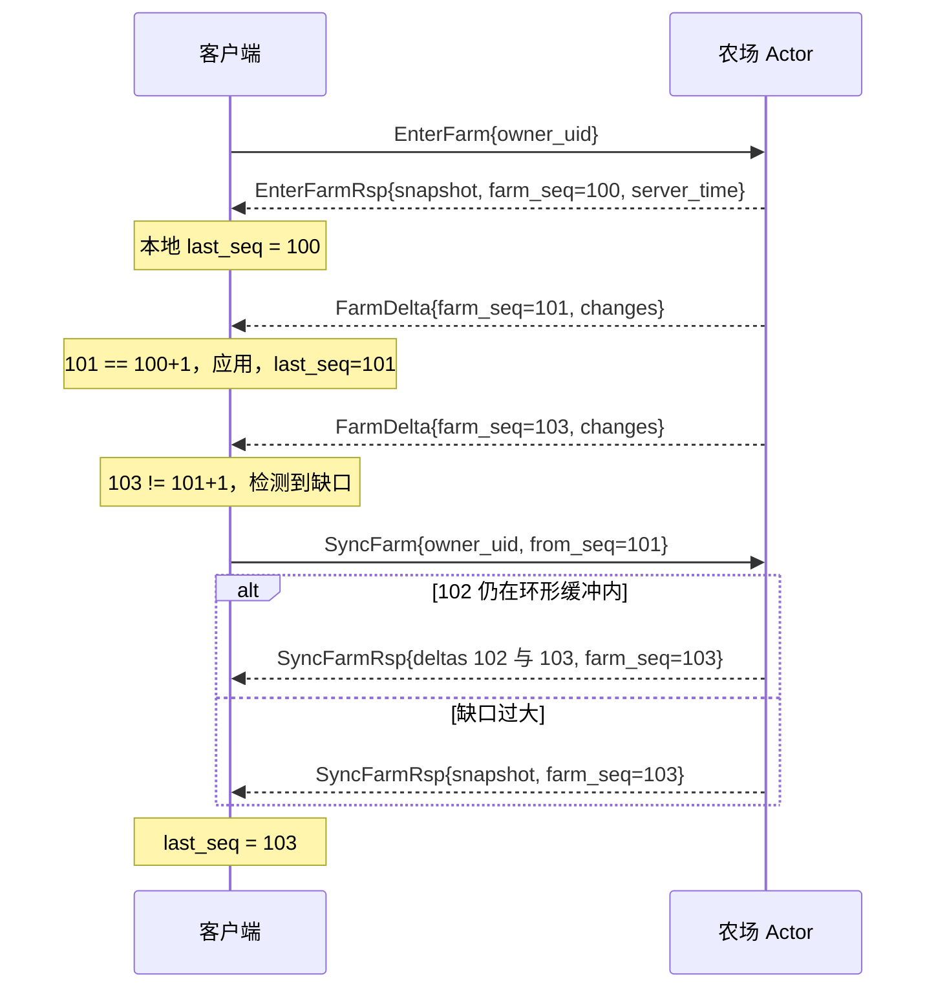

# 经典农场 · 通信协议与接口定义

> 本文是 [architecture.md](architecture.md) 的配套文档，定义客户端与服务端之间的全部通信契约：传输方式、消息信封、错误码、幂等语义、房间同步协议、接口清单。
>
> 上游依据：[game-design-full.md](game-design-full.md)。本文第 4 章的错误码全表是策划第 8 章「失败原因」的逐条实现映射——策划已明确「每个动作的失败原因必须是明确可枚举的，不允许未知错误」，这张表就是那句话的执行契约。

---

## 1. 传输分层

### 1.1 两条通道

| 通道 | 承载 | 理由 |
| --- | --- | --- |
| HTTPS | 注册、登录、分享链接落地页 | 无需长连接；登录洪峰的流量特征与游戏流量不同，需要独立限流和扩容 |
| WebSocket over TLS | 全部游戏流量 | 服务端要主动推送地块变更（策划 13.1：无需手动刷新），必须长连接 |

不使用 UDP / KCP。理由见 [architecture.md](architecture.md) 2.3 节：农场是秒级更新的房间制玩法，房间人数只有个位数，延迟容忍度 500 ms，TCP 完全够用，而 KCP 会带来一整套自实现的可靠性和拥塞控制负担。

### 1.2 编码

Schema 用 Protobuf 单一定义，传输层可切两种编码：

| 编码 | 子协议标识 | 用途 |
| --- | --- | --- |
| JSON | `farm.v1.json` | 开发期。抓包可读，浏览器 DevTools 直接看得懂 |
| Binary | `farm.v1.pb` | 压测与生产。体积约为 JSON 的 40%，编解码快约 5 倍 |

客户端通过 WebSocket 握手的 `Sec-WebSocket-Protocol` 头声明，服务端回显确认。**只维护一份 `.proto`**，两种编码由同一份生成代码产出，杜绝了「JSON 和二进制字段对不上」这类只在切换时才暴露的问题。

### 1.3 消息信封

所有 WebSocket 帧都是一个 `Envelope`：

```proto
message Envelope {
  uint32 cmd        = 1;  // 命令号，见第 5 章清单
  uint32 client_seq = 2;  // 请求携带；应答原样回带；服务端主动推送时为 0
  int32  err        = 3;  // 仅应答有效，0 表示成功，见第 4 章
  bytes  payload    = 4;  // 按 cmd 反序列化为对应的 Req / Rsp / Push 消息
}
```

`client_seq` 由客户端单调递增生成，作用有三个：把异步应答与发出的请求配对、确认或回滚乐观预测（[architecture.md](architecture.md) 9.3 节）、作为幂等键（第 3 章）。

### 1.4 心跳与校时合一

```proto
message PingReq  { int64 client_time = 1; }
message PongRsp  { int64 client_time = 1; int64 server_time = 2; }
```

客户端每 30 秒发一次 `Ping`，服务端 90 秒未收到则主动断开。同一条消息兼作时钟校准：

```text
rtt    = 收到 Pong 的本地时刻 - client_time
offset = server_time + rtt/2 - 收到 Pong 的本地时刻
```

客户端保留最近 8 次采样，取 **rtt 最小的那次**的 offset 作为当前时钟偏移。取最小 rtt 而不是平均值，是因为 rtt 最小的样本受网络排队干扰最小，其 `rtt/2` 的对称性假设最接近成立。这是 NTP 的核心技巧。

校时的必要性来自策划 3.x 的整套时间系统：客户端要显示「还有 3 分 20 秒成熟」这样的倒计时，如果本地时钟偏移几分钟，玩家会看到倒计时归零但收获失败。校准后本地倒计时可以完全离线推进，不需要服务端每秒推送剩余时间——这是 [architecture.md](architecture.md) 决策 D1 惰性计算思想在客户端的镜像。

### 1.5 限流

Gateway 层对每个连接做令牌桶限流：**容量 20，速率 10 次/秒**。

这个参数来自真实操作节奏：农场最密集的操作是「连续点击 18 块地收获」，人手速度约 5—8 次/秒，20 的桶容量足以吸收一次完整的连点。

超限的处理是**丢弃请求并返回 `ERR_RATE_LIMITED`，不断开连接**。断连的体验代价远大于限流本身。只有连续 5 次触发限流才断连，此时基本可以判定为脚本。

---

## 2. 房间同步协议

这是策划第 13 章「多人同农场」的实现契约。

### 2.1 模型

一个农场就是一个房间，房间 ID 即农场主的 uid。房间成员是当前正在查看该农场的所有玩家（主人 + 访客）。每个农场 Actor 维护一个单调递增的 `farm_seq`，**任何改变地块或农场级状态的操作都使其 +1**。



### 2.2 消息

```proto
message EnterFarmReq { uint64 owner_uid = 1; }
message EnterFarmRsp {
  FarmSnapshot snapshot    = 1;
  uint64       farm_seq    = 2;
  int64        server_time = 3;   // 用于客户端立即校准一次时钟
  Relation     relation    = 4;   // SELF / FRIEND，决定客户端展示哪些操作按钮
}

message FarmDelta {
  uint64      owner_uid   = 1;
  uint64      farm_seq    = 2;
  repeated PlotChange plots = 3;  // 变化的地块，通常只有 1 块
  FarmMetaChange meta     = 4;    // 农场级变化，如狗的启用状态
  uint64      actor_uid   = 5;    // 谁做的，客户端用于展示「好友 A 帮你浇了水」
  uint32      action      = 6;    // 动作类型，驱动动画表现
}

message SyncFarmReq { uint64 owner_uid = 1; uint64 from_seq = 2; }
message SyncFarmRsp {
  repeated FarmDelta deltas = 1;  // 增量补齐路径
  FarmSnapshot snapshot     = 2;  // 全量降级路径，二者只有一个非空
  uint64 farm_seq           = 3;
}
```

### 2.3 环形缓冲的容量选择

每个农场 Actor 保留最近 **200 条** delta。

这个数字的推导：一次全量快照是 18 块地约 2 KB，而一条 delta 通常只含 1 块地约 120 字节。当缺口超过约 17 条时，增量补齐的字节数就已经追平全量快照了。取 200 是留出充分余量——它覆盖了一个农场几分钟内的全部活跃操作，而内存代价只有 200 × 120 B = 24 KB，且仅对**当前有人在看**的农场存在。

超出缓冲范围时直接降级为全量快照，不做「部分增量 + 部分全量」这种混合方案：判断逻辑的复杂度换不来任何实质收益。

### 2.4 断线重连

重连时在握手中带上重连上下文，服务端尽可能补增量：

```proto
message HandshakeReq {
  string token             = 1;
  uint64 resume_farm_uid   = 2;  // 断线前正在查看的农场，0 表示无
  uint64 resume_farm_seq   = 3;  // 断线前的 last_seq
  uint32 client_config_ver = 4;  // 配置版本，不匹配则强制刷新
}
```

服务端的处理与 `SyncFarm` 一致：能补增量则补，否则回全量快照。**重连后必须以服务端状态强制覆盖客户端本地状态**，包括丢弃所有未确认的乐观预测——因为 [architecture.md](architecture.md) 决策 D3 的 C 档数据存在最多 30 秒的丢失窗口，客户端可能持有一个服务端已经不认的状态。

### 2.5 广播的实现约定

这不是客户端可见的协议，但它决定了协议的性能特征，写在这里以免实现时走弯路：

农场 Actor 广播时，**先把 payload 编码一次，再按 Gateway 分组发送**。一个房间可能有 3 个订阅者分布在 2 个 Gateway 上，朴素做法是编码 3 次发 3 个包，分组后是编码 1 次发 2 个包。在 200 万 PCU 规模下这个差异是网关 CPU 的主要来源之一，详见 [capacity-and-benchmark.md](capacity-and-benchmark.md) 的瓶颈分析。

```proto
// Gateway 内部消息，不对客户端暴露
message PushBatch {
  repeated uint64 conn_ids = 1;
  bytes           envelope = 2;  // 已编码好的 Envelope 字节，直接透传
}
```

---

## 3. 幂等语义

### 3.1 分级处理

不是所有接口都需要显式幂等机制。按重复执行的后果分三级：

| 级别 | 接口 | 机制 | 理由 |
| --- | --- | --- | --- |
| **状态机幂等** | 锄地、播种、浇水、除草、除虫、施肥、收获、清理 | 无需额外机制 | 状态转移天然拒绝重复。浇过水的地再浇返回 `ERR_ALREADY_WATERED`（策划 8.4 明确要求把「水分本已充足」作为失败而非静默成功），收过的地不再是成熟态 |
| **显式去重** | 购买、出售、扩地、买狗、喂狗、邮件领取、任务领取、加好友 | `client_seq` 去重表 | 重复执行会重复扣钱或重复发奖，是真实的资损 |
| **跨 Actor 配对** | 浇水/除草/除虫/偷菜的跨农场路径 | 服务端生成 `req_id` | 见 [architecture.md](architecture.md) 7.2 节 |

这个分级的价值在于：**大部分高频接口不需要维护去重表**。如果对所有接口一律做 `client_seq` 去重，每个 Actor 都要维护一张表并在每次请求时查表，纯属浪费。

### 3.2 去重表

需要显式去重的接口，Actor 内维护一张最近 64 条的 LRU：

```text
client_seq -> { err_code, 简短结果摘要 }
```

命中时不重新执行，直接返回上次的 `err_code`。若上次是成功，返回特殊码 `ERR_DUPLICATE_OK`——客户端据此知道「这个操作已经生效过了」，然后主动拉一次相关状态。

**为什么不存完整应答**。完整应答可能很大（比如购买后的背包快照），64 条全存会显著抬高 Actor 内存。而重复请求本身是低频异常路径，让客户端多拉一次状态是划算的。

**为什么是 64 条**。客户端在途并发请求不超过个位数，64 条覆盖了「断线重连后重发积压请求」的完整窗口。

### 3.3 分享链接的幂等

策划 11.2 节要求凭证「可被多人重复使用，不是一次性」，同时列出四种必须处理的情形。协议层的处理如下：

| 情形 | 返回 |
| --- | --- |
| 同一凭证被同一人重复点击 | `ERR_ALREADY_FRIEND`（幂等，不重复建立） |
| 邀请人与点击人是同一人 | `ERR_CANNOT_FRIEND_SELF` |
| 双方已是好友 | `ERR_ALREADY_FRIEND` |
| 任一方好友数已达 200 | `ERR_FRIEND_LIMIT_SELF` 或 `ERR_FRIEND_LIMIT_PEER` |

幂等由 `friendship` 表的主键唯一约束天然保证（[architecture.md](architecture.md) 决策 D5），不依赖 `client_seq`。这也意味着即使客户端换设备、换 `client_seq` 序列，重复点击仍然是幂等的。

凭证本身是无状态的 HMAC 签名串，不落库：

```text
payload = base64url({ inviter_uid, nonce, exp })
sig     = base64url(HMAC-SHA256(server_key, payload)[:16])
link    = https://<host>/i/<payload>.<sig>
```

`exp` 为 7 天（策划 18.7）。不落库意味着不能主动吊销单个凭证，只能通过轮换 `server_key` 批量失效。对这个场景足够。

---

## 4. 错误码全表

### 4.1 约定

- `0` 表示成功
- 错误码分段，每段 100 个，段内留空位便于扩展
- **不允许返回未在此表登记的错误码**。这是策划第 8 章「不允许未知错误」的直接落实
- 每个错误码有一个确定的客户端文案。文案由客户端根据码值查表，服务端不下发文案字符串（省流量，也便于多语言）

### 4.2 通用与会话（1000—1199）

| 码 | 常量 | 客户端文案 |
| ---: | --- | --- |
| 1001 | `ERR_INTERNAL` | 服务繁忙，请稍后重试 |
| 1002 | `ERR_BAD_REQUEST` | 请求参数有误 |
| 1003 | `ERR_RATE_LIMITED` | 操作太快了，慢一点 |
| 1004 | `ERR_TIMEOUT` | 操作超时，请重试 |
| 1005 | `ERR_DUPLICATE_OK` | 该操作已生效 |
| 1006 | `ERR_REDIRECT` | 服务器切换中，正在重连 |
| 1007 | `ERR_CONFIG_STALE` | 版本已更新，请刷新页面 |
| 1101 | `ERR_UNAUTHORIZED` | 请先登录 |
| 1102 | `ERR_TOKEN_EXPIRED` | 登录已过期，请重新登录 |
| 1103 | `ERR_USERNAME_TAKEN` | 该用户名已被注册 |
| 1104 | `ERR_BAD_CREDENTIAL` | 用户名或密码错误 |
| 1105 | `ERR_KICKED` | 账号已在其他地方登录 |

### 4.3 地块与种植（1200—1299）

对应策划 8.1—8.8。

| 码 | 常量 | 客户端文案 | 来自策划 |
| ---: | --- | --- | --- |
| 1201 | `ERR_PLOT_NOT_FOUND` | 地块不存在 | 8.1 / 8.2 |
| 1202 | `ERR_NOT_OWNER` | 只能在自己的农场进行此操作 | 8.1 / 8.2 / 8.3 / 8.7 / 8.8 |
| 1203 | `ERR_PLOT_NOT_WASTELAND` | 这块地已经翻过了 | 8.1 |
| 1204 | `ERR_PLOT_NOT_CLEANABLE` | 这块地没有需要清理的东西 | 8.2 |
| 1205 | `ERR_PLOT_NOT_TILLED` | 请先锄地 | 8.3 |
| 1206 | `ERR_PLOT_NOT_GROWING` | 作物不在生长中 | 8.4 / 8.5 / 8.6 / 8.7 |
| 1207 | `ERR_PLOT_NOT_MATURE` | 作物还没成熟 | 8.8 / 8.9 |
| 1208 | `ERR_PLOT_EMPTY` | 这块地没有作物 | 8.4 / 8.7 |
| 1209 | `ERR_SEED_NOT_OWNED` | 背包里没有这种种子 | 8.3 |
| 1210 | `ERR_CROP_LOCKED` | 等级不足，尚未解锁该作物 | 8.3 |
| 1211 | `ERR_ALREADY_WATERED` | 水分充足，不需要浇水 | 8.4 |
| 1212 | `ERR_NO_WEED` | 这块地没有杂草 | 8.5 |
| 1213 | `ERR_NO_PEST` | 这块地没有害虫 | 8.6 |
| 1214 | `ERR_FERTILIZER_NOT_OWNED` | 背包里没有这种化肥 | 8.7 |
| 1215 | `ERR_STAGE_ALREADY_FERTILIZED` | 当前生长阶段已经施过肥了 | 8.7 / 9.1 |
| 1216 | `ERR_HARVESTED_BY_OWNER` | 作物已被主人收获 | 13.3 |
| 1217 | `ERR_PLOT_WITHERED` | 作物已经枯萎了 | 5.3 |

1216 是一个语义上的细分：地块状态确实不是成熟态（本可以返回 1207），但策划 13.3 节明确要求「失败原因要指向具体状况，例如作物已被主人收获」。因此在偷菜路径上，如果地块本轮已被主人收获（`HarvestRound` 已推进而访客请求携带的是旧轮次），返回 1216 而不是 1207。

### 4.4 扩地与经济（1300—1399）

| 码 | 常量 | 客户端文案 | 来自策划 |
| ---: | --- | --- | --- |
| 1301 | `ERR_LEVEL_TOO_LOW` | 等级不足 | 4.5 / 10.1 |
| 1302 | `ERR_NOT_ENOUGH_COIN` | 金币不足 | 4.5 / 10.1 |
| 1303 | `ERR_PLOT_LIMIT` | 已达到 18 块地上限 | 4.5 |
| 1304 | `ERR_ITEM_NOT_FOUND` | 商品不存在 | 10.1 |
| 1305 | `ERR_NOT_ENOUGH_ITEM` | 数量不足 | 10.3 |
| 1306 | `ERR_ITEM_NOT_SELLABLE` | 该物品不可出售 | 10.3 |
| 1307 | `ERR_BAD_QUANTITY` | 数量不合法 | — |

策划 10.1 节规定商店不回收任何道具，策划 10.3 节规定道具与种子不可出售，1306 覆盖这两条。

### 4.5 社交与偷菜（1400—1499）

| 码 | 常量 | 客户端文案 | 来自策划 |
| ---: | --- | --- | --- |
| 1401 | `ERR_NOT_FRIEND` | 你们还不是好友 | 8.4 / 8.5 / 8.6 / 8.9 / 13.2 |
| 1402 | `ERR_ALREADY_FRIEND` | 你们已经是好友了 | 11.2 |
| 1403 | `ERR_CANNOT_FRIEND_SELF` | 不能添加自己为好友 | 11.2 |
| 1404 | `ERR_FRIEND_LIMIT_SELF` | 你的好友数已达 200 上限 | 11.2 |
| 1405 | `ERR_FRIEND_LIMIT_PEER` | 对方好友数已达上限 | 11.2 |
| 1406 | `ERR_INVITE_INVALID` | 邀请链接无效 | 11.2 |
| 1407 | `ERR_INVITE_EXPIRED` | 邀请链接已过期 | 11.2 |
| 1408 | `ERR_STEAL_SELF` | 不能偷自己的菜 | 8.9 / 13.2 |
| 1409 | `ERR_STEAL_ALREADY_DONE` | 这块地你本轮已经偷过了 | 8.9 / 17 |
| 1410 | `ERR_STEAL_QUOTA_EXHAUSTED` | 这块地能偷的已经被偷光了 | 8.9 / 11.3 |
| 1411 | `ERR_STEAL_INTERCEPTED` | 被看家狗抓住了 | 8.9 / 12.4 |
| 1412 | `ERR_STEAL_NO_AFFORD` | 金币不足以承担被抓的赔付风险 | 见下 |
| 1413 | `ERR_USER_NOT_FOUND` | 用户不存在 | 11.1 |

**1411 是一种特殊错误**。策划 8.9 节明确：「被狗拦截是一种特殊失败，它不返还操作机会，且会让访客赔付金币。」因此它虽然返回错误码，却是**有副作用**的——这是全表唯一违反「失败无副作用」通用规则的情形，而这个例外是策划刻意设计的。应答体因此需要携带赔付金额：

```proto
message StealRsp {
  uint32 crop_id      = 1;
  uint32 amount       = 2;  // 成功时偷到的数量
  int64  compensation = 3;  // 被拦截时赔付的金币，正数
  uint32 dog_type     = 4;  // 被哪种狗拦下，用于表现
}
```

**1412 是架构层新增的**，策划文档没有。原因是被拦截时要赔付「果实单价 × 10」（策划 12.4），必须保证访客付得起。处理方式是访客 Actor 在发起偷菜前预扣这笔潜在赔付，成功则退还，被拦截则转给主人。金币不足时直接在预扣阶段失败，返回 1412。设计细节见 [architecture.md](architecture.md) 7.2 节。

### 4.6 宠物（1500—1599）

| 码 | 常量 | 客户端文案 | 来自策划 |
| ---: | --- | --- | --- |
| 1501 | `ERR_DOG_ALREADY_OWNED` | 已经拥有这种狗了 | 12.1 |
| 1502 | `ERR_DOG_NOT_OWNED` | 还没有这种狗 | 12.1 |
| 1503 | `ERR_BOWL_FULL` | 狗盆已经满了 | 12.2 |
| 1504 | `ERR_NO_DOG_FOOD` | 狗粮不足 | 12.2 |

### 4.7 任务、邮件与图鉴（1600—1699）

| 码 | 常量 | 客户端文案 | 来自策划 |
| ---: | --- | --- | --- |
| 1601 | `ERR_TASK_NOT_COMPLETE` | 任务尚未完成 | 14.1 |
| 1602 | `ERR_TASK_ALREADY_CLAIMED` | 任务奖励已领取 | 14.1 |
| 1603 | `ERR_MAIL_NOT_FOUND` | 邮件不存在或已过期 | 15.2 |
| 1604 | `ERR_MAIL_NO_ATTACHMENT` | 这封邮件没有附件 | 15.2 |
| 1605 | `ERR_MAIL_ALREADY_CLAIMED` | 附件已领取 | 15.2 |

策划 15.2 节把「同一封邮件的附件只能领取一次」称为「本系统最重要的规则」，1605 是它的实现契约。它属于 3.1 节的「显式去重」级别。

---

## 5. 接口清单

命令号按功能分段。请求 `cmd` 为偶数、应答复用同一 `cmd`（靠 `Envelope.err` 区分），服务端主动推送用 9xxx 段。

### 5.1 HTTPS 接口

| 路径 | 方法 | 说明 |
| --- | --- | --- |
| `/api/register` | POST | 用户名 + 密码注册（策划 4.1），返回 token |
| `/api/login` | POST | 登录，返回 token 与 WebSocket 接入地址 |
| `/i/<payload>.<sig>` | GET | 分享链接落地页。未登录跳登录，登录后自动调用 `AcceptInvite` |

### 5.2 会话（100—199）

| cmd | 名称 | 说明 |
| ---: | --- | --- |
| 100 | `Handshake` | WebSocket 首帧，带 token 与重连上下文（2.4 节） |
| 102 | `Ping` | 心跳 + 校时（1.4 节） |
| 104 | `Logout` | 主动下线 |

同一账号同一时刻只允许一条有效 WebSocket 连接，采用“后登录挤前登录”策略。
新 token 会原子替换该 UID 的当前 token；新连接 `Handshake` 时再原子接管在线
租约并正常进入。旧连接收到 `Kick`（9006，`payload.reason=1105`）后停止重连、
清理本地登录态并返回登录页；即使推送延迟，旧 token 或旧租约也不能再执行命令。

### 5.3 农场与种植（200—299）

| cmd | 名称 | 执行者 | 说明 |
| ---: | --- | --- | --- |
| 200 | `EnterFarm` | — | 订阅房间，返回全量快照 |
| 202 | `LeaveFarm` | — | 取消订阅 |
| 204 | `SyncFarm` | — | 缺口补齐（2.1 节） |
| 206 | `Till` | 主人 | 锄地（策划 8.1） |
| 208 | `Clear` | 主人 | 清理（策划 8.2） |
| 210 | `Plant` | 主人 | 播种（策划 8.3） |
| 212 | `Water` | 主人 / 好友 | 浇水（策划 8.4） |
| 214 | `RemoveWeed` | 主人 / 好友 | 除草（策划 8.5） |
| 216 | `RemovePest` | 主人 / 好友 | 除虫（策划 8.6） |
| 218 | `Fertilize` | 主人 | 施肥（策划 8.7） |
| 220 | `Harvest` | 主人 | 收获（策划 8.8） |
| 222 | `Steal` | 好友 | 偷菜（策划 8.9） |
| 224 | `ExpandLand` | 主人 | 扩地（策划 4.5） |

所有地块操作的请求体形状一致，便于客户端统一封装：

```proto
message PlotActionReq {
  uint64 owner_uid  = 1;
  uint32 plot_index = 2;
  uint32 arg        = 3;  // 播种时为 crop_id，施肥时为 fertilizer_id，其余为 0
}
```

### 5.4 经济（300—399）

| cmd | 名称 | 说明 |
| ---: | --- | --- |
| 300 | `ShopList` | 商店列表。商品本身来自本地配置，服务端只返回解锁状态与价格校验用的配置版本 |
| 302 | `Buy` | 购买种子 / 化肥 / 狗粮 / 狗（策划 10.1） |
| 304 | `Sell` | 出售果实（策划 10.3） |
| 306 | `BagSnapshot` | 拉取背包 + 仓库全量 |

### 5.5 社交（400—499）

| cmd | 名称 | 说明 |
| ---: | --- | --- |
| 400 | `FriendList` | 好友列表，含在线状态与「农场有无可偷作物」的摘要 |
| 402 | `GenShareLink` | 生成分享链接（策划 11.2） |
| 404 | `AcceptInvite` | 用凭证建立好友关系 |
| 406 | `RemoveFriend` | 解除好友，双向生效（策划 11.1） |
| 408 | `AddFriendByUID` | 按 uid 直接建立好友关系 |
| 410 | `SearchUser` | 按用户名精确搜索，返回 uid 与昵称，随后可调用 `AddFriendByUID` |

`FriendList` 携带「农场有无可偷作物」这个摘要字段，是一个刻意的设计：策划 11.4 节的验算结论是「访问好友的主要动机是偷菜」，如果客户端要靠逐个进入好友农场才能发现哪里有菜可偷，会产生大量无效的 `EnterFarm` 请求。这个摘要把一次遍历 200 个好友的操作压缩成一次请求。

摘要值由好友的 Actor 在状态变化时更新到 Redis 的一个小 hash 里，`FriendList` 批量读取。它是**弱一致**的（可能读到几秒前的状态），这完全可以接受——进去发现菜已经被收了，本来就是偷菜玩法的一部分。

```proto
message SearchUserReq { string username = 1; }  // 精确匹配 account.username
message SearchUserRsp { uint64 uid = 1; string nickname = 2; }
```

用户名未命中返回 `ERR_USER_NOT_FOUND`（1413）。该命令同样适用 1.5 节的连接级令牌桶限流，以防止批量枚举账号。

### 5.6 宠物（500—599）

| cmd | 名称 | 说明 |
| ---: | --- | --- |
| 500 | `PetStatus` | 狗状态、盆内余量、等级、拦截次数 |
| 502 | `PetActivate` | 切换启用的狗（策划 12.1：同一时刻只启用一条） |
| 504 | `PetFeed` | 喂狗粮（策划 12.2） |

### 5.7 任务、邮件、图鉴（600—699）

| cmd | 名称 | 说明 |
| ---: | --- | --- |
| 600 | `TaskList` | 当前服务器本地自然日的 4 条任务与进度，含下次 00:00 的 `reset_at` |
| 602 | `TaskClaim` | 领取任务奖励，奖励直接入账并返回奖励回执；每日登录为 task_id=4 |
| 604 | `MailList` | 收件箱，个人邮件与全服公告归并 |
| 606 | `MailRead` | 标记已读；`mail_id` 指定单封，`all=true` 批量标记当前收件箱 |
| 608 | `MailClaim` | 领取附件（策划 15.2） |
| 610 | `MailDelete` | 删除；`mail_id` 指定单封，`all=true` 清理可删除邮件；未领取附件始终保留 |
| 612 | `CodexList` | 每种已解锁作物的权威收获次数、牌子阶段和下一目标（策划 16 章） |
| 614 | `ClaimDailyLogin` | 每日登录 task_id=4 的兼容领取入口；同一服务器本地自然日重复返回 `ERR_DUPLICATE_OK` |

### 5.8 服务端推送（9000—9099）

| cmd | 名称 | 说明 |
| ---: | --- | --- |
| 9000 | `FarmDelta` | 房间内地块或农场状态变更（2.2 节） |
| 9002 | `PlayerDelta` | 自己的金币 / 经验 / 等级 / 背包变化。跨 Actor 结算（如被偷、被赔付）也走它 |
| 9004 | `MailNotify` | 新邮件到达，只推数量不推内容 |
| 9006 | `Kick` | 被新登录挤下线；`payload.reason` 携带错误码（当前为 `ERR_KICKED` / 1105） |
| 9008 | `TaskNotify` | 一条每日任务的权威状态变化；只在成功玩法动作实际推进任务时推送 |

`PlayerDelta` 的存在是必要的：访客在好友农场浇水获得的经验、被偷菜后的仓库变化、看家狗拦截获得的赔付，这些都不属于任何一个「房间」，无法通过 `FarmDelta` 送达。

`TaskNotify` 的 `payload` 是单条 `Task`，字段为 `id`、`title`、`progress`、`target`、`reward_coin` 与 `claimed`。它独立于当前所在房间，按 uid 推送到该玩家当前有效连接；重复动作未改变已完成任务时不推送。每日登录（task_id=4）由初始 `TaskList` 呈现完成状态，不额外发送该推送。

`CodexList` 的响应 `payload.entries` 按 `crop_id` 升序返回已解锁条目；每项包含 `crop_id`、`harvest_count`、`tier`（`wood` / `bronze` / `silver` / `gold`）和 `next_target`，并以 `payload.total` 返回配置中的作物总数。成功收获响应的 `patch.codex_progress` 携带本次作物的最新条目；若本次新生成奖励邮件，还会返回 `codex_rewards`，并通过 9004 通知客户端刷新邮箱。

---

## 6. 验收场景的协议表达

策划 13.4 节列出三个必须演示的场景。这里给出每个场景对应的消息序列，它们同时也是集成测试的用例定义。逻辑层的保证机制见 [architecture.md](architecture.md) 第 7 章。

### 场景一：协同照料

```text
主人 O、好友 A、好友 B 同时在 O 的农场（三方均已 EnterFarm，last_seq = 100）

A -> Water{owner=O, plot=3, client_seq=7}
B -> RemoveWeed{owner=O, plot=5, client_seq=12}

服务端串行处理，假设 A 先到：
  -> A:     WaterRsp{client_seq=7, err=0, exp_gained=2}
  -> O,A,B: FarmDelta{farm_seq=101, plot=3, actor_uid=A, action=Water}
  -> B:     RemoveWeedRsp{client_seq=12, err=0, exp_gained=2, coin_gained=5}
  -> O,A,B: FarmDelta{farm_seq=102, plot=5, actor_uid=B, action=RemoveWeed}

三方的 last_seq 均推进到 102，看到完全一致的地块状态。
```

### 场景二：收获竞争

```text
plot=3 已成熟，FinalYield = 16。主人 O 点收获，好友 A 同时点偷菜。

设 O 先到：
  -> O:     HarvestRsp{err=0, amount=16}
  -> O,A:   FarmDelta{farm_seq=103, plot=3 -> Residue}
  -> A:     StealRsp{err=1216 ERR_HARVESTED_BY_OWNER}

设 A 先到（偷到 5 个）：
  -> A:     StealRsp{err=0, amount=5}
  -> O,A:   FarmDelta{farm_seq=103, plot=3, stolen_count=5}
  -> O:     HarvestRsp{err=0, amount=11}
  -> O,A:   FarmDelta{farm_seq=104, plot=3 -> Residue}

两种顺序下果实总量恒为 16，不多不少。
```

### 场景三：偷菜额度竞争

```text
plot=3 已成熟，FinalYield = 16，可偷上限 floor(16 × 0.4) = 6。
好友 A、B、C 同时提交偷菜。

串行处理，每次的可偷余量 = 6 - StolenCount：
  A: rand(1,10)=8 -> min(8, 6) = 6 -> StealRsp{err=0, amount=6}
  B: 余量 0       -> StealRsp{err=1410 ERR_STEAL_QUOTA_EXHAUSTED}
  C: 余量 0       -> StealRsp{err=1410}

若 A 再次提交：StealRsp{err=1409 ERR_STEAL_ALREADY_DONE}

被偷总量 6 ≤ 40% 上限，且每人至多成功一次。
```

---

## 7. 版本与兼容

`Envelope.cmd` 一经发布不再复用。字段的增删遵循 Protobuf 的常规约定：只加不删，删除的字段号进 `reserved`。

配置版本通过 `HandshakeReq.client_config_ver` 校验，不匹配时返回 `ERR_CONFIG_STALE` 并强制客户端刷新页面。3 周内不做资源热更，因此这是最简单也最可靠的处理。配置版本号的生成方式见 [architecture.md](architecture.md) 第 8 章。
