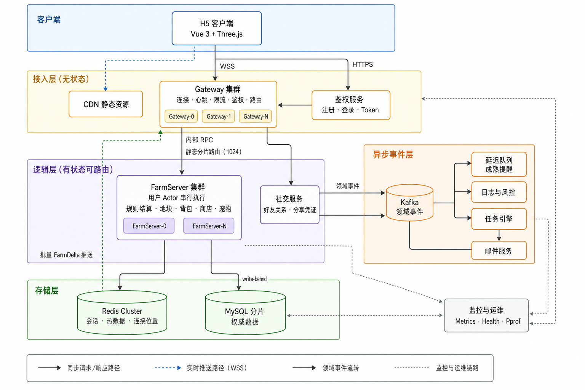

# 经典农场小游戏后端中期答辩

# 一、题目理解与核心问题

## 1.1 题目理解

本课题表面上要求实现一个类似 QQ 农场的经典农场小游戏，包含账号登录、种植循环、商店与仓库、好友互动、多人实时同步、任务、宠物、图鉴和邮件等功能。但从题目的交付要求看，真正的重点并不只是复刻页面和动画，而是能否把一个**时间驱动、多人互动、资源敏感**的游戏后端建设成一套可验证的工程系统：
1. 玩家看到的种植、收获和好友互动必须形成完整的业务闭环；
2. 金币、仓库、作物状态和奖励必须由服务端权威裁决；
3. 多人同时操作同一农场时，状态必须保持一致；
4. 断线、重连、重复消息和进程重启不能破坏玩家数据；
5. 架构需要说明如何扩展到 3000 万 DAU，并给出容量推导、瓶颈分析和压测方法；

因此，本项目需要同时完成两条闭环：
- **玩法和功能闭环**：玩家可以完成账号注册与登录、种植循环、商店购买与仓库交易；点击分享链接自动建立好友关系；多名玩家在同一农场互动时，能够实时同步地块状态；同时具备基础任务、宠物、图鉴和邮件等系统。游戏玩法设计见附件：docs/design/game-design-full.md。
- **工程设计与验证闭环**：系统对上述行为具备一致性、可恢复性、可扩展性和可验证性。


## 1.2 核心问题解决思路

围绕题目的功能和规模目标，将项目需要解决的工程难点归纳为以下六项：

- **问题一：客户端不可信，资源状态必须由服务端裁决**

  - H5 运行在用户浏览器中，请求参数、本地时间和页面状态都可能被修改。如果直接采信客户端提交的金币、价格、成熟时间、产量或奖励，就会产生资源作弊和状态不一致问题。

  - **解决思路：** 客户端只提交“购买、播种、收获、偷菜”等操作意图；服务端依据当前存档、服务器时间和游戏配置重新校验权限并计算结果，使每一次资源变化都能由服务端状态和规则唯一推导。

- **问题二：作物持续成长，但不能为所有地块常驻定时器**

  - 作物可能跨小时甚至跨天生长。若为每个玩家、每块土地维护常驻定时器，在 3000 万 DAU 下会产生大量无效的定时任务、内存占用和后台调度开销。

  - **解决思路：** 不使用定时器持续推动全部农场，而是在玩家进入农场、同步状态或执行动作时，根据持久化时间戳惰性推进作物状态。这样离线农场不占用运行时资源，服务重启后也能通过确定性状态机恢复相同结果。

- **问题三：主人和访客可能同时修改同一农场**

  - 主人收获、多名好友偷菜、访客浇水除草以及后台结算可能同时发生。如果这些操作并发修改同一份数据，可能出现重复收获、偷菜额度突破、金币覆盖和背包数据丢失。

  - **解决思路：** 以 UID 作为并发边界，将同一农场的全部状态变更投递到唯一的 Actor 串行区中执行，确保每个操作都基于前一个操作完成后的最新状态进行判断和提交。

- **问题四：跨农场操作涉及两个玩家的权威状态**

  - 好友互助和偷菜会同时影响访客与主人：访客侧涉及次数、金币预扣和奖励，主人侧涉及地块状态、剩余产量、狗拦截和赔付收入。两个玩家还可能位于不同 FarmServer，网络消息可能重复、延迟或丢失，不能假设一次远程调用必然成功。

  - **解决思路：** 将跨玩家操作拆分为“访客预占—主人提交—访客结算”三个阶段，并通过 `req_id` 幂等、结果回执、超时补偿和回滚保证异常情况下资源不重复扣发。

- **问题五：实时广播可能乱序、丢失或被断线打断**

  - 多人进入同一农场后，服务端既要返回操作响应，又要广播地块变化。响应与推送可能乱序，客户端也可能在广播过程中断线或漏收消息，导致本地农场镜像与服务端不一致。

  - **解决思路：** 为每个农场维护单调递增的 `FarmSeq`，并保留最近一段时间的 `FarmDelta`。客户端发现序列缺口时主动请求补齐；缺口超出增量窗口时回退到全量快照，以可恢复协议保证最终一致。

- **问题六：3000 万 DAU 无法通过一次单机测试直接证明**

  - DAU 是业务规模指标，不能直接等价为单机 QPS。需要先推导峰值连接数、读写 QPS、热 Actor 数量，以及 MySQL、Redis、Kafka、Gateway 和 FarmServer 的容量要求；同时，单机结果线性外推到集群还会遗漏共享存储和跨机通信成本。

  - **解决思路：** 建立假设透明、计算可复现的容量模型，将 3000 万 DAU 转换为可测量的单机通过线；再通过热点函数基准、单进程阶梯压测、行为链机器人、长时间稳态和故障演练逐层替换模型假设，并明确外推边界。

---

# 二、项目设计

## 2.1 项目架构

当前项目支持两种运行方式，完整项目架构设计见附件：docs/design/architecture.md。

- **`all` 模式**：Gateway 和 FarmRuntime 位于同一进程，适合日常开发和单机演示；
- **分离模式**：Gateway 与 FarmServer 独立部署，用于验证静态分片、跨网关推送和跨 Farm 事务。



下表按总体架构图描述各层的职责：

| 层次       | 组件                                            | 职责                                                         |
| ---------- | ----------------------------------------------- | ------------------------------------------------------------ |
| 客户端     | H5 客户端（Vue 3、Three.js）                    | 展示游戏、提交操作意图、维护农场镜像、应用 Patch/Delta，并处理断线恢复。 |
| 接入层     | CDN、Gateway 集群、鉴权服务                     | CDN 分发静态资源；Gateway 负责 WSS 连接、心跳、限流、Token 鉴权、房间订阅、UID 路由和 FarmDelta 推送；鉴权服务负责注册、登录和 Token 签发。 |
| 逻辑层     | FarmServer 集群、社交服务                       | FarmServer 按 1024 个静态分片，以用户 Actor 串行执行种植、地块、背包、商店、宠物和跨农场结算；社交服务管理好友关系、分享凭证和访问权限。 |
| 异步事件层 | Kafka、延迟队列、日志与风控、任务引擎、邮件服务 | Kafka 传递领域事件；延迟队列负责成熟提醒；任务引擎推进任务和奖励；邮件服务承接通知与附件；日志与风控负责审计和异常识别。 |
| 存储层     | Redis Cluster、MySQL 分片                       | Redis 保存 Session、热数据、连接位置和可偷摘要；MySQL 保存账号、玩家、地块、物品、好友、任务和邮件等权威数据。 |
| 监控与运维 | Metrics、Health、Pprof                          | 采集请求、Actor、广播和消息消费指标，支持健康检查、性能分析、容量评估和故障定位。 |

## 2.2 模块设计

模块划分遵循“**先按权威状态归属，再按职责与负载特征拆分**”的原则，具体模块划分如下（==目前代码层面还没划分微服务，后期成熟了后想向这个方向发展==）：


## 2.3 通信协议设计

通信协议按“客户端接入、服务间调用、跨农场事件”分层设计。下图是各个组件及服务之间的同通信协议，客户端只通过 HTTPS 和 WebSocket 与 Gateway 交互；Gateway 负责鉴权和路由，不直接修改农场聚合；跨 FarmServer 的操作通过事件总线异步完成。完整的协议设计文档参见：docs/design/protocol.md。


具体描述如下：

| 通信链路 | 当前协议 | 主要内容 |
| --- | --- | --- |
| 客户端 → Gateway | HTTPS | 注册、登录和分享链接等短请求。 |
| 客户端 ↔ Gateway | WSS + JSON | 全部游戏操作、响应和服务端推送。客户端先握手再发送种植、商店、好友、任务等操作；Ping/Pong 用于连接保活。 |
| Gateway → FarmServer | 内部 HTTP JSON RPC | Gateway 按用户ID路由到目标 FarmServer，内部调用使用 Token 认证。 |
| FarmServer → Gateway | 内部 HTTP 批量推送 | FarmServer 根据 Redis 中登记的连接位置，将 FarmDelta 按目标 Gateway 分组推送，再由 Gateway 写入对应的 WebSocket 连接。 |
| FarmServer ↔ FarmServer | Kafka 事件总线 | 跨农场互助、偷菜使用 `cross.action` 和 `cross.result` 两个 Topic，按 `req_id` 配对并实现幂等、回执和补偿。 |

客户端 WebSocket 消息统一使用 JSON 信封：核心字段为 `cmd`、`client_seq`、`err` 和 `payload`：`cmd` 表示操作类型，`client_seq` 用于请求与响应配对，`err` 返回统一错误码，`payload` 承载具体业务数据。服务端对 JSON 执行严格解析，拒绝未知字段和尾随内容；服务端主动推送的 FarmDelta 不绑定客户端请求，其 `client_seq` 为 0。

多人同步使用 `FarmSeq + FarmDelta`：农场状态变更后递增版本号并推送增量；客户端发现版本缺口时调用 `SyncFarm` 补齐，增量窗口失效则回退到完整快照。该协议使实时消息偶发丢失或客户端断线时，仍可以恢复到服务端权威状态。

## 2.3 目录设计

项目按“客户端、服务端、基础设施、配置、部署、文档”划分目录：

```text
farm/
├── client/                         # H5 客户端（Vite + Vue 3 + Three.js）
│   └── src/
│       ├── views/                  # 登录、农场、邀请落地页
│       ├── game/                   # 场景渲染、农场镜像、增量应用、操作与重连恢复
│       ├── net/                    # WebSocket 客户端、会话、认证与协议错误处理
│       └── components/             # 可复用界面组件
├── server/                         # Go 后端
│   ├── cmd/
│   │   ├── farm-server/            # all / gateway / farm 三种运行角色的装配入口
│   │   └── smoke/                  # 多人玩法与跨农场冒烟验证入口
│   ├── internal/
│   │   ├── gateway/                # HTTP / WebSocket 接入、房间、限流与路由
│   │   ├── actor/                  # UID Actor 运行时、串行 mailbox、写回与排水
│   │   ├── farm/                   # 农场聚合、地块、经济、宠物、成长、Delta 等玩法规则
│   │   ├── cross/                  # 跨农场预占、提交、回执、回滚与幂等处理
│   │   ├── farmrpc/                # Gateway—FarmServer 内部通信与批量推送
│   │   ├── routing/                # 静态逻辑分片与路由表
│   │   ├── store/                  # MySQL / Redis 持久化、缓存与数据访问
│   │   ├── connreg/                # 在线连接位置注册
│   │   ├── auth/、social/          # 账号认证、好友关系与分享凭证模块
│   │   ├── bus/                    # Kafka 与内存事件总线抽象
│   │   ├── gameconf/               # 游戏配置与生成后的作物数值
│   │   ├── wireenv/、pkgerr/       # 严格协议封装与统一错误码
│   │   └── obs/、debugclock/       # 指标、健康检查、性能分析与联调时钟
│   └── migrations/                 # MySQL 表结构与版本迁移
├── config/crops.csv                # 作物数值的单一配置来源
├── tools/gen-config/               # 从 CSV 生成 Go / JavaScript 配置的工具
├── deploy/                         # Docker 镜像、Compose 本地拓扑、分片路由表示例
├── scripts/                        # 本地启动、停止与联调脚本
└── docs/                           # 设计规格、容量验证与中期答辩材料
```

## 2.4 关键决策设计

**D1：客户端只提交意图，服务端产生结果**

客户端只提交商品、数量或地块等操作意图，价格、成熟时间、产量、经验和奖励均由服务端配置与规则计算，避免客户端篡改资源和收益。

**D2：同一玩家数据修改严格串行**

每个玩家对应一个 Actor mailbox，所有状态变更按接收顺序串行执行；未接收的请求可安全重试，已接收的请求必须返回最终结果。服务停止时先拒绝新请求，再排水并写回驻留 Actor。

**D3：作物状态惰性推进**

地块不维护长期定时器，而是在进入农场、同步或执行动作时，根据当前时间和存档时间戳推进状态，使离线农场不占用运行时定时器，重启后也能确定性恢复。

**D4：持久化按风险分级**

普通农场动作采用最长 30 秒的 write-behind 合并写回；金币、背包和邮件附件等高风险操作同步落盘并使用 MySQL 事务。

**D5：使用领域序列恢复农场镜像**

每个农场维护单调递增的版本号，Actor 保留最近 200 条增量变化数据。客户端序列连续时应用增量；出现缺口时优先补齐 Delta，窗口失效则回退到全量快照，从而支持断线恢复和最终一致。

**D6：跨农场操作使用补偿事务**

互助、偷菜等同时影响访客和主人状态的操作，拆分为“预占—远程提交—结果回执”三个阶段，并通过 `req_id` 幂等、超时回滚和补偿处理网络失败，保证资源不重复扣发。

**D7：连接位置注册与按网关批量推送**

玩家连接到任意 Gateway 后，将连接位置登记到 Redis。FarmServer 产生 FarmDelta 后，先按目标 Gateway 分组，再批量推送给对应连接，而不是广播到全部网关。这样支持多 Gateway 部署，也避免无效广播。

**D8：游戏配置单一来源、双端生成**

作物等数值以 CSV 作为单一配置来源，通过生成工具同步生成服务端和客户端配置。服务端仍是规则最终裁决者；双端共享配置用于展示和校验，避免价格、成熟时间等配置漂移。

# 三、实施计划

## 3.1 项目实施计划

项目采用**“搭建工程骨架 → 实现单人可玩 → 实现多人一致性 → 补强工程能力 → 验证能力”**的实施路径，测试环境穿插在每一个环境：

| 阶段 | 实施重点 | 主要产出 | 状态 |
| --- | --- | --- | --- |
| 阶段 0～1：工程骨架 | 搭建 H5、Go 与 MySQL/Redis 环境，完成注册登录和农场快照恢复。 | `all` 运行模式、基础迁移、统一协议与 `make smoke`。 | 已完成 |
| 阶段 2：种植循环 | 实现种植、照料、收获、买卖；客户端改为只提交操作意图。 | 农场状态机、Actor 串行处理、物品持久化与在线 Patch。 | 已完成 |
| 阶段 3：好友与同步 | 完成分享加好友、好友拜访、房间订阅和状态补齐。 | 好友关系、邀请凭证、`FarmSeq + DeltaRing` 与双端同步。 | 已完成 |
| 阶段 4：社交玩法 | 完成 Gateway / FarmServer 拆分、分片路由、Kafka、互助、偷菜和宠物等玩法。 | 双 Gateway、双 FarmServer 拓扑，跨农场补偿事务与跨网关推送。 | 已完成 |
| 阶段 5：阶段性可靠性修复 | 加固存储、重连、资源释放、配置生成和可观测性。 | 修复批次、配置检查、微基准、容量与数值校验工具。 | 已完成 |
| 阶段 6：GM 控制台 | 在开发环境提供玩家与农场数据查看、调整和网络诊断。 | 开发门控、目标农场视图、GM 领域命令。 | **开发中** |
| 阶段 7：集中测试与修复 | 围绕登录、种植、商店、好友、互助偷菜、宠物、任务和邮件开展端到端回归，集中修复问题。 | 功能测试用例、缺陷清单与闭环记录、核心流程演示证据。 | **后续重点** |
| 阶段 8：容量与故障验证 | 通过阶梯压测、行为链机器人、稳态测试和故障注入验证模型。 | P99 拐点、稳态报告、冷启动曲线和故障恢复证据。 | **后续重点** |
| 阶段9：规模化演进 | 根据压测瓶颈推进 revision/CAS、Actor fencing、动态路由和分片迁移。 | 路由版本、所有权租约和分片 handoff 方案。 | 按验证结果推进 |

## 3.2 项目测试计划

### 3.2.1 测试分层规划

项目测试采用**“规则正确 → 并发与存储一致 → 多人功能闭环 → 故障与性能验证”**的路线，整体采用**从便宜到昂贵、从确定性到真实环境**的分层策略：


| 层级                | 测试对象                                            | 关键断言或指标                                            | 当前状态                    |
| ------------------- | --------------------------------------------------- | --------------------------------------------------------- | --------------------------- |
| L1 配置与静态检查   | CSV 生成、配置边界、命令、错误码、严格 JSON         | 生成结果稳定；未知字段和尾随 JSON 被拒绝                  | 已有                        |
| L2 领域单元测试     | 作物推进、经济、宠物、任务、偷菜、补偿              | 状态转移正确、边界正确、资源守恒、重复调用幂等            | 部分                        |
| L3 Actor 并发测试   | 同 UID 串行、忙超时、panic、写回、停机排水          | 无并发写；已接收请求无歧义；写回失败时不错误卸载          | 已有                        |
| L4 存储集成测试     | MySQL 事务、Redis 回填、物品、好友、邮件、任务      | 重载前后状态一致；事务失败不产生部分提交                  | 部分                        |
| L5 协议与客户端测试 | `client_seq`、`FarmSeq`、乱序 Delta、重连、组件销毁 | 旧连接和旧房间事件不污染新会话；资源不泄漏                | 已有                        |
| L6 完整功能测试      | 登录、好友、拜访、互助、偷菜、任务邮件              | 没有明显BUG；双客户端与双分片结果一致；重复消息不重复结算 | **已有 smoke，目前BUG较多** |
| L7 故障测试         | kill 进程、慢 MySQL、Redis 故障、网络延迟           | 恢复时间、数据窗口、队列积压和告警符合预期                | **尚未开始**                |
| L8 性能与容量       | 微基准、单进程阶梯、稳态、洪峰                      | QPS、P99/P999、GC、mailbox、内存和写回合并率              | **尚未开始**                |

### 3.2.1  测试目标

| 测试目标 | 重点验证 |
| --- | --- |
| 服务端权威 | 客户端篡改价格、时间、数量不能改变结算结果 |
| 状态机正确 | 合法状态正确流转，非法操作不产生副作用 |
| 资源守恒 | 金币、背包、产量在并发和重试下不多扣、不多发 |
| UID 串行 | 同一玩家的并发操作不会覆盖或重复提交 |
| 跨农场一致 | 重复、延迟、超时消息不造成重复奖励或冻结资源遗留 |
| 实时同步恢复 | Delta 丢失、乱序、断线后客户端最终恢复权威状态 |
| 持久化可靠 | 重启前后状态一致，高价值事务不存在部分提交 |

### 3.2.2 功能测试矩阵

| 模块 | 正向流程 | 边界与异常 | 核心断言 |
| --- | --- | --- | --- |
| 账号登录 | 注册、登录、Handshake | 重复用户名、错误密码、失效 Token、配置过期 | 未鉴权连接不能执行游戏命令 |
| 种植循环 | 翻地、播种、照料、成熟、收获、清理 | 重复照料、未成熟收获、枯萎、多季作物 | 状态流转正确，失败无副作用 |
| 商店仓库 | 购买种子、出售果实 | 金币不足、数量非法、作物未解锁、隐藏作物 | 价格由服务端计算，金币与物品守恒 |
| 好友系统 | 搜索、申请、分享、添加、删除、拜访 | 添加自己、重复添加、好友上限、失效邀请 | 好友关系双方一致，删除后访问权限撤销 |
| 房间同步 | 多人进入、操作广播、离开房间 | Delta 丢失、乱序、重复、切换房间 | 旧房间事件不污染新房间，最终状态一致 |
| 互助偷菜 | 浇水、除草、除虫、偷菜、狗拦截 | 重复消息、额度耗尽、余额不足、主人抢先收获 | 40% 上限不突破，赔付和奖励只结算一次 |
| 宠物 | 购买、启用、喂食、拦截 | 重复购买、未拥有宠物、狗粮不足 | 拦截结果和赔付按服务端配置计算 |
| 任务邮件 | 任务推进、领奖、每日登录、附件领取 | 重复领取、事务失败、邮件过期 | 奖励最多发放一次，不存在部分提交 |

## 3.3 性能与容量测试计划

==这一块暂时没有想的很清楚，后续再补充，规划的参见文档见附件：docs/design/capacity-and-benchmark.md。==3000 万 DAU 是架构设计目标，不能通过一台机器直接模拟。本项目先将 DAU 转换为可计算的峰值并发、QPS、写入量和单机通过线，再用逐层压测替换模型假设。

### 3.3.1 单实例压测目标

推导系统 QPS 要求，按照：**人均日登录 4 次、单次 5 分钟、单次 30 个操作；高峰并发系数 4、QPS 系数 5，统一预留 20% 余量** 的规格假设进行计算，推导过程如下：

```text
日总在线时长 = 3,000 w × 4 × 5 分钟 = 10,000,000 小时
全天平均并发 = 10,000,000 / 24        							 ≈ 41.7 w
峰值并发     = 41.7 w × 4（高峰并发系数）             ≈ 166.7 w
设计并发     = 166.7 w × 1.2          						  = 200 w

日操作总数   = 3,000 w × 4 × 30       							 = 36 w
全天平均 QPS = 36 b / 86,400s         						  ≈ 4.17 w
峰值 QPS     = 4.17 w × 5            							 ≈ 20.8 w
设计 QPS     = 20.8 w × 1.2           						 = 25 w
设计写 QPS   = 25 w × 40%             							= 10 w

单实例通过线 = 25 w /（16 台 FarmServer × 0.65）≈ 2.4w QPS
```

核心结果如下：

| 指标              |  设计值 | 说明                                        |
| ----------------- | ------: | ------------------------------------------- |
| DAU               | 3,000 w | 题目给定的架构设计规模                      |
| 峰值并发连接      |   200 w | 按会话时长、高峰系数和冗余推导              |
| 峰值 QPS          |    25 w | 包含 20% 设计余量                           |
| 峰值写 QPS        |    10 w | 按 40% 写操作比例估算                       |
| 单实例 QPS 通过线 | ≥ 2.4 w | 以 16 个 FarmServer 实例、0.65 集群折扣反推 |

其中，`0.65` 用于折算单进程压测无法覆盖的跨机开销，包括内部 RPC、跨机广播、路由转发和尾延迟叠加。

### 3.3.2 分层验证计划

| 层次 | 测试方式 | 重点观察 | 当前状态 |
| --- | --- | --- | --- |
| 热点微基准 | 对 `Advance`、`Settle`、`Hazard`、`Yield` 执行 `go test -bench -benchmem` | 热路径耗时与 `0 allocs/op`，避免高频状态推进触发 GC 压力。 | 已完成基础基准 |
| 单进程阶梯压测 | 压测机与服务端分离，按 `1k → 5k → 10k → 15k → 20k → 25k → 30k → 40k QPS` 每档运行 3 分钟 | 找到 P99 延迟拐点，而非只记录最大 QPS；与 2.4w QPS 通过线对照。 | 待执行 |
| 行为链机器人 | 机器人按“登录—种植/照料/收获—商店—好友拜访—互助/偷菜—下线”运行；使用 `bench` 时间档加速作物周期 | 真实读写比、跨农场比例、Actor 加载/卸载和 write-behind 合并率。 | 待执行 |
| 稳态、洪峰与故障 | 4,000 机器人稳态运行 30 分钟；5 分钟内逐步拉升；稳态中途停止服务进程 | 内存增长、冷启动加载、恢复时间、数据窗口和队列积压。 | 待执行 |

### 3.3.3 验收指标

| 指标 | 通过线 |
| --- | --- |
| 稳定吞吐 | ≥ 25 w QPS |
| 服务端 P99 / P999 | < 50 ms / < 200 ms |
| 系统错误率 | < 0.01%（不包含“本轮已偷过”等正常业务拒绝） |
| GC pause P99 | < 5 ms |
| mailbox 深度 P99 | ≤ 2 |
| write-behind 合并率 | ≥ 5:1，需在 `fast` 时间档单独测量 |
| 内存稳定性 | 30 分钟稳态运行无持续增长 |

# 四、待办规划

- 第一步将优先完成**核心玩法的集中回归测试和缺陷修复**，确保登录、种植、好友互动、任务邮件、图鉴、宠物等功能能够稳定演示，优化客户端美术效果和体验。

- 第二步通过各种方法和实测数据校准容量模型，**检验系统性能并定位系统瓶颈**。

- 第三步规划借鉴一些游戏设计中优秀的设计与工程实践，对本项目的**设计进行一些改造**。

- 此外，项目将逐步**补强数据并发安全性、动态路由和分片迁移**等能力，补充**GM 控制台**。

最终目标是交付一个玩法闭环完整、状态由服务端权威裁决、具备多人同步能力，并有明确容量设计与测试证据的经典农场小游戏后端。

# 五、一些疑问

1. 3000 万 DAU 应该验证到什么程度？单机测试怎样界定“容量设计已经得到有效验证”？
2. 当前架构设计整体上是否合理，是否符合此类游戏的一般设计思路？
3. 哪些地方需要优化改进？（目前我认为 静态分片路由）
