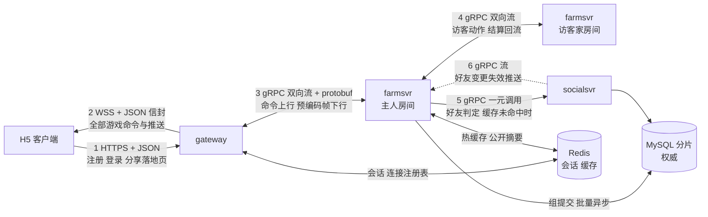

---

name: 农场架构重构
overview: 把后端从「五服务 + HTTP/JSON-RPC + Actor 串行区内同步落库 + Kafka 跨农场」重构为「三服务 + gRPC/protobuf + 房间内存决策加组提交 + 事务性发件箱」，目录按进程边界与架构分层重排。存储保持分层：MySQL 权威但移出热路径，Redis 只做会话与缓存。
todos:

- id: p0-probe
content: "P0 已完成：基线证实多访客延迟恶化（1人≈2.1s，5人大量5s超时，10人全超时）。仅把 syncFlush 移出 mailbox 对跨农场无效——Kafka 单消费者在 Do（含落盘）返回前不拉下一条。N=1 的 2s 来自预占+主人+结算三次串行 SaveFarm。完整方案（去 Kafka/gRPC + L2 组提交）仍然必要。P0 Actor 探针已在 P1 开始前还原，farmctl bench 保留。"
status: completed
- id: p1-layout
content: P1 合并为单 Go module，按新目录树（cmd / gateway / farmsvr / socialsvr / domain / shared）搬迁全部包，改 import，删 go.work 与 7 个子 go.mod。纯机械改动，零行为变更，测试须全绿
status: completed
- id: p2-merge-services
content: P2 服务合并 5 到 3：auth 并入 gateway，worker 的任务/邮件/图鉴并入 farmsvr；顺带拆 gateway 侧大文件（http_auth.go、ws.go、gateway_test.go）并把 gateway.Gateway 改名 Server
status: completed
- id: p3-grpc
content: P3 服务间通信全部改 gRPC + protobuf：建 proto/ 与 buf 工具链，gateway↔farmsvr 与 farmsvr↔farmsvr 用双向流，socialsvr 用一元调用加失效流；重写 farmrpc 的两个大文件，删 api/rpc 与 HTTP push 端点。客户端侧协议不变
status: completed
- id: p4-storage-split
content: P4 存储层按服务所有权拆成三个 store 包，新增 cross_note 发件箱表与批量写接口，把 farmsvr 的任务邮件写并进玩家事务，flush 间隔从 30 秒收到 1 秒
status: completed
- id: p5-room-commit
content: P5 实现 L1 房间与 L2 组提交：房间串行区剥离全部 IO，新增 farmsvr/commit 批量提交器把多个玩家的写攒进一个事务，ack 时机改为提交回调后，整批失败要回滚内存态
status: completed
- id: p6-settle
content: P6 实现 L4 结算票据：票据随主人事务插进 cross_note 表，经 farmsvr 之间的 gRPC 流投递，接收端按 note_id 幂等去重并回 ack 后删行，sweeper 负责崩溃重投；删除 platform/bus 与 Kafka 装配
status: completed
- id: p7-broadcast
content: P7 实现 L5 帧合并：farmsvr 按房间每 tick 把多条 delta 合并并预编码成一份客户端 JSON 信封，gateway 只做按 uid 查连接并转发字节
status: completed
- id: p8-bench-docs
content: P8 用 farmctl 跑多访客 e2e 延迟对比与组提交实测，把 capacity-and-benchmark.md 2.4 节的分片推导从「行写合并 5:1」改口径为「事务与 fsync 数合并」，更新 architecture.md 第 4、5.8、7.2 节与 protocol.md
status: pending
isProject: false

---


# 农场后端架构重构与目录规范化


## 现状基线

`server/` 155 个 Go 文件、31,846 行，八个 Go module 挂在 `go.work` 下。工作树干净，HEAD 在 `fe79e02`。仓库里还没有任何 `.proto` 或 buf 配置，`protobuf v1.36.5` 只是 prometheus 带进来的间接依赖。

延迟的四个结构性来源：

- **Actor 串行区里同步等 MySQL**。[server/platform/actor/runtime.go](server/platform/actor/runtime.go) 的 `run` 循环在 `actor.syncFlush` 时调 `r.flush()` 直接落库，这段时间该玩家的整个邮箱阻塞。多访客并发时延迟线性上升。同一个文件里 `DefaultFlushInterval` 是 30 秒，崩溃丢数据的窗口太长。
- **热路径上有进程间跳**。Farm 处理动作要 HTTP RPC 调 Worker 推进任务进度（`worker.advance_task`），跨农场动作要 RPC 问 Social 是否好友，跨农场结果要绕一圈 Kafka（`cross.result`）。
- **服务间是 HTTP POST + JSON 文本**。每跳都要建连接、编解码 JSON 字符串，且 uint64 还要走字符串编码绕开 JavaScript 的 Number 精度问题——而这个约束只在浏览器边界上才成立。
- **每个动作一条广播**。`farmrpc/push.go` 虽有 batch 路径，但仍是按动作扇出，N 个访客看同一块地会产生 N 倍消息，且每条都要重新编码一遍 JSON。

**注意这四条没有一条的根因是「MySQL 慢」。** 根因是同步 IO 待在串行区里、热路径上有多余的跳、广播没有合并。所以存储保持分层，重构的重点是把 IO 移出关键路径。

## 目标形态




五层设计的落点，每层在 `farmsvr/` 下一个目录：

- **L1 房间** `farmsvr/room`：每个农场一个串行循环，纯内存决策，串行区内零 IO。
- **L2 组提交** `farmsvr/commit`：把多个房间的决策攒成一个批量事务写 MySQL。
- **L3 日志**：不单独实现。MySQL 的 redo log 与 binlog 就是日志。
- **L4 结算票据** `farmsvr/settle`：票据随主人事务插进发件箱表，经 farmsvr 之间的 gRPC 流投递。
- **L5 帧合并** `farmsvr/broadcast`：每 tick 把一个房间的多条 delta 合并并**预编码一次**，沿 gRPC 流下行给 gateway 转发。


## 目录结构

顶层按**进程边界**切，进程内部按**架构层**切。三条纪律：`domain/` 里不出现任何 IO；每个服务只写自己 `store/` 里声明的表与 key；`shared/` 只放三个进程都要用的东西，放不下就说明它属于某个服务。

```
server/
  go.mod                     # module farm/server，删掉 go.work 与 7 个子 go.mod
  cmd/
    gateway/main.go          # 只做装配
    farmsvr/main.go
    socialsvr/main.go
    farmctl/main.go          # 原 tools/smoke，拆成子命令

  gateway/                   # 接入进程
    httpapi/                 # 链路 1：注册 登录 分享落地页
    wsapi/                   # 链路 2：升级 信封 分派 限流 心跳
    session/                 # 会话签发校验、单点登录踢线
    presence/                # 连接注册表：uid 在哪条连接、哪个网关、订阅了哪个房间
    relay/                   # 链路 3 客户端侧：到各 farmsvr 的流、按 uid 路由、帧转发
    store/                   # 拥有 account 表；Redis 的 sess:* 与连接注册表

  farmsvr/                   # 逻辑进程
    grpcapi/                 # 链路 3 4 服务端：Session 流、CrossFarm 流
    room/                    # L1
    commit/                  # L2
    settle/                  # L4
    broadcast/               # L5
    crossfarm/               # 跨农场协议：预占、主人裁决、结算回流的编排
    friendcache/             # 链路 5 6 客户端侧：本地好友缓存 + 失效订阅
    store/                   # 拥有玩家全部表 + cross_note；Redis 的热缓存与 card:*

  socialsvr/                 # 好友进程
    grpcapi/                 # 链路 5 6 服务端
    friendship/              # 好友与申请的领域规则：上限、自反、双向一致
    store/                   # 拥有 friendship / friend_request 表；Redis 的好友列表缓存

  domain/                    # 纯领域逻辑，零 IO，只被 farmsvr 依赖
    plot/                    # 地块状态机、惰性推进、健康度结算、产量
    crop/  pet/  codex/  task/  mail/  shop/

  shared/                    # 三个进程都要用
    pb/                      # buf 生成物，不手改
    grpcx/                   # 拨号、按分片表的 resolver、拦截器、status 与错误码映射
    clientjson/              # 面向浏览器的 JSON 信封与大整数字符串规则
    errcode/                 # 协议错误码
    sqlx/                    # 分片路由、批量事务助手、重试与死锁退避
    redisx/                  # UniversalClient 封装与 key 构造
    gameconfig/              # 策划数值与生成代码
    telemetry/               # 日志 指标 探针
    sharding/                # 1024 逻辑分片与路由表
    testclock/               # 可推进的调试时钟

proto/
  farm/v1/session.proto      # 链路 3
  farm/v1/crossfarm.proto    # 链路 4
  social/v1/social.proto     # 链路 5 6
  common/v1/error.proto
buf.yaml
buf.gen.yaml
```

跟旧结构的对应关系（P1 的搬迁清单）：

- `platform/farm`（30 文件 4683 行）按子领域拆进 `domain/*`，其中 `actions.go`（629 行）按动作域拆开
- `platform/actor` → `farmsvr/room`；`platform/cross` → `farmsvr/crossfarm`
- `platform/connreg` → `gateway/presence`；`platform/store`（21 文件 3699 行）按表所有权拆进三个 `store/`
- `platform/farmrpc` 在 P3 被 gRPC 取代，其中 `push.go` 的合并逻辑进 `farmsvr/broadcast`
- `platform/bus`（Kafka）在 P6 删除
- `platform/obs`→`shared/telemetry`，`routing`→`shared/sharding`，`gameconf`→`shared/gameconfig`，`pkgerr`+`api/rpcerr`→`shared/errcode`，`wireenv`+`pkgjson`→`shared/clientjson`，`debugclock`→`shared/testclock`
- `api/rpc`、`api/authapi`、`api/workerapi`、`api/socialapi` 全部消失（P2 与 P3）

不用 Go 的 `internal/` 目录：单 module、单仓库，加一层只是让每条 import 路径变长，换不来实际约束。

### 命名规则

1. 包名一律小写完整单词，不缩写、不带下划线，目录名等于包名。
2. 文件名 `snake_case`，按职责命名。禁止 `types.go`、`util.go`、`common.go`。
3. 生产文件不超过 400 行，超了按职责拆。
4. 类型名不重复包名：`gateway.Gateway` 改 `wsapi.Server`，`farmrpc.FarmDeltaEncoder` 改 `broadcast.DeltaEncoder`，`WithFarmRPC` 改 `WithFarmClient`。
5. 测试文件与被测文件一一对应，集成测试用 `_integration_test.go` 后缀。
6. 生成代码集中在 `shared/pb`（protobuf）与 `gen_` 前缀（gameconfig），都在包注释里声明生成来源。

必须处理的大文件：

- `gateway/http_auth.go`（999 行，名不副实，实际含构造、路由表、连接登记、push 接收、调试时钟、注册登录）→ P2 拆进 `httpapi/` 与 `wsapi/`，push 接收部分在 P3 随 gRPC 流消失
- `gateway/ws.go`（762 行）→ P2 拆成 `wsapi/conn.go` / `dispatch.go` / `outbox.go`
- `gateway/gateway_test.go`（2947 行）→ P2 按被测领域拆成 6 到 8 个文件
- `farmrpc/server.go`（1048 行）→ P3 重写为 `farmsvr/grpcapi` 下按命令域拆分的 handler
- `farmrpc/push.go`（753 行）→ P3 重写为 `farmsvr/broadcast`


## 关键设计决定


### 存储保持分层，权威留在 MySQL

曾考虑过让 Redis 做唯一权威，算完账否掉了。按 [capacity-model.py](docs/design/capacity-model.py) 的口径注册用户是 1.2 亿，权威数据不能淘汰，意味着 840 GB 农场数据加 56 GB 好友索引全部常驻内存，加主从与 fork 余量要备约 2.7 TB，八十多台内存机器。而同时驻留的活跃 Actor 只有 260 万、24.3 GB——97% 的内存花在存一个月都不会读一次的离线玩家数据上。

分层之后 Redis 里只剩会话（约 0.4 GB）、连接注册表（约 0.4 GB）、好友列表缓存与 `card:{uid}` 摘要（约 2 GB），**不到 30 GB**。

性能上的代价可控。[capacity-and-benchmark.md](docs/design/capacity-and-benchmark.md) 2.4 节已经算过：10 万峰值写 QPS 经 write-behind 合并 5:1 后是 2 万 TPS，7 个分片够用，取 16 个是留余量。L2 组提交会把合并率做得更高——落到每个 MySQL 分片上是每秒两百来个批量事务。**MySQL 从来没在承受 10 万 QPS**，它承受的是组提交之后的批量事务，所以合并率才是核心监控指标。

关键路径上的差别：组提交攒批窗口平均 2.5 毫秒，加上一次批量事务 3 毫秒（Redis 是 0.5 毫秒），合计 5.5 对 3 毫秒。这 2.5 毫秒的差距淹没在客户端几十毫秒的网络往返里，而现状是每动作一个同步事务、多访客排队到几十上百毫秒——收益来自 L1 加 L2，不来自换存储。

还有一个对 MySQL 有利的结构性事实：**Actor 单写者模型消除了行锁竞争**。一个 uid 的行永远只有拥有它的 farmsvr 实例写，不存在两个连接抢同一行。行锁与死锁是游戏后端 MySQL 变慢的头号原因，这个架构天然避开了。

顺带一个简化：Redis 上不再有跨 key 事务需求，全是单 key 操作与缓存，所以单实例和 Cluster 之间没有代码差异，`redis.UniversalClient` 加一行配置即可，不需要 hash tag 那套约束。

### 表与 key 的所有权

**跨服务读允许，跨服务写不允许**——单写者原则约束的是写。

MySQL 表：

- gateway 拥有 `account`
- farmsvr 拥有 `player`、`farm_plot`、`item`、`player_codex`、`player_task`、`mail`、`daily_login`，以及 P6 新增的 `cross_note`
- socialsvr 拥有 `friendship`、`friend_request`

Redis key：

- gateway：`sess:{token}`、`sessactive:{uid}`、连接注册表
- farmsvr：`farm:{uid}` 热缓存（可淘汰，miss 回落 MySQL）、`card:{uid}` 公开摘要
- socialsvr：`friendlist:{uid}` 好友列表缓存，写时删除


### socialsvr 的好友关系存储

好友关系的特征跟农场数据正相反：**极低频写、高频读、不可重建**。1.2 亿用户每天摊 0.1 次好友操作也只有 140 QPS，Redis 的高频写能力完全用不上；而丢一段关系玩家会直接投诉，Redis 的持久化强度不够。所以权威留在关系表，这也是绝大多数游戏的做法。

沿用现有的两张表，但把 `friendship` 从单行权威改成**双向两行**：

```sql
CREATE TABLE friend (
  uid        BIGINT UNSIGNED,
  friend_uid BIGINT UNSIGNED,
  created_at BIGINT,
  PRIMARY KEY (uid, friend_uid)
);
```

改双向两行的理由是查询模式：真实需求永远是「列出我的好友」，两行的话按主键前缀一次扫完；单行权威 `(lo, hi)` 省一半空间，但要在 lo 位和 hi 位各查一次。而且好友关系迟早要挂**有方向的属性**——备注名、亲密度、上次赠送时间、分组，我给你的备注名和你给我的不是一回事，单行存不下。

代价是加好友要写两行，而两行的分片键不同、可能落不同分片。用与用户名唯一索引相同的「先占位后确认」思路：先写发起方那一行，再写对方那一行，失败重试（主键冲突天然幂等）。判定是否好友时**两边都查**，任一边缺失就按非好友处理并触发补齐，保证判定对称。低频全量校验兜底。

三层缓存把读挡在数据库之外：farmsvr 进程内缓存最热，socialsvr 的 `friendlist:{uid}` 次之，都 miss 才落库。

两条边界划分：

**用户名搜索不进 socialsvr。** `account` 表归 gateway。搜索请求到 gateway 就地查出 uid，再带着 uid 调 socialsvr。socialsvr 的所有接口只认 uid，不认识 username。

**好友列表的昵称等级不向 farmsvr 扇出。** 200 个好友分布在不同 farmsvr 实例上，逐个问会扇出 200 次。改成 farmsvr 在玩家资料变更时写一份公开摘要 `card:{uid}`（唯一写者），gateway 组装列表时一次 `MGET` 取回。现有的 `steal_hint:{uid}` 并进这个 key。

### farmsvr 把好友判定移出热路径

现在每次跨农场动作都要 RPC 问一次 `social.are_friends`。改成 `farmsvr/friendcache` 持有本地缓存，命中就不出进程；未命中才走链路 5 的一元调用。farmsvr 启动时向 socialsvr 建立链路 6 的订阅流，好友关系变更时 socialsvr 在流上推失效通知，farmsvr 收到就清对应条目。

### 服务间全部改 gRPC，客户端侧不动

客户端仍是 HTTPS + JSON 和 WSS + JSON 信封，[protocol.md](docs/design/protocol.md) 面向客户端的部分不变。protobuf 只活在服务器内部，收益有三点：二进制编解码省 CPU 与延迟；`.proto` 是强制的协议合同，改错在编译期暴露；服务间可以直接用原生 `uint64`，`AGENTS.md` 那条大整数字符串规则退化到只在浏览器边界生效。

生成代码提交进仓库，沿用现有 `make gen` / `make gen-check` 的模式，CI 校验生成物与 `.proto` 一致，顺带跑 buf 的 lint 与 breaking-change 检查。

### gateway 与 farmsvr 之间是一条复用的双向流

```proto
service FarmSession {
  rpc Session(stream ClientCommand) returns (stream ServerFrame);
}

message ClientCommand {
  uint64 request_id = 1;   // 流内多路复用，用来关联应答
  uint64 uid = 2;
  string idempotency_key = 3;
  oneof body { EnterFarm enter = 10; PlotAction plot = 11; ... }
}

message ServerFrame {
  uint64 request_id = 1;      // 0 表示服务端主动推送
  repeated uint64 target_uid = 2;
  bytes payload = 3;          // 已编码好的客户端 JSON 信封
}
```

两个要点。一是 gateway 对每个 farmsvr 实例只维持少量长流，所有玩家的命令在流上按 `request_id` 复用，不再是每次动作一个 HTTP 请求。二是 `payload` 装的是**已经编码完的客户端 JSON**，gateway 拿到后只按 `target_uid` 查连接注册表写 socket，不解析也不重新编码——这是 L5 帧合并真正省掉 N 倍开销的地方。

现有的 `/internal/v1/push/*` 五个 HTTP 端点全部并进这条流的下行方向。

### 跨玩家结算：发件箱表加 gRPC 投递

玩家 A 在玩家 B 的农场偷菜，A 在 farmsvr-1、B 在 farmsvr-2。单写者原则下 farmsvr-2 不能直接改 A 的数据，只能送一张票据。

顺序是：farmsvr-2 提交 B 的状态变更时，在**同一个 MySQL 事务**里插一行 `cross_note(note_id, target_uid, payload, created_at)`，两者同生共死；事务提交后立刻沿链路 4 的 gRPC 流把票据推给 farmsvr-1；对方在自己的事务里入账并写 `cross_note_applied(note_id)` 唯一索引去重，然后在流上回 ack；收到 ack 才删除发件箱行。进程崩了重启，未删除的行由 sweeper 沿同一条流重投。

这是标准的事务性发件箱。因为 MySQL 事务天然跨行，比 Redis 版少了 hash tag 那套技巧。它彻底替代 Kafka 的 `cross.action` 与 `cross.result`。

### 组提交优化的是 fsync 次数，不是行写次数

这一条纠正了容量模型里一个用错的指标，直接决定 flush 间隔能定多短。

现有的 5:1 合并率靠的是 30 秒 flush 窗口：玩家每 10 秒一次操作，30 秒攒 3 次合成 1 次写。**这个合并只在同一个玩家内部发生**，所以窗口一缩短合并就消失——收到 200 毫秒，同一玩家攒不到第二次操作，行写合并率掉回 1:1，全局行写从 2 万涨回 10 万每秒，按旧口径要把分片从 16 个翻到 32 个。

但 MySQL 的真实瓶颈是事务提交时的 fsync，不是行写次数。组提交合并的是**不同玩家**的写：16 台 farmsvr 每台每秒 6250 行写，按 500 行封顶一个事务，每台每秒 12.5 个事务，分到每个 MySQL 分片也是十几 TPS，离容量文档假设的 3000 TPS 上限差两个数量级；全局 fsync 从每秒 10 万次降到两百次。行写总量确实没减少，但 6250 行每秒的主键更新对单台 SSD MySQL 不算负担。

结论：`DefaultFlushInterval` **定在 1 秒**，崩溃丢失窗口从 30 秒收到 1 秒，分片数不用增加。改动金币道具的动作走同步档，等它所在的那批提交完成才回 ack；纯农场状态的动作（浇水除草）立即回 ack，丢了靠惰性推进重算，最坏是玩家白浇一次。

组提交的批量事务如果失败，整批的 ack 都要变失败，并让相关房间回滚内存态到提交前。这是相比单条写多出来的复杂度，但单写者模型让行锁冲突几乎不存在，实践中应该罕见。`shared/sqlx` 提供死锁退避重试与按行数封顶的批切分。

### 预期收益与各阶段的贡献

服务端部分，不含客户端到机房的网络往返。

单访客一次浇水，现状约 8 到 22 毫秒：HTTP 跳 1 到 2，串行区内同步事务 5 到 15，worker RPC 1 到 3，push 回程 1 到 2。重构后改金币道具的动作约 6 到 7 毫秒（攒批 2.5 加事务 3），纯农场状态的动作约 1 毫秒。

十个访客同时操作同一农场，现状队尾 50 到 150 毫秒——所有请求排在主人 Actor 邮箱里挨个等同步事务。重构后串行区每个只花微秒，十个决策攒进同一批提交，**仍是 6 到 7 毫秒，几乎不随访客数增长**。这是整个重构最主要的收益。

单机 QPS 方面，当前串行区被同步 IO 卡住，单 Actor 每秒最多 200 个请求；重构后串行区纯内存，瓶颈转移到 CPU 与组提交器。容量文档假设的 `QPS_PER_FARMSERVER = 30000` 重构前很可能达不到，重构后才有可能，P8 必须实测。

各阶段的贡献不均衡，执行时心里要有数：

- **P5（L1 加 L2）是收益主力**，约占全部延迟改善的 80%，也是唯一能解决「延迟随访客数增长」的一条。
- **P2（服务合并）性价比最高**：`worker.advance_task` 从跨进程 RPC 变同进程调用、好友判定从 RPC 变本地缓存，跨农场路径上省 2 到 6 毫秒，改动量却很小。
- **P3（gRPC）主要买工程质量，不是性能**。同机房一跳省 1 到 2 毫秒，在几十毫秒的端到端里占比小。它真正的价值是协议合同、长流复用免掉每次动作的连接建立、以及给 L5 的预编码帧提供载体。约两千行工作量要有心理准备。
- **P7（L5 帧合并）是长尾防护，不是均值优化**。容量模型里 `AVG_ROOM_SUBSCRIBERS = 1.3`，平均每个房间只有 1.3 个订阅者，帧合并在均值场景几乎无收益；它防的是大 V 农场两百好友同时来访把 farmsvr CPU 打满。


### 服务从五个合并到三个

- **gateway** 吸收 auth。登录洪峰和游戏流量的伸缩曲线确实不同，但当前规模下多一个进程只是多一跳 RPC 和一套部署。
- **farmsvr** 吸收 worker（任务、邮件、图鉴）。这条是延迟优化：任务推进从跨进程 RPC 变成同进程函数调用，而且任务与邮件的写能并进同一个玩家事务，直接提升组提交的合并率。
- **socialsvr** 保留。好友表的分片键是 `friend_uid` 维度，与农场按 uid 的路由规则不同，合并会破坏分片一致性。


## 分阶段执行

每个阶段结束时系统可运行、测试全绿，并且**搬迁改名与逻辑改动分属不同 commit**，保证 diff 可读。

- **P0 验证实验**：在当前代码上做最小改动——只把 [runtime.go](server/platform/actor/runtime.go) 里的 `syncFlush` 移出串行区（不做完整组提交），用 `smoke` 工具压出 1 / 5 / 10 访客的 e2e 延迟曲线。目的是在投入后面八个阶段之前，用真数据确认「延迟不随访客数线性增长」这个判断成立。半天工作量，结论不符合预期就回来改方案。这一步的代码不保留，P5 会重做。
- **P1 单 module + 目录重排**：纯 `git mv` 加改 import，零行为变更。触及 155 个文件，删 `go.work` 与 7 个 `go.mod`。
- **P2 服务合并 5 到 3**：auth 并入 gateway，worker 并入 farmsvr。删 `api/authapi`（120 行）、`api/workerapi`（273 行）与两个 main；顺手拆 gateway 侧三个大文件、消 stutter 命名。
- **P3 gRPC 改造**：建 `proto/` 与 buf 工具链；四条链路逐条切换；`shared/grpcx` 提供拨号、按分片表的 resolver、错误码映射与观测拦截器；删 `api/rpc`（206 行）、`api/socialapi` 手写 DTO（594 行）、`farmrpc` HTTP 层（约 1870 行）。新增 `.proto` 约 400 行。
- **P4 存储层按所有权拆分**：`platform/store` 的 21 个文件拆进三个 `store/`；`friendship` 迁成双向两行的 `friend` 表；新增 `cross_note` 与 `cross_note_applied` 表；给 L2 提供批量事务写接口；`shared/sqlx` 承接分片路由、重试与批切分；flush 间隔收到 1 秒。
- **P5 L1 加 L2**：房间串行区剥离全部 IO，新增组提交器约 500 行，含整批失败的内存态回滚。
- **P6 L4 结算票据**：发件箱写入、gRPC 流投递与 ack、幂等去重、崩溃 sweeper，新增约 450 行；删 `platform/bus`（606 行）与 Kafka 装配。
- **P7 L5 帧合并**：按房间每 tick 合并并预编码一次，`farmsvr/broadcast` 约 300 行。
- **P8 压测与文档**：用 `farmctl` 跑多访客延迟对比与单机 QPS 上限；**修订 [capacity-and-benchmark.md](docs/design/capacity-and-benchmark.md) 2.4 节的分片推导口径**，从「行写合并 5:1」改成「事务与 fsync 数合并」——结论 16 个主分片能保住（容量约束本来就只要 7 个），但论证过程必须重写；更新 [architecture.md](docs/design/architecture.md) 第 4、5.8、7.2 节与 [protocol.md](docs/design/protocol.md) 的服务间协议部分。

净变化约减 1400 行手写代码（不含 `shared/pb` 生成物）。

## 需要在执行中确认的风险点

- **P0 的结论是后续八个阶段的前提**。如果把同步 IO 移出串行区之后延迟仍随访客数线性增长，说明瓶颈另有其处，方案要重来。这也是把 P0 放在最前面的理由。
- **组提交的实际批大小**。上面按「16 台 farmsvr、每台每秒 6250 行写、1 秒窗口」推出每批 6250 行，需要按行数封顶切分（暂定 500 行一个事务），否则单事务的 binlog 条目过大、锁持有过久。P5 压测定值。
- **gRPC 流断开时的语义**。gateway 到 farmsvr 的流断了，流上正在等应答的请求要按「结果未知」处理。命令必须带 `idempotency_key`，重连后重放不能双重扣道具。P3 里设计。
- `friendship` **改** `friend` **双向两行是一次数据迁移**。需要一次性脚本把单行拆成两行，并保留旧表只读一段时间作为回退。

