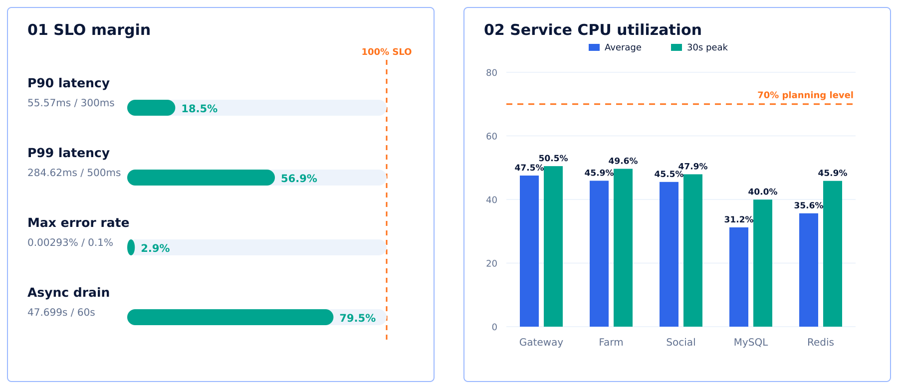

# 第3章 性能测试（4页）

## Slide 1：3.1 业务画像：从 DAU 推导接口峰值负载

- 轻度、常规、社交重度三类用户：占比、会话时长、每会话请求数，加权得到 20 分钟、100 次请求。
- 总体推导：3000 万 DAU → 6000 万会话/天 → 峰值 3333 次会话/秒 → 400 万在线、33.3 万业务 QPS、542 万驻留 Actor。
- 接口层推导：将每会话 100 次请求拆成六类行为组，再按组内权重分配到 31 个接口。
- 六类行为组峰值：进入与同步 3.33 万、本地农场 10.67 万、好友与跨农场 9 万、任务 4 万、邮件 2.67 万、商店/宠物/图鉴 3.67 万 QPS。
- 理论依据：Little 定律 `并发量 = 到达率 × 平均停留时间`。
- 布局角色：数据推导 / 漏斗式流程；不设置底部总结横条。

## Slide 2：3.2 实验设计：构造可外推的 10k 容量单元

- 三层验证：单接口专项 → 31 接口混合压测 → 容量单元外推。
- 三维同比缩放：1 万 QPS / 12 万连接 / 16.26 万 Actor，与生产目标统一保持 1:33.333。
- 实验拓扑：3 个独立发压器；1 Gateway、1 Farm、1 Social、1 MySQL、1 Redis；账号集合互不重叠。
- 四个实验窗口：A 空载基线、B 连接与状态、C 120 秒业务负载、D 异步排空。
- SLO：P90 < 300ms、P99 < 500ms、错误率 ≤ 0.1%、异步任务 60 秒内排空。
- 理论只在内容中自然体现：业务操作画像、多维同比缩放、分阶段资源归因、SLO 稳定容量判定；不单独设置“方法依据”横条，不使用 Amdahl/USL 作为当前实验证据。
- 布局角色：实验设计 / 拓扑 + 时间轴；不设置底部总结横条。

## Slide 3：3.3 实测结果：10k 混合容量单元通过

- 场景条件：12 万连接、16.26 万 Actor、1 万混合业务 QPS，31 个接口同时运行。
- 请求结果：发送 1,200,000，成功 1,199,997，31/31 接口通过。
- SLO 对照：最坏 P90 55.57ms / 300ms；最坏 P99 284.62ms / 500ms；最大错误率 0.00293% / 0.1%；异步排空 47.699s / 60s。
- 峰值 CPU 利用率：Gateway 50.49%、Farm 49.65%、Social 47.93%、MySQL 39.96%、Redis 45.85%。
- 不展示代码优化收益，不设置底部总结横条。
- 布局角色：数据证据 / 结果仪表盘；标题下直接展示测试条件与通过状态。
- Required images:
  - SLO 与服务 CPU 精确数据图；严格输入资产，必须原样保留数值、标签、坐标、颜色与图例，不允许图片模型重绘或改数。

    

## Slide 4：3.4 容量规划：从实测单元外推生产部署

- 外推链路：固定成本 + 状态成本 × 33.333 + 单请求完整成本 × 33.3 万 QPS，再按 70% 规划利用率预留余量。
- 逻辑资源：365 核 CPU、798.37 GiB 内存。
- 基础部署：120 个实例或数据节点，456 核、1040 GiB；Gateway 40、Farm 37、Social 12、MySQL 1 写主、Redis 30 主分片。
- 三可用区：197 个实例或数据节点，812 核、1882 GiB；Gateway 60、Farm 56、Social 18、MySQL 1 主 2 副本、Redis 30 主 30 副。
- 适用边界：用户行为需生产埋点校准；补充多档容量、长稳与存储 IOPS 测试。
- 布局角色：容量推导 / 对比方案；重点区分“实测”“外推”“部署规划”。

## 全局视觉规范

- 16:9，浅灰白背景，深海军蓝大标题，蓝色与青绿色作为主强调色，橙红色仅用于风险或阈值。
- 使用圆角卡片、细描边、扁平线性图标；数据表格转为大数字、流程箭头和进度条，避免密集报表。
- 中文字体粗细层级清楚，正文保持可投影阅读；四页维持统一视觉语言，但使用不同信息布局。
- 不显示页码，不增加额外口号或底部总结横条。
